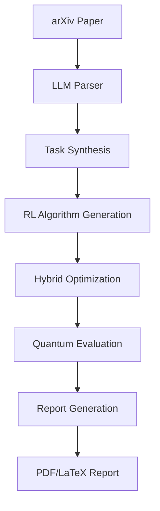

# QuantumMetaGPT


[](https://opensource.org/licenses/Apache-2.0)

QuantumMetaGPT is an autonomous research agent for quantum computing that:
1. Parses quantum research papers from arXiv
2. Generates quantum algorithms using reinforcement learning
3. Optimizes algorithms with hybrid quantum-classical methods
4. Evaluates on simulators and real quantum hardware
5. Produces scientific reports with visualizations

## Architecture Overview


### Key Features
1) Hybrid Quantum-AI Development: Combines LLMs with quantum circuit optimization

2) Reinforcement Learning: PPO, A2C, DDPG, and SAC agents for algorithm discovery

3) Hardware Integration: Runs on Qiskit simulators and IBM Quantum backends

4) Automated Reporting: Generates publication-ready reports with visualizations

5) Security System: Hardware-bound licensing with AES-256 encryption

Installation
```bash
# Clone repository
git clone https://github.com/yourusername/QuantumMetaGPT.git
cd QuantumMetaGPT

# Install dependencies
pip install -r requirements.txt

# Set environment variables
export IBMQ_TOKEN="your_ibmq_token"
export OPENAI_API_KEY="your_openai_key"

# Generate license
python -m qmetagpt.security_licensing.cli_license generate
Usage
python
from QuantumMetaGPT import run_pipeline

# Run full pipeline
run_pipeline(arxiv_id="quant-ph/2310.12345")
```

### Module Structure
```mermaid
quantummetagpt/
├── llm_paper_parser       # arXiv paper processing
├── task_synthesizer       # Quantum task formalization
├── quantum_algorithm_generator  # RL-based circuit generation
├── optimizer_engine       # Hybrid quantum-classical optimization
├── evaluation_engine      # Quantum hardware evaluation
├── report_generator       # Scientific report creation
├── security_licensing     # License management
└── utils                  # Logging and error handling
```
Contributing
Contributions are welcome! Please see our contribution guidelines.

License
Apache 2.0 - See LICENSE for details.


###`CONTRIBUTING.md`
```markdown
# Contribution Guidelines

We welcome contributions to QuantumMetaGPT! Please follow these guidelines:

## Development Setup
1. Fork the repository
2. Clone your fork: `git clone https://github.com/yourusername/QuantumMetaGPT.git`
3. Create a virtual environment: `python -m venv venv`
4. Activate environment: `source venv/bin/activate`
5. Install dependencies: `pip install -r requirements-dev.txt`

## Coding Standards
- Follow PEP 8 style guide
- Use type hints for all function signatures
- Document public methods with docstrings
- Write unit tests for new features
- Keep modules focused and cohesive

## Testing
Run the test suite with:
```bash
pytest --cov=qmetagpt --cov-report=html
Pull Requests
Create a new branch for your feature: git checkout -b feature-name

Implement your changes with tests

Ensure all tests pass: pytest

Update documentation if needed

Submit a pull request to the main repository

Reporting Issues
Please use GitHub issues to report bugs or request features. Include:

Detailed description of the issue

Steps to reproduce

Expected vs actual behavior

Environment details


### 16. `LICENSE`
```text
Apache License
Version 2.0, January 2004
http://www.apache.org/licenses/

TERMS AND CONDITIONS FOR USE, REPRODUCTION, AND DISTRIBUTION

1. Definitions.

"License" shall mean the terms and conditions for use, reproduction, and distribution...

[Standard Apache 2.0 License Text]
17. .env.example
env
# IBM Quantum credentials
IBMQ_TOKEN="your_ibmq_token"

# OpenAI API
OPENAI_API_KEY="your_openai_key"

# LLM configuration
LLM_MODEL="gpt-4"
LLM_TEMPERATURE=0.7

# Quantum backend
QUANTUM_BACKEND="ibmq_manila"
USE_HARDWARE=false
SHOTS=1024

# RL training
RL_AGENT="PPO"
RL_TIMESTEPS=50000