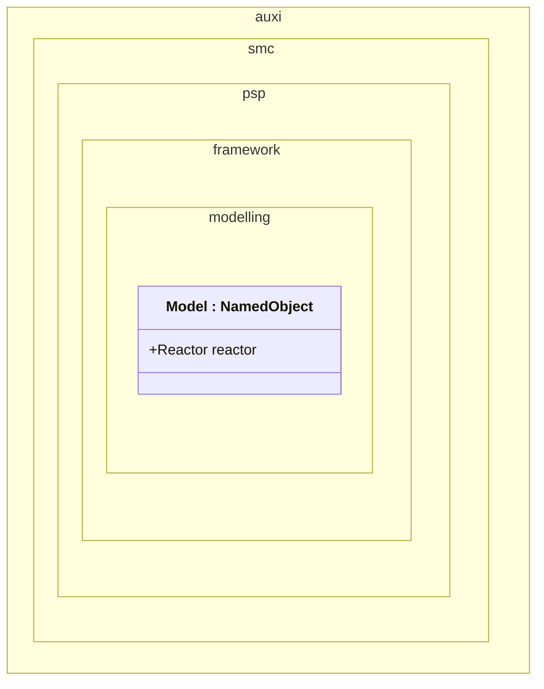
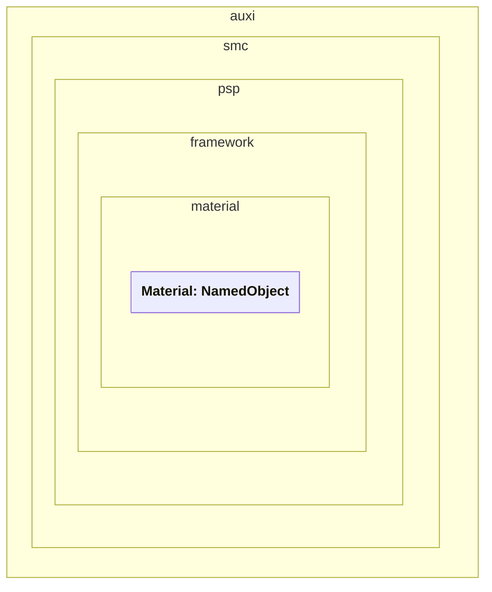
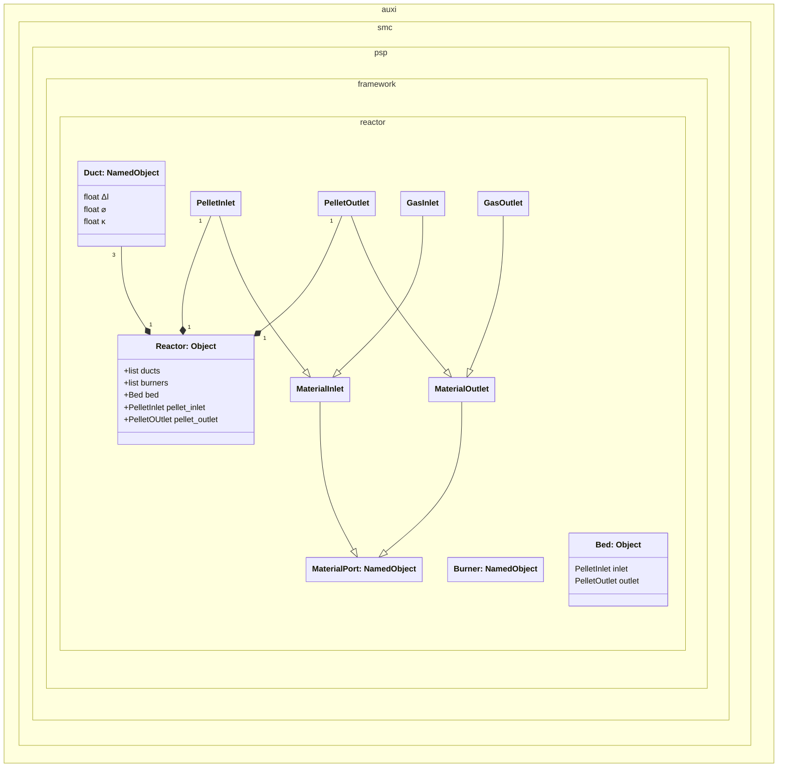

# Software Design

## `auxi.smc.psp.modelling`

```mermaid
---
  config:
    class:
      hideEmptyMembersBox: true
---
classDiagram
    direction TB
    namespace auxi.smc.psp.framework.modelling {
        class Model["Model : NamedObject"] {
            +Reactor reactor
        }
    }
```

## `auxi.smc.psp.material`

```mermaid
---
  config:
    class:
      hideEmptyMembersBox: true
---
classDiagram
    namespace auxi.smc.psp.framework.material {
        class Material["Material: NamedObject"] {
        }
    }
```

## `auxi.smc.psp.reactor`

```mermaid
---
  config:
    class:
      hideEmptyMembersBox: true
---
classDiagram
    %% direction BT
    namespace auxi.smc.psp.framework.reactor {
        class Reactor["Reactor: Object"] {
            +list<Duct> ducts
            +list<Burner> burners
            +Bed bed
            +PelletInlet pellet_inlet
            +PelletOUtlet pellet_outlet
        }

        class Duct["Duct: NamedObject"] {
            float Δl
            float ⌀
            float κ
        }

        class Burner["Burner: NamedObject"]

        class Bed["Bed: Object"] {
            PelletInlet inlet
            PelletOutlet outlet
        }

        class MaterialPort["MaterialPort: NamedObject"]
        class MaterialInlet
        class GasInlet
        class PelletInlet
        class MaterialOutlet
        class GasOutlet
        class PelletOutlet
    }
    Duct "3" --* "1" Reactor
    PelletInlet "1" --* "1" Reactor
    PelletOutlet "1" --* "1" Reactor
    MaterialInlet --|> MaterialPort
    GasInlet --|> MaterialInlet
    PelletInlet --|> MaterialInlet
    MaterialOutlet --|> MaterialPort
    GasOutlet --|> MaterialOutlet
    PelletOutlet --|> MaterialOutlet
```
