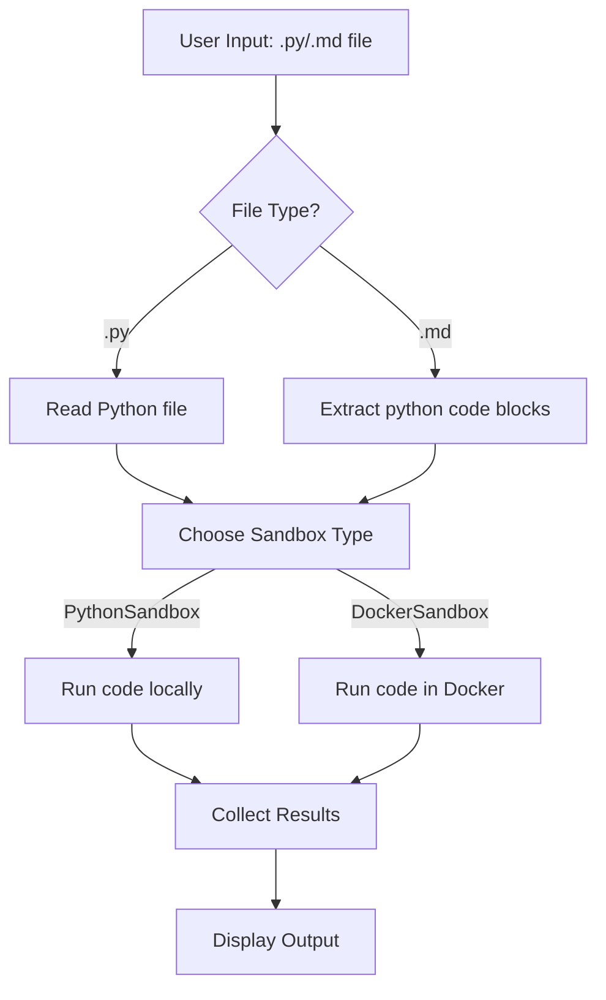
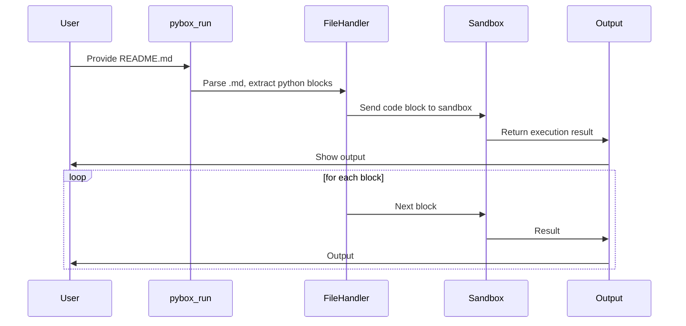

# PyBox

A sandbox for safely running Python code in isolated environments. PyBox is part of the PyLama ecosystem and integrates with LogLama as the primary service for centralized logging and environment management.

## Features

- Code analysis for detecting dependencies
- Dependency management for automatic installation
- Python sandbox for running code in the current environment
- Docker sandbox for running code in isolated containers
- Interactive terminal menu for running examples (arrow keys + Enter)
- Utility functions for system information and execution results
- Integration with LogLama for centralized logging and environment management
- Structured logging with component context for better debugging and monitoring

## Installation

```bash
# Install from PyPI
pip install pybox

# Or install locally in development mode
python -m venv venv
source venv/bin/activate  # On Windows: venv\Scripts\activate
pip install -e .  # This is important! Always install in development mode before starting

# Alternatively, use the Makefile
make setup
```

> **IMPORTANT**: Always run `pip install -e .` before starting the project to ensure all dependencies are properly installed and the package is available in development mode.

## Usage

```python
from pybox import PythonSandbox, DockerSandbox

# Run code in the current Python environment
python_sandbox = PythonSandbox()
result = python_sandbox.run_code("""
import math
print(f'The square root of 16 is {math.sqrt(16)}')
""")
print(result)

# Run code in an isolated Docker container
docker_sandbox = DockerSandbox()
result = docker_sandbox.run_code("""
import platform
print(f'Running on {platform.system()}')
""")
print(result)
```

## Using the Makefile

PyBox includes a Makefile to simplify common development tasks:

```bash
# Set up the project (creates a virtual environment and installs dependencies)
make setup

# Run the API server (default port 8000)
make run

# Run the API server on a custom port
make run PORT=8080

# The run-port command is also available for backward compatibility
make run-port PORT=8080

# Run tests
make test

# Format code with black
make format

# Lint code with flake8
make lint

# Docker Testing
# Build Docker test images
make docker-build

# Run tests in Docker
make docker-test

# Start interactive Docker test environment
make docker-interactive

# Start PyBox mock service in Docker
make docker-mock

# Clean up Docker test resources
make docker-clean

# Clean up project (remove __pycache__, etc.)
make clean

# Show all available commands
make help
```

## Docker Testing

PyBox includes a Docker-based testing infrastructure that allows you to run tests in isolated containers. This ensures consistent test environments and makes it easier to test integration with other components.

### Using Docker Tests

```bash
# Build the Docker test images
make docker-build

# Run all tests in Docker
make docker-test

# Start an interactive Docker test environment
make docker-interactive

# Start a PyBox mock service for integration testing
make docker-mock

# Clean up Docker test resources
make docker-clean
```

### Integration with PyLama Ecosystem

PyBox is part of the PyLama ecosystem and can be tested together with other components using the main Makefile in the PyLama project root:

```bash
# From the PyLama project root
make docker-test-pybox      # Run PyBox tests only
make docker-integration-test # Run integration tests across all components
```

## Running code from .py and .md files

You can use PyBox to safely run code from Python scripts (`.py`) or extract and run all Python code blocks from Markdown files (`.md`). This functionality is available both as a command-line tool and in the interactive menu.

### Usage (CLI)

```bash
python -m pybox.pybox_run script.py
python -m pybox.pybox_run README.md
python -m pybox.pybox_run README.md --docker
```

- For `.py` files: the whole script is executed in a sandbox.
- For `.md` files: all code blocks marked as ```python are extracted and executed one by one in isolation.
- Add `--docker` to run code in an isolated Docker container.

### Usage (Interactive Menu)

Launch the menu:
```bash
pybox
```
Choose "Uruchom kod z pliku .py lub .md" and follow the prompts to run any script or markdown code blocks, locally or in Docker.


## Overview
PyBox is a sandbox system for safely running Python code from scripts or markdown, with support for dependency management and Docker isolation.

---

## Mermaid Diagram – Main Flow



---

## ASCII Diagram – Component Overview

```
+-------------------+
|    User/CLI/Menu  |
+--------+----------+
         |
         v
+--------+----------+
| pybox_run / menu   |
+--------+----------+
         |
         v
+-------------------+
| File Handler      |
| (.py/.md parser)  |
+--------+----------+
         |
         v
+-------------------+
|  Sandbox Layer    |
| PythonSandbox     |
| DockerSandbox     |
+--------+----------+
         |
         v
+-------------------+
|  Output/Reporter  |
+-------------------+
```

---

## Flow Description
1. **User** selects file via CLI or menu.
2. **File Handler** detects file type:
   - `.py`: reads the script.
   - `.md`: extracts all ```python code blocks.
3. **Sandbox Layer** runs code using `PythonSandbox` (local) or `DockerSandbox` (container).
4. **Output/Reporter** collects and displays results for each code block/script.

---

## Example Sequence (Markdown)


```

---

## Key Components
- **pybox_run**: CLI/utility for running code from files
- **examples.py**: Interactive menu, now integrates file execution
- **PythonSandbox/DockerSandbox**: Safe code execution layers
- **DependencyManager**: Handles required packages
- **Markdown Parser**: Extracts code blocks from `.md`

---

## Extending
- Add support for more file types (e.g., Jupyter).
- Enhance reporting (HTML, JSON output).
- Add block selection for markdown.

### Example

Suppose you have a Markdown file with:

```markdown
```python
print("Hello from markdown!")
```
```

Running `python -m pybox.pybox_run README.md` or using the interactive menu will execute the code above in a sandbox and print the results.

## Interactive Examples Menu

PyBox provides an interactive terminal menu for running usage examples. The menu allows you to navigate using arrow keys and select examples with Enter. Powered by the [`questionary`](https://github.com/tmbo/questionary) library.

### Running the interactive menu

You can start the interactive menu via the console script or directly:

```bash
# Using the installed entry point
pybox

# Or directly
python -m pybox.examples
```

Follow the on-screen menu to choose an example (e.g. CodeAnalyzer, DependencyManager, PythonSandbox, DockerSandbox, etc.).

### Requirements

The interactive menu requires `questionary` (installed automatically with PyBox 0.1.1+):

```bash
pip install questionary
```

## License

Apache License 2.0
