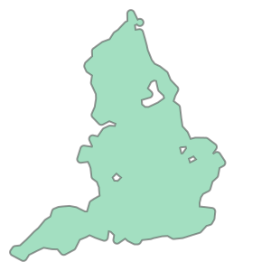
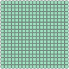

# Bounding Shapes
This library creates [Shapely](https://shapely.readthedocs.io/en/stable/) shapes designed to fit closely around a set of given points, and provides functionality to create a grid of points inside those shapes. 
This simplifies the problem of trying to find a shape that fits around all points, whilst allowing for gaps/multiple shapes to accomodate for situations where points may be clustered around a few areas, or handling points far outside a cluster. 


```python
import geopandas as gpd
from shapely import MultiPoint

# Example dataset of rainfall stations covering England
fn = "AllRainfallStations"
imported_gdf = gpd.read_file(f"zip://{fn}.zip!{fn}/{fn}.shp")
imported_gdf.head()
```

<div>
<table border="1" class="dataframe">
  <thead>
    <tr style="text-align: right;">
      <th></th>
      <th>sample_N</th>
      <th>geometry</th>
    </tr>
  </thead>
  <tbody>
    <tr>
      <th>0</th>
      <td>1</td>
      <td>POINT (-1.17133 52.18628)</td>
    </tr>
    <tr>
      <th>1</th>
      <td>1</td>
      <td>POINT (-1.1637 52.98624)</td>
    </tr>
    <tr>
      <th>2</th>
      <td>1</td>
      <td>POINT (-1.67298 51.69289)</td>
    </tr>
    <tr>
      <th>3</th>
      <td>1</td>
      <td>POINT (-0.64929 52.49389)</td>
    </tr>
    <tr>
      <th>4</th>
      <td>1</td>
      <td>POINT (-0.99517 52.73152)</td>
    </tr>
  </tbody>
</table>
</div>


```python
# Convert improted data into Multipoint object
reprojected_gdf = imported_gdf.to_crs(crs="EPSG:32631")
points = MultiPoint(list(zip(reprojected_gdf.geometry.x, reprojected_gdf.geometry.y)))
points
```


    

    


```python
from bounding_shape.bounding_shape import create_bounding_area

bounding_area = create_bounding_area(points)
bounding_area.polygon
```


    

    


Using the libary to create a set of points inside an area: 


```python
spaced_points = bounding_area.create_grid() 
spaced_points.grid
```


    

    


## Targeting a number of grid points
If creating a grid and there is a target number of points for the shape to be split into, the `get_grid_spacing_for_points` method allows this to be specified with the magnitude parameter. 


```python
from bounding_shape.bounding_shape import get_grid_spacing_for_points
from shapely import MultiPoint

points = MultiPoint([[0.0, 0.0], [0.0, 100.0], [100.0, 100.0], [100.0, 0.0]])

distance = get_grid_spacing_for_points(points=points, magnitude=20)

spaced_points = create_bounding_area(points=points, buffer=0.0).create_grid(grid_spacing=distance)
spaced_points.grid
```


    

    


