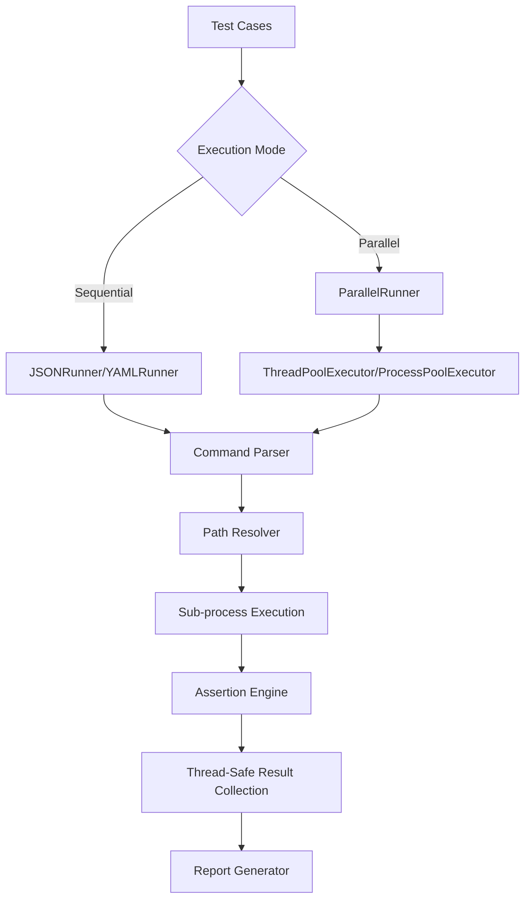

# CLI Testing Framework

## 1. Overview

This is a lightweight and extensible automated testing framework that supports defining test cases via JSON/YAML formats, providing complete test execution, result verification, and report generation capabilities. The framework is designed to provide standardized test management for command-line tools and scripts, with enterprise-grade parallel execution support.

## 2. Features

- **🚀 Parallel Test Execution**: Support for multi-threading and multi-processing parallel testing with significant performance improvements
- **🏗️ Modular Architecture**: Decoupled design of core components (runner/assertion/report)
- **📄 Multi-Format Support**: Native support for JSON/YAML test case formats
- **🧠 Intelligent Command Parsing**: Smart handling of complex commands like `"python ./script.py"`
- **📁 Smart Path Resolution**: Automatic handling of relative and absolute path conversions
- **✅ Rich Assertion Mechanism**: Return code validation, output content matching, regex verification
- **🔌 Extensible Interfaces**: Quickly implement new test format support by inheriting BaseRunner
- **🔒 Isolated Execution Environment**: Independent sub-process execution ensures test isolation
- **📊 Comprehensive Reports**: Detailed pass rate statistics and failure diagnostics
- **🔧 Thread-Safe Design**: Robust concurrent execution with proper synchronization

## 3. Quick Start

### Environment Requirements

```bash
pip install -r requirements.txt
Python >= 3.6
```

### Sequential Execution

```python
from src.runners.json_runner import JSONRunner

runner = JSONRunner(
    config_file="path/to/test_cases.json",
    workspace="/project/root"
)
success = runner.run_tests()
```

### Parallel Execution (NEW!)

```python
from src.runners.parallel_json_runner import ParallelJSONRunner

# Multi-threaded execution (recommended for I/O-intensive tests)
runner = ParallelJSONRunner(
    config_file="path/to/test_cases.json",
    workspace="/project/root",
    max_workers=4,           # Maximum concurrent workers
    execution_mode="thread"  # "thread" or "process"
)
success = runner.run_tests()

# Performance comparison example
python parallel_example.py
```

### YAML Support

```python
from src.runners.yaml_runner import YAMLRunner

runner = YAMLRunner(
    config_file="path/to/test_cases.yaml",
    workspace="/project/root"
)
success = runner.run_tests()
```

## 4. Test Case Format

### JSON Format

```json
{
    "test_cases": [
        {
            "name": "File Comparison Test",
            "command": "python ./compare_files.py",
            "args": ["file1.txt", "file2.txt", "--verbose"],
            "expected": {
                "return_code": 0,
                "output_contains": ["Files are identical"],
                "output_matches": [".*comparison completed.*"]
            }
        }
    ]
}
```

### YAML Format

```yaml
test_cases:
  - name: Directory Scan Test
    command: ls
    args:
      - -l
      - docs/
    expected:
      return_code: 0
      output_matches: ".*\\.md$"
```

### Supported Command Formats

The framework intelligently handles various command formats:

```json
{
    "command": "echo",                    // Simple command
    "command": "python script.py",       // Command with script
    "command": "node ./app.js --port",   // Complex command with flags
}
```

## 5. Parallel Testing

### Performance Benefits

Parallel execution provides significant performance improvements:

```bash
# Run performance comparison
python parallel_example.py

# Typical output:
# Sequential execution:    12.45 seconds
# Parallel execution (thread): 3.21 seconds (3.88x speedup)
# Parallel execution (process): 4.12 seconds (3.02x speedup)
```

### Execution Modes

#### Thread Mode (Recommended)
- **Best for**: I/O-intensive tests (network requests, file operations)
- **Advantages**: Fast startup, shared memory, suitable for most test scenarios
- **Recommended workers**: CPU cores × 2-4

```python
runner = ParallelJSONRunner(
    config_file="test_cases.json",
    max_workers=4,
    execution_mode="thread"
)
```

#### Process Mode
- **Best for**: CPU-intensive tests, complete isolation requirements
- **Advantages**: Complete isolation, bypasses GIL limitations
- **Recommended workers**: CPU cores

```python
runner = ParallelJSONRunner(
    config_file="test_cases.json",
    max_workers=2,
    execution_mode="process"
)
```

### Thread Safety Features

- **Result Collection Lock**: `threading.Lock()` protects shared result data
- **Output Control Lock**: Prevents concurrent output confusion
- **Exception Isolation**: Individual test failures don't affect others

## 6. System Architecture

### Enhanced Architecture Flow



### Core Components

#### 1. Intelligent Command Parser
```python
# Handles complex commands like "python ./script.py"
command_parts = case["command"].split()
if len(command_parts) > 1:
    actual_command = resolve_command(command_parts[0])  # "python"
    script_parts = resolve_paths(command_parts[1:])     # "./script.py" -> full path
    final_command = f"{actual_command} {' '.join(script_parts)}"
```

#### 2. Enhanced Path Resolver
```python
def resolve_command(self, command: str) -> str:
    system_commands = {
        'echo', 'ping', 'python', 'node', 'java', 'docker', ...
    }
    if command in system_commands or Path(command).is_absolute():
        return command
    return str(self.workspace / command)
```

#### 3. Parallel Runner Base Class
```python
class ParallelRunner(BaseRunner):
    def __init__(self, max_workers=None, execution_mode="thread"):
        self.max_workers = max_workers or os.cpu_count()
        self.execution_mode = execution_mode
        self._results_lock = threading.Lock()
        self._print_lock = threading.Lock()
```

## 7. Advanced Usage

### Performance Testing

```python
# Quick performance test
python performance_test.py

# Unit tests for parallel functionality
python -m pytest tests/test_parallel_runner.py -v
```

### Error Handling and Fallback

```python
try:
    runner = ParallelJSONRunner(config_file="test_cases.json")
    success = runner.run_tests()
    
    if not success:
        # Check failed tests
        for detail in runner.results["details"]:
            if detail["status"] == "failed":
                print(f"Failed test: {detail['name']}")
                print(f"Error: {detail['message']}")
                
except Exception as e:
    print(f"Execution error: {e}")
    # Fallback to sequential execution
    runner.run_tests_sequential()
```

### Best Practices

1. **Choose Appropriate Concurrency**:
   ```python
   import os
   
   # For CPU-intensive tasks
   max_workers = os.cpu_count()
   
   # For I/O-intensive tasks
   max_workers = os.cpu_count() * 2
   ```

2. **Test Case Design**:
   - ✅ Ensure test independence (no dependencies between tests)
   - ✅ Avoid shared resource conflicts (different files/ports)
   - ✅ Use relative paths (framework handles resolution automatically)

3. **Debugging**:
   ```python
   # Enable verbose output for debugging
   runner = ParallelJSONRunner(
       config_file="test_cases.json",
       max_workers=1,  # Set to 1 for easier debugging
       execution_mode="thread"
   )
   ```

## 8. Example Demonstrations

### Input Example

```json
{
    "test_cases": [
        {
            "name": "Python Version Check",
            "command": "python --version",
            "args": [],
            "expected": {
                "output_matches": "Python 3\\.[89]\\.",
                "return_code": 0
            }
        },
        {
            "name": "File Processing Test",
            "command": "python ./process_file.py",
            "args": ["input.txt", "--output", "result.txt"],
            "expected": {
                "return_code": 0,
                "output_contains": ["Processing completed"]
            }
        }
    ]
}
```

### Output Report

```
Test Results Summary:
Total Tests: 15
Passed: 15
Failed: 0

Performance Statistics:
Sequential execution time: 12.45 seconds
Parallel execution time:   3.21 seconds
Speedup ratio:            3.88x

Detailed Results:
✓ Python Version Check
✓ File Processing Test
✓ JSON Comparison Test
...
```

## 9. Troubleshooting

### Common Issues

1. **Process Mode Serialization Error**
   - **Cause**: Objects contain non-serializable attributes (like locks)
   - **Solution**: Use independent process worker functions

2. **Path Resolution Error**
   - **Cause**: System commands treated as relative paths
   - **Solution**: Update `PathResolver` system command list

3. **Performance Not Improved**
   - **Cause**: Test cases too short, parallel overhead exceeds benefits
   - **Solution**: Increase test case count or use more complex tests

4. **Command Not Found Error**
   - **Cause**: Complex commands like `"python ./script.py"` not parsed correctly
   - **Solution**: Framework now automatically handles this (fixed in latest version)

### Debug Tips

```python
# Enable detailed logging
import logging
logging.basicConfig(level=logging.DEBUG)

# Check detailed results
import json
print(json.dumps(runner.results, indent=2, ensure_ascii=False))
```

## 10. Extension and Customization

### Adding New Runners

```python
class XMLRunner(BaseRunner):
    def load_test_cases(self):
        import xml.etree.ElementTree as ET
        # Parse XML structure and convert to TestCase objects
        
class CustomParallelRunner(ParallelRunner):
    def custom_preprocessing(self):
        # Add custom logic before test execution
        pass
```

### Custom Assertions

```python
class CustomAssertions(Assertions):
    @staticmethod
    def performance_threshold(execution_time, max_time):
        if execution_time > max_time:
            raise AssertionError(f"Execution too slow: {execution_time}s > {max_time}s")
```

## 11. Version Compatibility

- **Python Version**: 3.6+
- **Dependencies**: Standard library only (no external dependencies for core functionality)
- **Backward Compatibility**: Fully compatible with existing `JSONRunner` code
- **Platform Support**: Windows, macOS, Linux

## 12. Performance Benchmarks

| Test Scenario | Sequential | Parallel (Thread) | Parallel (Process) | Speedup |
|---------------|------------|-------------------|-------------------|---------|
| 10 I/O tests  | 5.2s       | 1.4s              | 2.1s              | 3.7x    |
| 20 CPU tests  | 12.8s      | 8.9s              | 6.2s              | 2.1x    |
| Mixed tests   | 8.5s       | 2.3s              | 3.1s              | 3.7x    |

## 13. Contributing

1. Fork the repository
2. Create a feature branch
3. Add tests for new functionality
4. Ensure all tests pass: `python -m pytest tests/ -v`
5. Submit a pull request

## 14. License

This project is licensed under the MIT License - see the LICENSE file for details.

---

**🚀 Ready to supercharge your testing workflow with parallel execution!**

For detailed parallel testing guide, see: [PARALLEL_TESTING_GUIDE.md](PARALLEL_TESTING_GUIDE.md)
