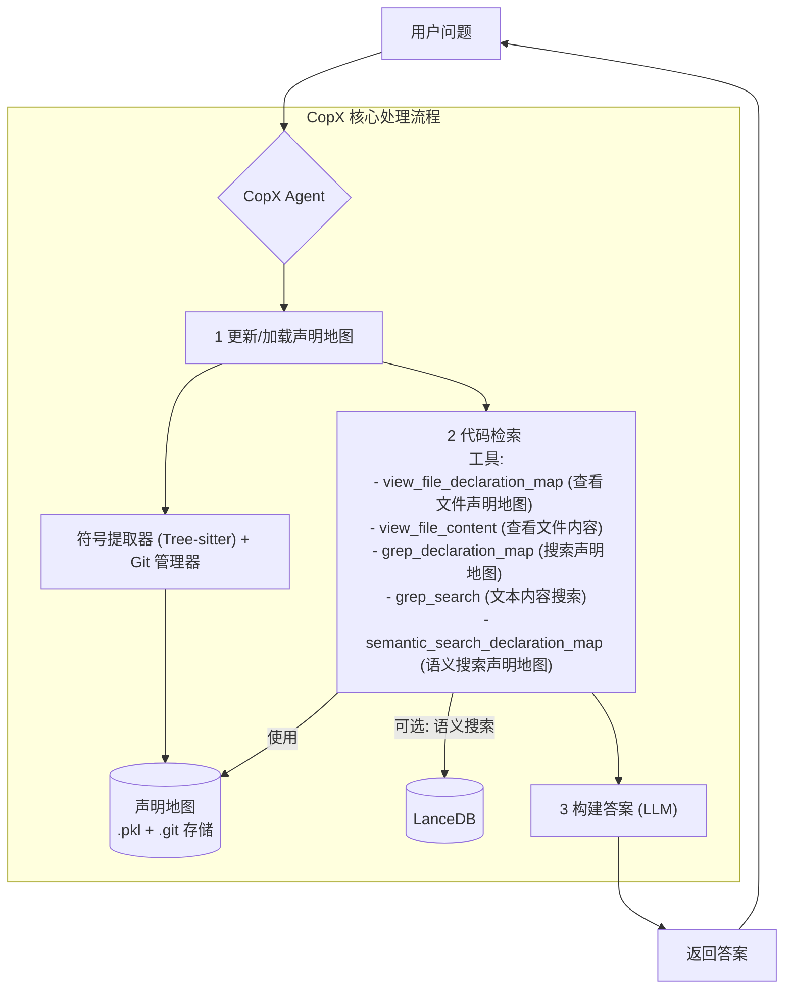

# ✨ CopX - 你的**代**码**项**目专**家** ✨

[English](../README_en.md)

🚀 **Co**de **P**roject E**x**pert (CopX)  是一个旨在对任意代码库进行问答的系统
- **快速**：基于声明的上下文检索，无需 embedding 模型。
- **准确**：语义搜索和精确的代码结构分析，确保答案的准确性。
- **灵活**：支持多种编程语言，可轻松扩展。
- **高效**：增量更新和 Git 支持，确保处理大型代码库时的效率。

## 核心功能

*   **基于声明的上下文**: 通过解析源文件并构建符号（函数、类、变量等）的“声明地图”来理解代码结构。这允许精确地、不基于 embedding 地检索相关代码上下文。
*   **增量更新**: 利用隐藏的 Git 仓库跟踪文件更改，并增量更新声明地图，确保大型代码库的效率。
*   **混合检索 (可选)**: 可以集成语义搜索（例如，使用 LanceDB 和 embedding 模型）用于那些受益于语义理解的查询，作为主要基于声明检索的补充。
*   **LLM 驱动的问答**: 利用大型语言模型 (LLM) 理解问题，并根据检索到的上下文形成答案。
*   **多语言支持**: 通过 Tree-sitter 配置，可以轻松扩展以支持各种编程语言。目前开箱即用支持 Python、Golang、TypeScript 和 JavaScript。
*   **灵活部署**: 可以作为 FastAPI 服务或 MCP (模型上下文协议) 服务器运行。

### CopX 效果展示：理解 mem0 项目

为了展示 CopX 在理解复杂代码项目方面的能力，我们进行了一个对比实验。我们选择了 [mem0](https://github.com/mem0ai/mem0) 项目作为分析对象。

1.  **标准 Cline (Plan 模式)**：直接向 Cline 提问。
2.  **集成 CopX 的 Cline (通过 MCP)**：Cline 利用 CopX MCP 工具对 `mem0` 进行分析。

以下是结果对比：

| 特性| 标准 Cline (Plan 模式) | CopX (通过 MCP)|
| :----------- | :--------------------------------------------------------------------------------------------------------------------------------------------------------------------------------------------------------------- | :---------------------------------------------------------------------------------------------------------------------------------------------------------------------------------------------------------------------------------------------------------------------- |
| **提示词** | How does this project organize memories?| How does this project organize memories? |
| **模型** |gemini-2.5-pro|gemini-2.5-pro|
| **回答** | | |
| **完整回答**   | [docs/ask_cline_mem0.md](docs/ask_cline_mem0.md)| [docs/ask_copx_mem0.md](docs/ask_copx_mem0.md)|


## 工作流程图

以下是 agent 工作流程的简化图示：



## 使用指南

CopX 可以通过两种模式运行：作为 MCP 服务器或作为 FastAPI 服务。

### 1. MCP (模型上下文协议) 服务器

MCP 服务器将 CopX 的功能公开为一个工具，可供兼容 MCP 的客户端（例如 AI IDE）使用。

**先决条件:**
*   确保已安装 `uv`。您可以按照 [https://github.com/astral-sh/uv](https://github.com/astral-sh/uv) 上的说明进行安装。

**运行方式:**
在您的终端中执行以下命令：
```bash
uvx --from copx copx-mcp
```
这将启动 MCP 服务器，并注册一个名为 "Ask Expert" 的工具。

**推荐的 AI IDE 配置:**
您可以将 CopX MCP 服务器集成到您的 AI IDE (例如支持 MCP 的 IDE) 中，使用类似以下的配置：

```json
{
  "copx": {
    "command": "uvx",
    "args": [
      "--from",
      "copx",
      "copx-mcp"
    ],
    "env": {
      "COPX_MODEL": "ollama/devstral", // 例如："openai/gpt-4"
      "COPX_DATA_PATH": "/home/yourname/Documents/Copx", // 例如：持久化路径
      "COPX_API_KEY": "你的API密钥",
      "COPX_BASE_URL": "你的LLM基础URL"
    },
    "disabled": false,
    "autoApprove": [
      "Ask Expert"
    ],
    "timeout": 1800
  }
}
```
**参数说明:**
*   `COPX_MODEL`: 指定 CopX 使用的 litellm 风格的模型名称 (例如, `"ollama/devstral"`, `"openai/gpt-4"`)。
*   `COPX_DATA_PATH`: CopX 存储其内部数据的目录，例如项目的声明地图和 Git 快照 (例如, `"~/Documents/Copx"`)。建议使用持久路径。
*   `COPX_API_KEY`: 您选择的 LLM 服务的 API 密钥。
*   `COPX_BASE_URL`: 您的 LLM API 端点的基础 URL。

**MCP 工具: `Ask Expert`**
*   **描述**: 获取关于项目代码库的专家答案。
*   **参数**:
    *   `project_path` (字符串, 必需): 项目代码库的绝对路径。
    *   `question` (字符串, 必需): 关于代码库的问题。

### 2. FastAPI 服务

FastAPI 服务提供了一个用于查询的 HTTP 端点。

**配置:**
查询端点直接在请求体中接受 LLM 配置参数。

**运行方式:**
使用 Uvicorn (或任何 ASGI 服务器):
```bash
uvicorn copx.copx_fastapi:app --reload --host 0.0.0.0 --port 8000
```

**API 端点: `POST /query`**

请求体 (`application/json`):
```json
{
  "project_path": "/path/to/your/codebase",
  "question": "用户认证是如何工作的？",
  "model": "openai/gpt-4", // litellm 格式                
  "base_url": "https://api.example.com/v1", 
  "api_key": "your_llm_api_key",    
  "git_path": "~/.copx_data"        
}
```
*   `project_path`: 您要查询的代码库的绝对路径。
*   `question`: 您关于代码库的问题。
*   `model`, `base_url`, `api_key`: LLM 提供商的详细信息。
*   `git_path`: CopX 将存储其缓存（声明地图和 git 快照）的目录。建议使用持久路径，例如 `~/.copx_data` 或项目中的 `./.copx_data`。如果目录不存在，CopX 将创建它。

## 工作原理

CopX 通过一个多阶段流程处理用户关于代码库的查询：

1.  **声明地图更新/加载**:
    *   当收到项目的查询时，CopX 首先确保其声明地图是最新的。
    *   它使用 `ProjectGitManager` 跟踪自上次运行以来的文件更改。
    *   `SymbolExtractor`（由 Tree-sitter驱动）根据特定语言的规则解析修改过的或新的文件。
    *   提取的符号（函数、类、变量及其位置）存储在 `declaration_map` 中。此地图作为 `.pkl` 文件持久化，并且文件版本在指定数据目录内的隐藏 `.git` 仓库中进行跟踪。

2.  **代码检索**:
    *   `CodeRetriever` 节点使用 `declaration_map` 根据符号名称和代码结构查找与用户查询直接相关的代码段。
    *   可选地，对于更广泛或更抽象的查询，它可以利用（如果已配置）对代码的 LanceDB 索引（例如函数体）进行语义搜索。

3.  **答案构建**:
    *   `AnswerFormulator` 节点获取检索到的上下文（来自声明地图和/或语义搜索）和原始问题。
    *   然后它与 LLM 交互以生成全面的答案。

## 支持的语言

CopX 使用 Tree-sitter 进行代码解析，并通过 `src/copx/symbal_extractor/configs/` 目录下的配置文件支持各种语言。
目前支持：

*   Python (`.py`)
*   Golang (`.go`)
*   JavaScript (`.js`, `.jsx`)
*   TypeScript (`.ts`, `.tsx`)

## 添加对新语言的支持

要添加对新编程语言的支持：

1.  **安装 Tree-sitter 语法库**:
    找到该语言的 Tree-sitter 语法的 Python 绑定 (例如, `tree-sitter-ruby`) 并安装它：
    ```bash
    pip install tree-sitter-newlanguage
    ```

2.  **创建配置文件**:
    在 `src/copx/symbal_extractor/configs/` 目录下，创建一个新的 JSON 文件 (例如, `newlanguage.json`)。
    此文件需要指定：
    *   `tree_sitter_module`: 已安装的该语言的 Python 模块名称 (例如, `tree_sitter_newlanguage`)。
    *   `language_accessor_name` (可选): 如果模块中的语言对象不是通过 `module.language` 访问的，请指定正确的访问器 (例如, `get_language`)。
    *   `extraction_rules`: 一个规则数组，定义哪些 AST 节点类型对应哪些符号（函数、类、变量等）以及如何提取它们的名称。有关示例，请参阅现有的配置文件 (例如, `py.json`, `go.json`)。

    示例 `newlanguage.json`:
    ```json
    {
      "tree_sitter_module": "tree_sitter_newlanguage",
      "extraction_rules": [
        {
          "node_type": "function_definition",
          "name_field": "name",
          "symbol_type": "Function"
        },
        {
          "node_type": "class_definition",
          "name_field": "name",
          "symbol_type": "Class"
        }
        // ... 更多规则
      ]
    }
    ```

## 安装

1.  **克隆仓库:**
    ```bash
    git clone <repository_url> # 替换为实际的仓库 URL
    cd copx
    ```

2.  **安装依赖:**
    建议使用虚拟环境。
    ```bash
    python -m venv .venv
    source .venv/bin/activate  # Windows 系统: .venv\Scripts\activate
    pip install -r requirements.txt # 或者: uv pip install -r requirements.txt
    # (假设后续会生成 requirements.txt 文件，或列出关键依赖)
    # 关键依赖包括: fastapi, uvicorn, pocketflow, pydantic, tree_sitter, aiofiles, lancedb (可选), 以及各种 tree-sitter 语言绑定。
    ```
    您需要为计划支持的语言安装 Tree-sitter 语言绑定，例如:
    ```bash
    pip install tree-sitter-python tree-sitter-go tree-sitter-javascript tree-sitter-typescript
