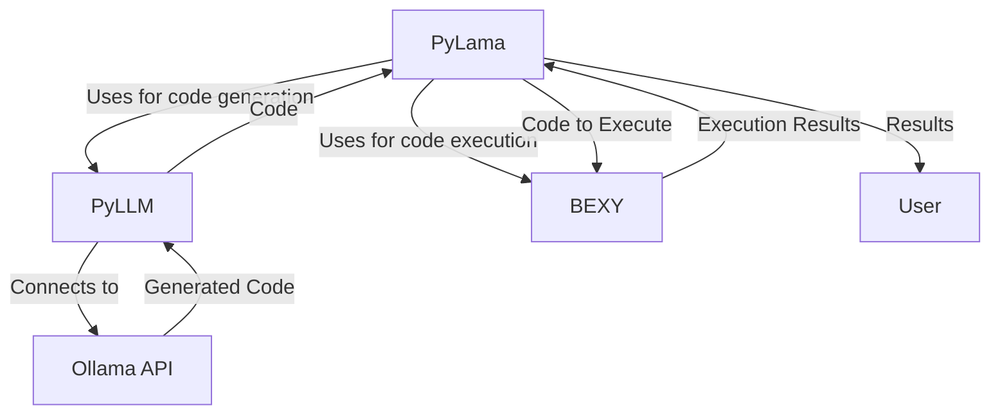
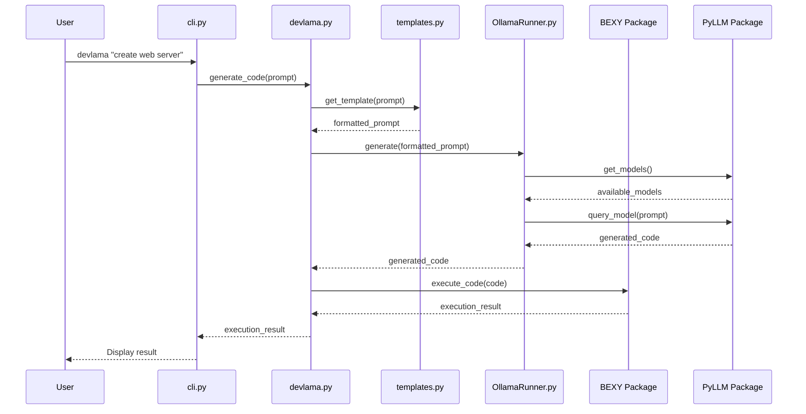
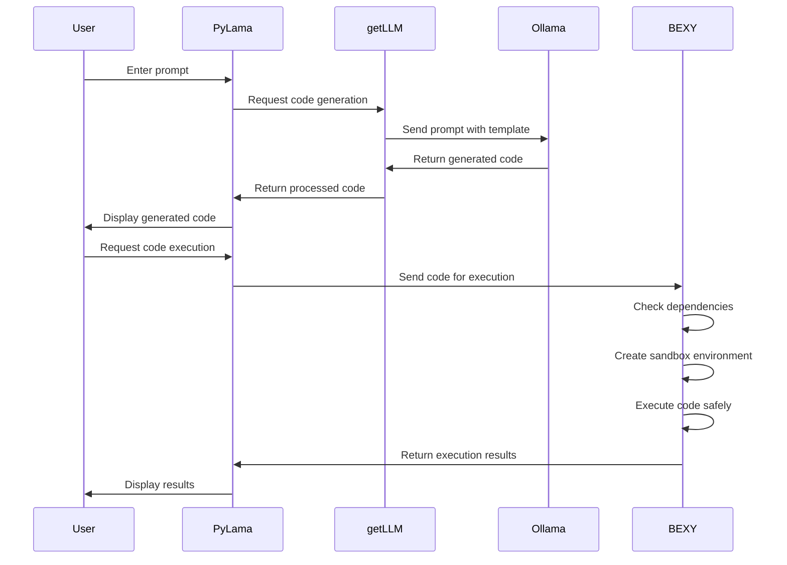

# DevLama - Python Code Generation with Ollama

> **IMPORTANT NOTICE**: DevLama functionality has been migrated to the `getllm` package. Please use `getllm` instead of `devlama` for all code generation and model management tasks. See the [getllm README](/getllm/README.md) for more information.

## PyLama Ecosystem Navigation

| Project | Description | Links |
|---------|-------------|-------|
| **DevLama** | Python code generation with Ollama | [GitHub](https://github.com/py-lama/devlama) · [Docs](https://py-lama.github.io/devlama/) |
| **GetLLM** | LLM model management and code generation | [GitHub](https://github.com/py-lama/getllm) · [PyPI](https://pypi.org/project/getllm/) · [Docs](https://py-lama.github.io/getllm/) |
| **LogLama** | Centralized logging and environment management | [GitHub](https://github.com/py-lama/loglama) · [PyPI](https://pypi.org/project/loglama/) · [Docs](https://py-lama.github.io/loglama/) |
| **APILama** | API service for code generation | [GitHub](https://github.com/py-lama/apilama) · [Docs](https://py-lama.github.io/apilama/) |
| **BEXY** | Sandbox for executing generated code | [GitHub](https://github.com/py-lama/bexy) · [Docs](https://py-lama.github.io/bexy/) |
| **JSLama** | JavaScript code generation | [GitHub](https://github.com/py-lama/jslama) · [NPM](https://www.npmjs.com/package/jslama) · [Docs](https://py-lama.github.io/jslama/) |
| **JSBox** | JavaScript sandbox for executing code | [GitHub](https://github.com/py-lama/jsbox) · [NPM](https://www.npmjs.com/package/jsbox) · [Docs](https://py-lama.github.io/jsbox/) |
| **SheLLama** | Shell command generation | [GitHub](https://github.com/py-lama/shellama) · [PyPI](https://pypi.org/project/shellama/) · [Docs](https://py-lama.github.io/shellama/) |
| **WebLama** | Web application generation | [GitHub](https://github.com/py-lama/weblama) · [Docs](https://py-lama.github.io/weblama/) |

## Author

**Tom Sapletta** — DevOps Engineer & Systems Architect

- 💻 15+ years in DevOps, Software Development, and Systems Architecture
- 🏢 Founder & CEO at Telemonit (Portigen - edge computing power solutions)
- 🌍 Based in Germany | Open to remote collaboration
- 📚 Passionate about edge computing, hypermodularization, and automated SDLC

[](https://github.com/tom-sapletta-com)
[](https://linkedin.com/in/tom-sapletta-com)
[](https://orcid.org/0009-0000-6327-2810)
[](https://www.digitname.com/)

## Support This Project

If you find this project useful, please consider supporting it:

- [GitHub Sponsors](https://github.com/sponsors/tom-sapletta-com)
- [Open Collective](https://opencollective.com/tom-sapletta-com)
- [PayPal](https://www.paypal.me/softreck/10.00)
- [Donate via Softreck](https://donate.softreck.dev)

---

DevLama is a Python tool that leverages Ollama's language models to generate and execute Python code. It simplifies the process of writing and running Python scripts by handling dependency management and code execution automatically. With the template system, it generates higher quality, platform-aware code that's ready to run. DevLama is part of the PyLama ecosystem and integrates with LogLama as the primary service for centralized logging and environment management.

## PyLama Ecosystem

DevLama is part of the PyLama ecosystem, which includes the following related projects:

| Project | Description | Repository Link |
|---------|-------------|----------------|
| **GetLLM** | LLM model management and code generation (replaces DevLama) | [/getllm](/getllm) |
| **LogLama** | Centralized logging, environment management, and service orchestration | [/loglama](/loglama) |
| **APILama** | API service for code generation and LLM operations | [/apilama](/apilama) |
| **BEXY** | Sandbox environment for executing generated code | [/bexy](/bexy) |
| **JSLama** | JavaScript code generation with LLM | [/jslama](/jslama) |
| **JSBox** | JavaScript sandbox for executing generated JS code | [/jsbox](/jsbox) |
| **SheLLama** | Shell command generation and execution | [/shellama](/shellama) |
| **WebLama** | Web application generation and deployment | [/weblama](/weblama) |

## DevLama Command Usage

The `devlama` command is the primary interface for generating Python code using LLM models. Below are the main commands and options available.

> **IMPORTANT**: The `devlama` functionality has been migrated to the `getllm` package. All commands shown below should now be used with `getllm` instead of `devlama`.

### Basic Command Structure

```bash
devlama [options] "your prompt here"
```

### Command Options

| Option | Description |
|--------|-------------|
| `-r, --run` | Execute the generated code after creation |
| `-s, --save` | Save the generated code to a file |
| `-m, --model MODEL` | Specify which Ollama model to use |
| `-t, --template TYPE` | Specify the code template type |
| `-d, --dependencies LIST` | Specify allowed dependencies |
| `--mock` | Use mock mode (no Ollama required) |
| `-i, --interactive` | Start interactive mode |

### Template Types

| Template | Description |
|----------|-------------|
| `basic` | Simple code generation without extra features |
| `platform_aware` | Generates code with platform-specific optimizations |
| `dependency_aware` | Manages dependencies automatically |
| `testable` | Includes test cases with the generated code |
| `secure` | Focuses on security best practices |
| `performance` | Optimizes for performance |
| `pep8` | Follows PEP 8 style guidelines |

## Features

- **Real Ollama Integration**: Uses real Ollama models to generate high-quality Python code
- **Automatic Model Installation**: Automatically installs models when requested, including special handling for SpeakLeash/Bielik models
- **Mock Mode**: Supports a mock mode for testing without requiring Ollama
- **Smart Model Selection**: Automatically selects the best available model with fallbacks
- **Progress Indicator**: Shows real-time progress during code generation
- **Template System**: Generates code with awareness of platform, dependencies, and more
- **Interactive Mode**: Provides an interactive CLI for model selection and code generation
- **Code Execution**: Can execute generated code directly
- **LogLama Integration**: Integrates with LogLama for centralized logging, environment management, and service orchestration
- **Structured Logging**: All operations are logged with component context for better debugging and monitoring

## Requirements

- Python 3.8+
- [Ollama](https://ollama.ai) installed and running (unless using mock mode)
- One or more code generation models pulled in Ollama (e.g., `codellama:7b`, `phi3:latest`)

## Installation

```bash
# Clone the repository
git clone https://github.com/py-lama/devlama.git
cd devlama

# Create a virtual environment (recommended)
python -m venv venv
source venv/bin/activate  # On Windows: venv\Scripts\activate

# Install dependencies in development mode
pip install -e .  # This is important! Always install in development mode before starting
```

> **IMPORTANT**: Always run `pip install -e .` before starting any project in the PyLama ecosystem. This ensures all dependencies are properly installed and the package is available in development mode.

## Usage

### Command Examples

> **IMPORTANT**: The following commands should now be used with `getllm` instead of `devlama`.

```bash
# Generate code using the default model
devlama "create a function to calculate fibonacci numbers"

# Generate and run code
devlama -r "create a web server with Flask"

# Save generated code to a file
devlama -s "create a script to download files from URLs"

# Use a specific model
devlama --model codellama:7b "create a binary search tree implementation"

# Use mock mode (no Ollama required)
devlama --mock "print hello world"

# Use a model that will be automatically installed if not available
devlama --model SpeakLeash/bielik-1.5b-v3.0-instruct-gguf "print hello world"
```

### Interactive Mode

> **IMPORTANT**: The following commands should now be used with `getllm` instead of `devlama`.

```bash
# Start interactive mode
devlama -i

# Start interactive mode with mock implementation
devlama -i --mock
```

In interactive mode, you can:
- Select models from a list
- Generate code with custom prompts
- Execute generated code
- Save code to files
- Update the model list

### New Features in GetLLM

The `getllm` package includes new features not available in `devlama`, such as Hugging Face model search:

```bash
# Search for models on Hugging Face
getllm --search bielik

# Update models list from Hugging Face
getllm --update-hf
```

## Project Relationships

DevLama works with other components in the PyLama ecosystem:

- **GetLLM**: Provides the LLM model management backend (DevLama has been migrated to GetLLM)
- **LogLama**: Handles logging, environment management, and service orchestration
- **BEXY**: Executes the generated code in a sandbox environment
- **APILama**: Provides API access to code generation functionality

## Ollama Model Integration

The `devlama` command integrates with Ollama to provide high-quality code generation. When you run a command, it will:

1. Connect to the Ollama server running on `localhost:11434`
2. Check if the requested model is available
3. **Automatically install the model** if it's not available and auto-install is enabled
4. **Automatically select an available model** if the requested one isn't found
5. Use the best available model for code generation
6. Fall back to alternative models if needed
7. Display a progress spinner with elapsed time during code generation

### Setting Up Ollama for DevLama

```bash
# Install Ollama (if not already installed)
# See https://ollama.ai for installation instructions

# Start the Ollama server
ollama serve

# Pull recommended models for code generation
ollama pull codellama:7b
ollama pull phi3:latest
```

### Model Management Commands

> **IMPORTANT**: The following commands should now be used with `getllm` instead of `devlama`.

```bash
# List available models
devlama list

# Install a model
devlama install codellama:7b

# Set default model
devlama set-default codellama:7b

# Show default model
devlama default

# Update models list from Ollama
devlama update
```

### Automatic Model Installation

PyLama can automatically install models when requested:

```bash
# This will automatically download and install the model if not available
devlama --model SpeakLeash/bielik-1.5b-v3.0-instruct-gguf "print hello world"
```

#### SpeakLeash/Bielik Models

PyLama has enhanced support for SpeakLeash/Bielik models with the following features:

1. **Automatic Installation**: Downloads and installs the model from Hugging Face when first requested
2. **Model Reuse**: Detects existing Bielik installations to avoid redundant downloads
3. **Extended Timeouts**: Automatically increases API timeout to 120 seconds for these larger models

Example output:
```
Found existing Bielik model installation: bielik-custom-1747866289:latest
Using existing model instead of downloading again.
Increased API timeout to 120 seconds for Bielik model.
                                                                        
Generated Python code:
----------------------------------------
#!/bin/env python3
import sys, os

# Function to check if the operating system is Linux
def is_linux():
    return os.name == 'posix' and sys.platform == 'linux'

if not is_linux():
    print("This code requires a Linux operating system to run.")
    exit()

# Hello World function
def hello_world():
    print("Hello, World!")

if __name__ == "__main__":
    # Call the hello_world function
    hello_world()
----------------------------------------
```

PyLama's installation process for SpeakLeash/Bielik models:

1. Downloads the model file from Hugging Face
2. Creates a custom Modelfile with appropriate parameters
3. Creates the model in Ollama with a unique name
4. Updates your environment settings to use the new model
5. Remembers the model for future use to avoid redundant downloads

For more details on working with Bielik models, see [BIELIK.txt](BIELIK.txt).

### Environment Variables

You can configure PyLama using environment variables:

- `OLLAMA_PATH`: Path to the Ollama executable (default: `ollama`)
- `OLLAMA_MODEL`: Default model to use (default: `codellama:7b`)
- `OLLAMA_FALLBACK_MODELS`: Comma-separated list of fallback models (default: `codellama:7b,phi3:latest,tinyllama:latest`)
- `OLLAMA_AUTO_SELECT_MODEL`: Whether to automatically select an available model when the specified one isn't found (default: `True`)
- `OLLAMA_AUTO_INSTALL_MODEL`: Whether to automatically install a model when it's not found (default: `True`)
- `OLLAMA_TIMEOUT`: API timeout in seconds (default: `30`, recommended `120` for Bielik models)

## Troubleshooting

### Model Not Found

If you see an error like this:

```
Model 'your-model-name' not found in Ollama. Available models: ['codellama:7b', 'phi3:latest']
```

You can either:

1. Pull the model manually:
   ```bash
   ollama pull your-model-name
   ```

2. Enable automatic model installation (already enabled by default):
   ```bash
   export OLLAMA_AUTO_INSTALL_MODEL=true
   ```

### Connection Timeout

If you see a timeout error:

```
Error querying Ollama API: HTTPConnectionPool(host='localhost', port=11434): Read timed out. (read timeout=30)
```

Make sure Ollama is running:

```bash
ollama serve
```

If Ollama is running but still timing out, try increasing the timeout:

```bash
export OLLAMA_TIMEOUT=120  # Recommended for larger models like Bielik
```

Note: PyLama now automatically increases the timeout to 120 seconds for Bielik models, but you may need to set this manually for other large models.

### Duplicate Model Downloads

If you notice that PyLama is downloading the same model multiple times:

1. For SpeakLeash/Bielik models, PyLama now automatically detects existing installations
2. For other models, ensure you're using the exact same model name each time
3. Check your Ollama installation with `ollama list` to see all installed models

## Mock Mode

PyLama includes a mock mode that doesn't require Ollama to be installed or running. This is useful for testing or when you don't have access to Ollama.

```bash
devlama --mock "print hello world"
```

In mock mode, PyLama will return pre-defined code examples based on the prompt.

## Troubleshooting

### Model Not Found

If you see an error like this:

```
Model 'your-model-name' not found in Ollama. Available models: ['codellama:7b', 'phi3:latest']
```

You need to pull the model first:

```bash
ollama pull your-model-name
```

### Connection Timeout

If you see a timeout error:

```
Error querying Ollama API: HTTPConnectionPool(host='localhost', port=11434): Read timed out. (read timeout=30)
```

Make sure Ollama is running:

```bash
ollama serve
```

If Ollama is running but still timing out, the model might be too large for your system. Try using a smaller model:

```bash
devlama --model tinyllama:latest "your prompt"
```

## PyLama Microservices Architecture

## Overview

This repository contains a microservices-based architecture for the PyLama ecosystem, consisting of the following components:

- **BEXY**: Python code execution sandbox
- **PyLLM**: LLM operations service
- **PyLama**: Ollama management service
- **SheLLama**: Shell and filesystem operations service
- **APILama**: API gateway for all services
- **WebLama**: Web frontend (JavaScript/HTML/CSS)

The architecture has been refactored to improve maintainability, scalability, and separation of concerns. Each component now exposes a REST API that can be consumed by other services through the APILama gateway.

## Architecture

The PyLama ecosystem is built around a central orchestration service (PyLama) that coordinates all other components. This architecture allows for better integration and simplified deployment.

```
                   +------------+
                   |   Ollama   |
                   |   (LLM)    |
                   +------------+
                        ^
                        |
                        v
+------------+     +------------+     +---------------+     +------------+
|   BEXY    |     |   PyLLM    |<--->|   PyLama      |<--->| SheLLama   |
|  (Sandbox) |<--->|   (LLM)    |     | (Orchestrator)|     |  (Shell)   |
+------------+     +------------+     +---------------+     +------------+
      ^                  ^                  ^                  ^
      |                  |                  |                  |
      v                  v                  v                  v
+-----------------------------------------------------------------------+
|                            APILama                                    |
|                          (API Gateway)                                |
+-----------------------------------------------------------------------+
                                ^
                                |
                                v
+-----------------------------------------------------------------------+
|                            WebLama                                    |
|                           (Frontend)                                  |
+-----------------------------------------------------------------------+
                                ^
                                |
                                v
+-----------------------------------------------------------------------+
|                            Browser                                    |
+-----------------------------------------------------------------------+
```

## Services

### BEXY (Port 8000)

Python code execution sandbox service that provides:
- Code execution in isolated environments
- Dependency management
- Code analysis

### PyLLM (Port 8001)

LLM operations service that provides:
- LLM model queries
- Code fixing functionality
- Alternative fix generation

### SheLLama (Port 8002)

Shell and filesystem operations service that provides:
- File operations (read, write, list, search)
- Directory management
- Shell command execution
- Git integration for version control

### APILama (Port 8080)

API gateway service that provides:
- Unified API for all services
- Request routing to appropriate services
- Health monitoring
- Logging and error handling

### WebLama (Static Frontend)

Web frontend that provides:
- User interface for interacting with the services
- Code editor with syntax highlighting
- File explorer
- Execution results display

### PyLama (Port 8003)

Ollama management service that provides:
- Model management
- Model inference
- Model fine-tuning

## Getting Started

### Prerequisites

- Docker and Docker Compose (recommended for easy deployment)
- Python 3.8 or higher (for development without Docker)
- Node.js 14 or higher (for WebLama frontend development)
- Git

### Docker Deployment (Recommended)

The easiest way to run the entire PyLama ecosystem is using Docker Compose, which will set up all components with the correct configuration and dependencies.

1. Clone the repository:
   ```bash
   git clone https://github.com/py-lama/devlama.git
   cd py-lama
   ```

2. Start all services with Docker Compose:
   ```bash
   docker-compose up -d
   ```
   This will start all components in the correct order with PyLama as the central orchestration point.

3. Access the web interface:
   - Open your browser and navigate to `http://localhost:80`

4. Monitor the logs:
   ```bash
   docker-compose logs -f
   ```

5. Stop all services:
   ```bash
   docker-compose down
   ```

### Manual Installation (Development)

For development purposes, you can set up each component individually.

1. Clone the repository:
   ```bash
   git clone https://github.com/py-lama/devlama.git
   cd py-lama
   ```

2. Set up each component:

   #### PyLama (Central Orchestration Service)
   ```bash
   cd devlama
   python -m venv venv
   source venv/bin/activate  # On Windows: venv\Scripts\activate
   pip install -e .
   ```

   #### APILama (API Gateway)
   ```bash
   cd apilama
   python -m venv venv
   source venv/bin/activate  # On Windows: venv\Scripts\activate
   pip install -e .
   ```

   #### SheLLama (Shell Operations)
   ```bash
   cd shellama
   python -m venv venv
   source venv/bin/activate  # On Windows: venv\Scripts\activate
   pip install -e .
   ```

   #### BEXY (Sandbox)
   ```bash
   cd bexy
   python -m venv venv
   source venv/bin/activate  # On Windows: venv\Scripts\activate
   pip install -e .
   ```

   #### PyLLM (LLM Operations)
   ```bash
   cd getllm
   python -m venv venv
   source venv/bin/activate  # On Windows: venv\Scripts\activate
   pip install -e .
   ```

   #### WebLama (Frontend)
   ```bash
   cd weblama
   npm install
   ```

### Running the Services Manually

If you're not using Docker, start the services in the following order:

1. **BEXY** (Sandbox):
   ```bash
   cd bexy
   source venv/bin/activate  # On Windows: venv\Scripts\activate
   python -m bexy.app --port 8000 --host 127.0.0.1
   ```

2. **PyLLM** (LLM Operations):
   ```bash
   cd getllm
   source venv/bin/activate  # On Windows: venv\Scripts\activate
   python -m getllm.app --port 8001 --host 127.0.0.1
   ```

3. **APILama** (API Gateway):
   ```bash
   cd apilama
   source venv/bin/activate  # On Windows: venv\Scripts\activate
   python -m apilama.app --port 8080 --host 127.0.0.1
   ```
   Note: APILama will automatically use SheLLama as a library.

4. **PyLama** (Central Orchestration):
   ```bash
   cd devlama
   source venv/bin/activate  # On Windows: venv\Scripts\activate
   python -m devlama.app --port 8003 --host 127.0.0.1
   ```
   PyLama coordinates all other services and provides a unified interface.

5. **WebLama** (Frontend):
   ```bash
   cd weblama
   npm start
   ```
   Or serve the static files with a web server of your choice.

6. Access the web interface:
   - Open your browser and navigate to `http://localhost:8080` (or whatever port you configured for the WebLama frontend)

## API Documentation

### APILama Endpoints

#### Health Check
```
GET /api/health
```
Returns the health status of the APILama service.

#### PyLama Endpoints
```
GET /api/devlama/health
POST /api/devlama/execute
```

#### BEXY Endpoints
```
GET /api/bexy/health
POST /api/bexy/execute
```

#### PyLLM Endpoints
```
GET /api/getllm/health
POST /api/getllm/generate
```

#### SheLLama Endpoints
```
GET /api/shellama/health
GET /api/shellama/files
GET /api/shellama/file
POST /api/shellama/file
DELETE /api/shellama/file
GET /api/shellama/directory
POST /api/shellama/directory
DELETE /api/shellama/directory
POST /api/shellama/shell
```

## Development

### Adding a New Service

To add a new service to the ecosystem:

1. Create a new directory for your service
2. Implement the service with a REST API
3. Add routes to APILama to proxy requests to your service
4. Update the WebLama frontend to interact with your service through APILama

### Testing

Each service has its own test suite. To run the tests for a service:

```bash
cd <service-directory>
python -m unittest discover tests
```

To run the integration tests for the entire ecosystem:

```bash
python integration_test.py
```

## Benefits of the Microservices Architecture

1. **Modularity**: Each service can be developed, deployed, and scaled independently
2. **Scalability**: Services can be scaled based on demand
3. **Maintainability**: Clearer separation of concerns
4. **Deployment Flexibility**: Components can be deployed separately or together
5. **Language Agnostic**: Future components could be written in different languages


## Using the Makefile

PyLama includes a Makefile to simplify common development tasks:

```bash
# Set up the project (creates a virtual environment and installs dependencies)
make setup

# Run the API server (default port 8002)
make run

# Run the API server on a custom port
make run PORT=8080

# The run-port command is also available for backward compatibility
make run-port PORT=8080

# Run tests
make test

# Format code with black
make format

# Lint code with flake8
make lint

# Clean up project (remove __pycache__, etc.)
make clean

# Show all available commands
make help
```

## Docker Testing Infrastructure

The PyLama ecosystem includes a comprehensive Docker testing infrastructure for all components. This allows for isolated testing of individual components as well as integration testing across the entire ecosystem.

### Docker Test Files

Each component (PyLama, BEXY, PyLLM, APILama, WebLama) includes the following Docker testing files:

- **Dockerfile.test**: Defines the test environment with all necessary dependencies
- **docker-compose.test.yml**: Configures the test services with proper networking and dependencies
- **run_docker_tests.sh**: Provides a convenient script to build, run, and manage the Docker test environment

### Running Docker Tests

To run tests using the Docker infrastructure:

```bash
# Build and run all tests
./run_docker_tests.sh --build --run-tests

# Start in interactive mode
./run_docker_tests.sh --interactive

# Start all services in the PyLama ecosystem
./run_docker_tests.sh --full-stack

# Run integration tests with all services
./run_docker_tests.sh --integration

# Run Ansible tests for comprehensive integration testing
./run_docker_tests.sh --ansible-tests

# Stop containers
./run_docker_tests.sh --stop

# Clean up containers and volumes
./run_docker_tests.sh --clean
```

### Ansible Integration Tests

The PyLama ecosystem includes Ansible playbooks for comprehensive integration testing:

- **ansible_tests/playbooks/**: Contains test playbooks for each component
- **ansible_tests/inventory/**: Defines the inventory for local testing
- **ansible_tests/templates/**: Includes templates for generating test reports

These tests verify that all components work together correctly, testing endpoints and interactions between services.

### Benefits of Docker Testing

1. **Isolated Environment**: Tests run in a clean, isolated environment
2. **Reproducibility**: Tests produce consistent results across different systems
3. **Integration Testing**: Easily test interactions between multiple services
4. **CI/CD Ready**: Docker tests can be integrated into continuous integration pipelines
5. **Mock Services**: Components can use mock implementations for faster testing

## Project Structure and Dependencies

PyLama is built on a modular architecture with three main components:

### Architecture Overview

```
+----------------+     +----------------+     +----------------+
|                |     |                |     |                |
|     PyLama     |---->|     PyLLM     |     |     BEXY      |
|                |     |                |     |                |
+----------------+     +----------------+     +----------------+
        |                                            ^
        |                                            |
        +--------------------------------------------+
```

### Component Relationships (Mermaid Diagram)



### Core Components

1. **PyLama Package** - Main application
   - Provides CLI interface for code generation
   - Manages templates for different code generation scenarios
   - Coordinates between PyLLM and BEXY

2. **PyLLM Package** - LLM integration
   - Handles communication with Ollama API
   - Manages model selection and configuration
   - Processes prompts and extracts code from responses

3. **BEXY Package** - Sandbox for code execution
   - Provides safe execution environments (Python and Docker)
   - Manages dependencies for generated code
   - Analyzes code for security and performance

### Directory Structure

```
devlama/
├── devlama/              # Main package directory
│   ├── __init__.py     # Package initialization
│   ├── cli.py          # Command-line interface
│   ├── devlama.py       # Core functionality
│   ├── OllamaRunner.py # Ollama API integration
│   ├── templates.py    # Template management
│   ├── dependency_utils.py # Dependency utilities
│   └── examples/       # Example code templates
│       ├── web_server.py
│       ├── file_io.py
│       ├── api_request.py
│       ├── database.py
│       └── default.py
├── tests/              # Test directory
│   ├── __init__.py
│   ├── test_templates.py
│   ├── test_cli.py
│   └── test_devlama.py
├── pyproject.toml      # Project configuration
└── setup.py            # Installation script
```

### Module Interactions



### Implementation Details

#### PyLama Core (devlama.py)

The core module coordinates all functionality:

- **check_ollama()**: Verifies Ollama is running
- **generate_code()**: Generates Python code from prompts
- **execute_code()**: Executes the generated code
- **save_code_to_file()**: Saves code to a file

#### Template System (templates.py)

Provides templates for different code generation scenarios:

- **basic**: Simple code generation
- **platform_aware**: Adapts code to the current platform
- **dependency_aware**: Includes necessary dependencies
- **testable**: Includes unit tests
- **secure**: Adds security checks
- **performance**: Optimizes for performance
- **pep8**: Follows PEP 8 style guidelines

#### Dependency Management

PyLama uses a sophisticated dependency management system:

1. **Direct Dependencies**:
   - **PyLama** depends on core Python libraries and utilities like `requests` and `python-dotenv`
   - Development dependencies include `pytest`, `black`, and `flake8`

2. **External Package Dependencies**:
   - **PyLLM**: Used for model management and LLM integration
   - **BEXY**: Used for code execution and sandbox functionality

3. **Dynamic Import System**:
   - PyLama uses dynamic imports to locate and use PyLLM and BEXY
   - The system first tries to find packages in the standard Python path
   - If not found, it looks for them in the parent directory (development mode)
   - This approach allows flexibility in both development and production environments

### Installation Process

PyLama can be installed in two ways:

#### 1. Development Mode

For development, all three packages (PyLama, PyLLM, BEXY) should be installed in development mode:

```bash
# Clone the repositories
git clone https://github.com/py-lama/devlama.git
git clone https://github.com/py-lama/getllm.git
git clone https://github.com/py-lama/bexy.git

# Install in development mode
cd py-lama/devlama
pip install -e .
cd ../../getllm
pip install -e .
cd ../bexy
pip install -e .
```

This setup allows changes in any package to be immediately available to the others.

#### 2. Production Installation

For end users, PyLama can be installed directly from PyPI:

```bash
pip install devlama
```

This will install PyLama along with its dependencies, including PyLLM and BEXY.

## Examples

```bash
# After installation
devlama "create a simple hello world program"

# Or run directly from the source directory
python -m devlama.cli "create a simple hello world program"
```

This will generate a Python script that prints "Hello, World!" and execute it.

### Interactive Mode

```bash
devlama -i
```

This launches PyLama in interactive mode, allowing you to:
- Generate code with different prompts
- Switch between models
- Change templates
- Save and run generated code

### Specifying a Template

```bash
devlama -t dependency_aware -d "requests,beautifulsoup4" "create a web scraper for news headlines"
```

This will generate a web scraper using the specified dependencies.

### Additional Options

```bash
devlama -m "codellama:7b" -t testable -s -r "create a function to calculate fibonacci numbers"
```

This will:
- Use the codellama:7b model
- Generate code with the testable template
- Save the code to a file (-s)
- Run the generated code (-r)

- `prompt`: The task description for code generation (can be provided as positional arguments)
- `-t, --template`: Choose a template type for code generation (default: platform_aware)
  - Available templates: basic, platform_aware, dependency_aware, testable, secure, performance, pep8
- `-d, --dependencies`: Specify allowed dependencies (for dependency_aware template)
- `-m, --model`: Specify which Ollama model to use (default: llama3)


## Features

- **AI-Powered Code Generation** - Generate Python code using Ollama's language models
- **Template System** - Use specialized templates for different coding needs (security, performance, testing)
- **Platform-Aware Code** - Generate code optimized for your specific operating system
- **Automatic Dependency Management** - Automatically detects and installs required Python packages
- **Code Execution** - Run generated code in a controlled environment
- **Error Handling** - Automatic error detection and debugging suggestions with specialized templates
- **Modular Architecture** - Separated components for better maintainability with independent packages

## Prerequisites

- Python 3.8+
- [Ollama](https://ollama.com/) installed and running locally
- At least one Ollama model (e.g., llama3, llama2, mistral)

## Installation

### Prerequisites

- Python 3.8 or higher
- [Ollama](https://ollama.ai/) installed and running

### Installation Steps

1. Clone the repository:
   ```bash
   git clone https://github.com/py-lama/devlama.git
   cd devlama
   ```

2. Install the packages in development mode:
   ```bash
   # Install the BEXY package
   cd bexy
   pip install -e .
   
   # Install the getLLM package
   cd ../getllm
   pip install -e .
   
   # Install the main PyLama application
   cd ../devlama
   pip install -e .
   ```

   > **Note:** If you encounter issues with Poetry, you can install directly with pip:
   > ```bash
   > pip install -e ../bexy
   > pip install -e ../getllm
   > pip install -e .
   > ```

3. Ensure Ollama is running:
   ```bash
   ollama serve
   ```

4. Install at least one code generation model:
   ```bash
   ollama pull codellama:7b
   # or a smaller model if you have limited resources
   ollama pull phi:2.7b
   ```

### Workflow Diagram



## API REST

Serwer udostępnia następujące endpointy:

### `POST /ask`

Wysyła zapytanie do modelu Ollama.

**Żądanie**:
```json
{
  "prompt": "Co to jest Python?",
  "temperature": 0.7,
  "max_tokens": 1000
}
```

**Odpowiedź**:
```json
{
  "response": "Python to wysokopoziomowy, interpretowany język programowania..."
}
```

### `GET /models`

Pobiera listę dostępnych modeli Ollama.

**Odpowiedź**:
```json
{
  "models": [
    {
      "name": "tinyllama:latest",
      "size": 1640,
      "current": true
    },
    {
      "name": "llama3:latest",
      "size": 3827,
      "current": false
    }
  ]
}
```

### `POST /echo`

Proste narzędzie do testowania działania serwera.

**Żądanie**:
```json
{
  "message": "Test"
}
```

**Odpowiedź**:
```json
{
  "response": "Otrzymano: Test"
}
```

## Używanie z cURL

```bash
# Zapytanie do modelu
curl -X POST -H "Content-Type: application/json" \
     -d '{"prompt":"Co to jest Python?"}' \
     http://localhost:5001/ask

# Pobranie listy modeli
curl http://localhost:5001/models

# Test echo
curl -X POST -H "Content-Type: application/json" \
     -d '{"message":"Test"}' \
     http://localhost:5001/echo
```

## Plik konfiguracyjny .env

Skrypt tworzy plik `.env` z ustawieniami, które możesz edytować:

```
# Konfiguracja modelu Ollama
MODEL_NAME="tinyllama:latest"

# Konfiguracja serwera
OLLAMA_URL="http://localhost:11434"
SERVER_PORT=5001

# Parametry generowania
TEMPERATURE=0.7
MAX_TOKENS=1000
```

## Obsługiwane modele

Skrypt działa z wszystkimi modelami dostępnymi w Ollama. Oto szczegółowa lista najpopularniejszych modeli:

| Model | Rozmiar | Przeznaczenie |
|-------|---------|---------------|
| **llama3** | 8B | Ogólnego przeznaczenia, dobry do większości zadań |
| **phi3** | 3.8B | Szybki, dobry do prostszych zadań, zoptymalizowany pod kątem kodu |
| **mistral** | 7B | Ogólnego przeznaczenia, efektywny energetycznie |
| **gemma** | 7B | Dobry do zadań języka naturalnego i kreatywnego pisania |
| **tinyllama** | 1.1B | Bardzo szybki, idealny dla słabszych urządzeń |
| **qwen** | 7-14B | Dobry w analizie tekstu, wsparcie dla języków azjatyckich |
| **llava** | 7-13B | Multimodalny z obsługą obrazów - pozwala na analizę obrazów i tekstu |
| **codellama** | 7-34B | Wyspecjalizowany model do kodowania - świetny do generowania i analizy kodu |
| **vicuna** | 7-13B | Wytrenowany na konwersacjach, dobry do dialogów |
| **falcon** | 7-40B | Szybki i efektywny, dobry stosunek wydajności do rozmiaru |
| **orca-mini** | 3B | Dobry do podstawowych zadań NLP |
| **wizardcoder** | 13B | Stworzony do zadań związanych z kodem |
| **llama2** | 7-70B | Poprzednia generacja modelu Meta, sprawdzony w różnych zastosowaniach |
| **stablelm** | 3-7B | Dobry do generowania tekstu i dialogów |
| **dolphin** | 7B | Koncentruje się na naturalności dialogów |
| **neural-chat** | 7-13B | Zoptymalizowany pod kątem urządzeń Intel |
| **starling** | 7B | Mniejszy ale skuteczny, zoptymalizowany pod kątem jakości odpowiedzi |
| **openhermes** | 7B | Dobra dokładność, postępowanie zgodnie z instrukcjami |
| **yi** | 6-34B | Zaawansowany model wielojęzyczny |

### Wybór rozmiaru modelu

Przy wyborze własnego modelu, warto rozważyć różne rozmiary:

- **Mini (1-3B)**: Bardzo małe modele - szybkie, ale ograniczone możliwości
- **Small (3-7B)**: Małe modele - dobry kompromis szybkość/jakość
- **Medium (8-13B)**: Średnie modele - lepsze odpowiedzi, wymaga więcej RAM
- **Large (30-70B)**: Duże modele - najlepsza jakość, wysokie wymagania sprzętowe

### Wymagania sprzętowe

Poniżej orientacyjne wymagania sprzętowe dla różnych rozmiarów modeli:

| Rozmiar modelu | Minimalna ilość RAM | Zalecana ilość RAM | GPU |
|----------------|---------------------|-------------------|-----|
| Mini (1-3B) | 4GB | 8GB | Opcjonalnie |
| Small (3-7B) | 8GB | 16GB | Zalecany |
| Medium (8-13B) | 16GB | 24GB | Zalecany ≥4GB VRAM |
| Large (30-70B) | 32GB | 64GB | Wymagany ≥8GB VRAM |

## FAQ

- **Q: How do I update the model list?**
  - A: Run `devlama update` to update the model list from Ollama.

- **Q: How do I select a different model?**
  - A: Use `devlama --model MODEL_NAME` or set a default with `devlama set-default MODEL_NAME`.

- **Q: How do I save the generated code to a file?**
  - A: Use the `-s` or `--save` flag: `devlama -s "create a function to calculate fibonacci numbers"`.

- **Q: How do I run the generated code?**
  - A: Use the `-r` or `--run` flag: `devlama -r "create a function to calculate fibonacci numbers"`.

- **Q: How do I use a specific template?**
  - A: Use the `-t` or `--template` flag: `devlama -t dependency_aware "create a web server with Flask"`.

- **Q: How do I specify allowed dependencies?**
  - A: Use the `-d` or `--dependencies` flag: `devlama -d "flask,requests" -t dependency_aware "create a web server"`.

## Migration to GetLLM

The functionality of DevLama has been migrated to the GetLLM package. To migrate:

1. Use `getllm` instead of `devlama` for all commands
2. All command options remain the same
3. GetLLM provides additional features like Hugging Face model search

Example migration:

```bash
# Old command
devlama --model codellama:7b "create a binary search tree implementation"

# New command
getllm --model codellama:7b "create a binary search tree implementation"
```

See the [GetLLM README](/getllm/README.md) for more information on the new features.
