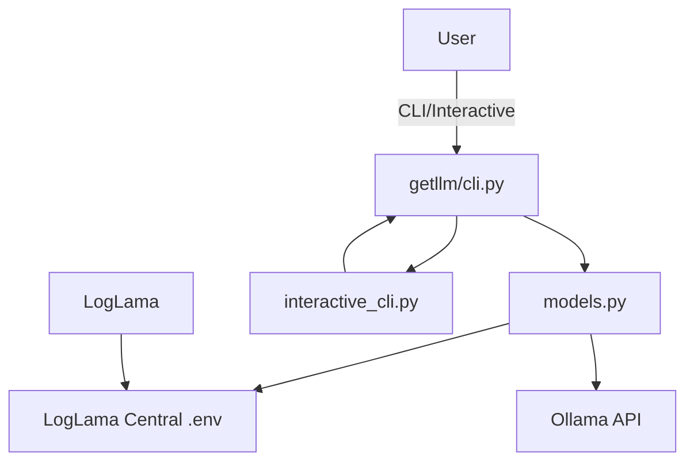
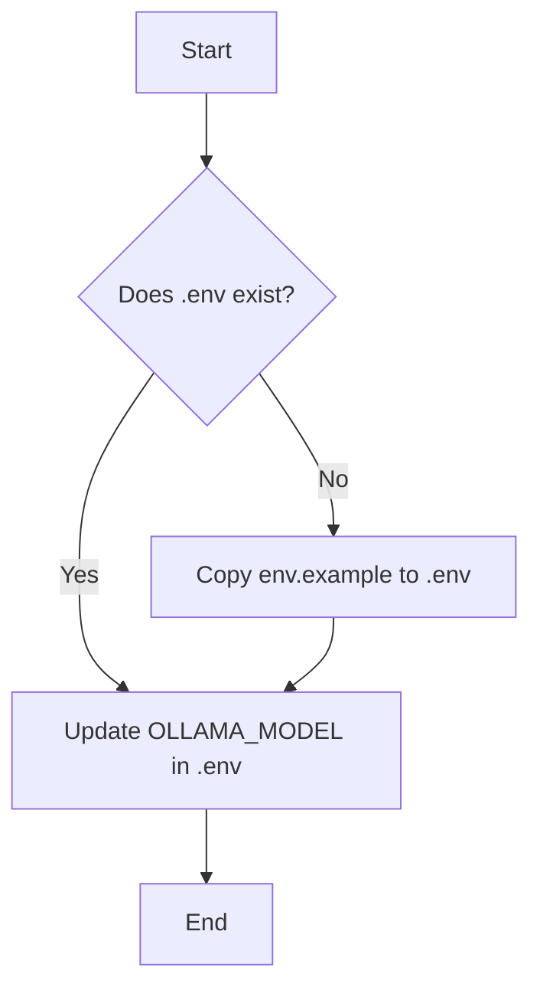

# getllm

getllm is a Python package for managing LLM models with Ollama integration. It allows you to install, list, set the default model, and update the model list. PyLLM is part of the PyLama ecosystem and integrates with LogLama as the primary service for centralized logging and environment management.

## Ollama Integration

PyLLM provides comprehensive integration with Ollama for managing and using LLM models:

- **Model Management**: Install, list, and select models
- **Automatic Model Installation**: Automatically install models when they are not found
- **Fallback Mechanisms**: Use fallback models when the requested model is not available
- **Environment Configuration**: Configure Ollama through environment variables
- **Special Model Handling**: Special installation process for SpeakLeash Bielik models

## LogLama Integration

PyLLM integrates with LogLama as the primary service in the PyLama ecosystem. This integration provides:

- **Centralized Environment Management**: Environment variables are loaded from the central `.env` file in the `pylama` directory
- **Shared Configuration**: Model configurations are shared across all PyLama components
- **Dependency Management**: Dependencies are validated and installed by LogLama
- **Service Orchestration**: Services are started in the correct order using LogLama CLI
- **Centralized Logging**: All PyLLM operations are logged to the central LogLama system
- **Structured Logging**: Logs include component context for better filtering and analysis
- **Health Monitoring**: LogLama monitors PyLLM service health and availability

---

## General Diagram (Mermaid)


---

## ASCII Diagram: CLI Command Flow
```
User
    |
    v
+-----------------+
|   getllm CLI     |
+-----------------+
    |
    v
+-----------------+
|   models.py     |
+-----------------+
    |
+-----------------+
| LogLama Central |
|    .env File    |
+-----------------+
    |
+-----------------+
|  Ollama API     |
+-----------------+
```

---

## Modes

- **CLI**: `getllm <command>`
- **Interactive**: `getllm -i` or `getllm interactive`

---

## Installation

```bash
# Create a virtual environment
python -m venv venv
source venv/bin/activate  # On Windows: venv\Scripts\activate

# Install the package in development mode
pip install -e .  # This is important! Always install in development mode before starting
```

> **IMPORTANT**: Always run `pip install -e .` before starting the project to ensure all dependencies are properly installed and the package is available in development mode.

---

## Using the Makefile

PyLLM includes a Makefile to simplify common development tasks:

```bash
# Set up the project (creates a virtual environment and installs dependencies)
make setup

# Run the API server (default port 8001)
make run

# Run the API server on a custom port
make run PORT=8080

# The run-port command is also available for backward compatibility
make run-port PORT=8080

# Run tests
make test

# Format code with black
make format

# Lint code with flake8
make lint

# Clean up project (remove __pycache__, etc.)
make clean

# Show all available commands
make help
```

---

## Key Files

- `getllm/cli.py` – main CLI
- `getllm/interactive_cli.py` – interactive shell with menu and cursor selection
- `getllm/models.py` – model logic, .env/env.example handling, Ollama integration
- `.env`/`env.example` – environment config and default model

---

## Example Usage

### List available models
```bash
getllm list
```

### Install a model
```bash
getllm install deepseek-coder:6.7b
```

### Set default model
```bash
getllm set-default deepseek-coder:6.7b
```

### Show default model
```bash
getllm default
```

### Update model list from Ollama
```bash
getllm update
```

### Run interactive mode (menu, cursor selection)
```bash
getllm -i
```

---

## set_default_model function flow (Mermaid)


---

## Interactive mode - menu (ASCII)
```
+--------------------------------+
|  getllm - interactive mode       |
+--------------------------------+
| > List available models         |
|   Show default model           |
|   List installed models        |
|   Install model                |
|   Set default model            |
|   Update model list            |
|   Test default model           |
|   Exit                         |
+--------------------------------+
  (navigation: arrow keys + Enter)
```

---

## Installation

```bash
pip install getllm
```

## Usage

### Basic Model Management

```python
from getllm import get_models, get_default_model, set_default_model, install_model

# Get available models
models = get_models()
for model in models:
    print(f"{model['name']} - {model.get('desc', '')}")

# Get the current default model
default_model = get_default_model()
print(f"Current default model: {default_model}")

# Set a new default model
set_default_model("codellama:7b")

# Install a model
install_model("deepseek-coder:6.7b")
```

### Direct Ollama Integration

```python
from getllm import OllamaIntegration, get_ollama_integration, start_ollama_server

# Start the Ollama server if it's not already running
ollama = start_ollama_server()

# Or create an OllamaIntegration instance with a specific model
ollama = get_ollama_integration(model="codellama:7b")

# Check if the model is available
if ollama.check_model_availability():
    print(f"Model {ollama.model} is available")
else:
    print(f"Model {ollama.model} is not available")

    # Install the model
    if ollama.install_model(ollama.model):
        print(f"Successfully installed {ollama.model}")

# List installed models
installed_models = ollama.list_installed_models()
for model in installed_models:
    print(f"Installed model: {model['name']}")
```

## Environment Variables

The package uses the following environment variables for Ollama integration:

- `OLLAMA_PATH`: Path to the Ollama executable (default: 'ollama')
- `OLLAMA_MODEL`: Default model to use (default: 'codellama:7b')
- `OLLAMA_FALLBACK_MODELS`: Comma-separated list of fallback models (default: 'codellama:7b,phi3:latest,tinyllama:latest')
- `OLLAMA_AUTO_SELECT_MODEL`: Whether to automatically select an available model if the requested model is not found (default: 'true')
- `OLLAMA_AUTO_INSTALL_MODEL`: Whether to automatically install a model when it's not found (default: 'true')
- `OLLAMA_TIMEOUT`: API timeout in seconds (default: '30')

These variables can be set in a .env file in the project root directory or in the system environment.

## License
This project is licensed under the Apache 2.0 License (see LICENSE file).
