# MLOps-Forge

[](https://github.com/TaimoorKhan10/MLOps-Forge/actions)
[](https://github.com/TaimoorKhan10/MLOps-Forge)
[](https://www.python.org/)
[](https://github.com/TaimoorKhan10/MLOps-Forge/blob/main/LICENSE)
[](https://github.com/TaimoorKhan10/MLOps-Forge)

A complete production-ready MLOps framework with built-in distributed training, monitoring, and CI/CD. Deploy ML models to production with confidence using our battle-tested infrastructure. This project implements an end-to-end ML pipeline that follows industry best practices for developing, deploying, and maintaining ML models in production environments at scale.

## 📋 Table of Contents
- [Features](#-features)
- [Architecture](#️-architecture)
  - [Component Details](#component-details)
  - [System Flow](#system-flow)
- [Getting Started](#-getting-started)
  - [Prerequisites](#prerequisites)
  - [Installation](#installation)
  - [Configuration](#configuration)
- [Usage](#-usage)
  - [Data Pipeline](#data-pipeline)
  - [Model Training](#model-training)
  - [Model Deployment](#model-deployment)
  - [Monitoring](#monitoring)
- [CI/CD Pipeline](#-cicd-pipeline)
- [Development](#-development)
  - [Project Structure](#project-structure)
  - [Contributing](#contributing)
- [Advanced Usage](#-advanced-usage)
  - [Distributed Training](#distributed-training)
  - [A/B Testing](#ab-testing)
  - [Drift Detection](#drift-detection)
- [Security](#-security)
- [License](#-license)

## 🚀 Features

- **Automated Data Pipeline**: Robust data validation, cleaning, and feature engineering
- **Experiment Tracking**: Comprehensive version control for models, datasets, and hyperparameters with MLflow
- **Distributed Training**: GPU-accelerated training across multiple nodes for large models
- **Model Registry**: Centralized model storage and versioning with lifecycle management
- **Continuous Integration/Deployment**: Automated testing, validation, and deployment pipelines
- **Model Serving API**: Fast and scalable REST API with input validation and automatic documentation
- **Model Monitoring**: Performance tracking, drift detection, and automated retraining triggers
- **A/B Testing**: Framework for model experimentation and controlled rollouts
- **Infrastructure as Code**: Docker containers and Kubernetes configurations for reliable deployments

## 🏗️ Architecture

This system follows a modular microservice architecture with the following components:

```mermaid
graph TD
    %% Main title and styles
    classDef pipeline fill:#f0f6ff,stroke:#3273dc,color:#3273dc,stroke-width:2px
    classDef component fill:#ffffff,stroke:#209cee,color:#209cee,stroke-width:1.5px
    classDef note fill:#fffaeb,stroke:#ffdd57,color:#946c00,stroke-width:1px,stroke-dasharray:5 5
    classDef infra fill:#e3fcf7,stroke:#00d1b2,color:#00d1b2,stroke-width:1.5px,stroke-dasharray:5 5
    
    %% Infrastructure
    subgraph K8S["Kubernetes Cluster"]
        %% Data Pipeline
        subgraph DP["Data Pipeline"]
            DI[Data Ingestion]:::component
            DV[Data Validation]:::component
            FE[Feature Engineering]:::component
            FSN[Feature Store Integration]:::note
            
            DI --> DV
            DV --> FE
        end
        
        %% Model Training
        subgraph MT["Model Training"]
            ET[Experiment Tracking - MLflow]:::component
            DT[Distributed Training]:::component
            ME[Model Evaluation]:::component
            ABN[A/B Testing Framework]:::note
            
            ET --> DT
            DT --> ME
        end
        
        %% Model Registry
        subgraph MR["Model Registry"]
            MV[Model Versioning]:::component
            MS[Metadata Storage]:::component
            MCI[CI/CD Integration]:::note
            
            MV --> MS
        end
        
        %% API Layer
        subgraph API["API Layer"]
            FA[FastAPI Application]:::component
            PE[Prediction Endpoints]:::component
            HM[Health & Metadata APIs]:::component
            HPA[Horizontal Pod Autoscaling]:::note
            
            FA --> PE
            FA --> HM
        end
        
        %% Monitoring
        subgraph MON["Monitoring"]
            PM[Prometheus Metrics]:::component
            GD[Grafana Dashboards]:::component
            DD[Feature-level Drift Detection]:::component
            RT[Automated Retraining Triggers]:::component
            AM[Alert Manager Integration]:::note
            
            MPT[Model Performance Tracking]:::component
            DQM[Data Quality Monitoring]:::component
            ABT[A/B Testing Analytics]:::component
            LA[Log Aggregation]:::component
            DT2[Distributed Tracing]:::note
            
            PM --> GD
            PM --> DD
            DD --> RT
            MPT --> DQM
            DQM --> ABT
            ABT --> LA
        end
        
        %% Component relationships
        DP -->|Training Data| MT
        DP -->|Metadata| MR
        MT -->|Model Artifacts| MR
        MR -->|Latest Model| API
        API -->|Metrics| MON
        MT -->|Performance Metrics| MON
    end
    
    %% CI/CD Pipeline
    CICD[CI/CD Pipeline: GitHub Actions]:::infra
    CICD -->|Deploy| K8S
    
    %% Apply classes
    class DP,MT,MR,API,MON pipeline
```



### Component Details

1. **Data Pipeline**
   - **Data Ingestion**: Connectors for various data sources (databases, object storage, streaming)
   - **Data Validation**: Schema validation, data quality checks, and anomaly detection
   - **Feature Engineering**: Feature transformation, normalization, and feature store integration

2. **Model Training**
   - **Experiment Tracking**: MLflow integration for tracking parameters, metrics, and artifacts
   - **Distributed Training**: PyTorch distributed training for efficient model training
   - **Model Evaluation**: Comprehensive metrics calculation and validation

3. **Model Registry**
   - **Model Versioning**: Storage and versioning of models with metadata
   - **Artifact Management**: Efficient storage of model artifacts and associated files
   - **Deployment Management**: Tracking of model deployment status

4. **API Layer**
   - **FastAPI Application**: High-performance API with automatic OpenAPI documentation
   - **Prediction Endpoints**: RESTful endpoints for model inference
   - **Health & Metadata**: Endpoints for system health checks and model metadata

5. **Monitoring System**
   - **Metrics Collection**: Prometheus integration for metrics collection
   - **Drift Detection**: Statistical methods to detect data and concept drift
   - **Performance Tracking**: Continuous monitoring of model performance metrics
   - **Automated Retraining**: Triggers for retraining based on drift detection

### System Flow

1. **Development Workflow**:
   ```mermaid
   flowchart LR
       DS[Data Scientist] --> |Develops Model| DEV[Development Environment]
       DEV --> |Commits Code| GIT[Git Repository]
       GIT --> |Triggers| CI[CI/CD Pipeline]
       CI --> |Runs Tests| TEST[Test Suite]
       TEST --> |Validates Model| VAL[Model Validation]
       VAL --> |Performance Testing| PERF[Performance Tests]
       PERF --> |Builds| BUILD[Docker Image]
       BUILD --> |Deploys| DEPLOY[Kubernetes Cluster]
   ```

2. **Production Data Flow**:
   ```mermaid
   flowchart LR
       DATA[Data Sources] --> |Ingestion| PIPE[Data Pipeline]
       PIPE --> |Validated Data| TRAIN[Training Pipeline]
       TRAIN --> |Trained Model| REG[Model Registry]
       REG --> |Latest Model| API[API Service]
       API --> |Predictions| USERS[End Users]
       API --> |Metrics| MON[Monitoring]
       MON --> |Drift Detected| RETRAIN[Retraining Trigger]
       RETRAIN --> TRAIN
   ```

## 🚦 Getting Started

### Prerequisites

- Python 3.9+ with pip
- Docker and Docker Compose
- Kubernetes cluster (local or cloud-based)
- AWS account (for cloud deployment)

### Installation

```bash
# Clone the repository
git clone https://github.com/TaimoorKhan10/MLOps-Forge.git
cd MLOps-Forge

# Create and activate virtual environment
python -m venv venv
source venv/bin/activate  # On Windows: venv\Scripts\activate

# Install dependencies
pip install -e .
```

### Configuration

1. **Environment Variables**:
   Create a `.env` file based on the provided `.env.example`:

   ```
   # MLflow Configuration
   MLFLOW_TRACKING_URI=http://mlflow:5000
   MLFLOW_S3_ENDPOINT_URL=http://minio:9000
   
   # AWS Configuration for Deployment
   AWS_ACCESS_KEY_ID=your-access-key
   AWS_SECRET_ACCESS_KEY=your-secret-key
   AWS_REGION=us-west-2
   
   # Kubernetes Configuration
   K8S_NAMESPACE=mlops-production
   ```

2. **Infrastructure Setup**:
   ```bash
   # For local development with Docker Compose
   docker-compose up -d
   
   # For Kubernetes deployment
   kubectl apply -f infrastructure/kubernetes/
   ```

## 🧰 Usage

### Data Pipeline

```python
from mlops_production_system.pipeline import DataPipeline

# Initialize the pipeline
pipeline = DataPipeline(config_path="config/pipeline_config.yaml")

# Run the pipeline
processed_data = pipeline.run(input_data_path="data/raw/training_data.csv")
```

### Model Training

```python
from mlops_production_system.models import ModelTrainer
from mlops_production_system.training import distributed_trainer

# For single-node training
trainer = ModelTrainer(model_config="config/model_config.yaml")
model = trainer.train(X_train, y_train)
metrics = trainer.evaluate(X_test, y_test)

# For distributed training
distributed_trainer.run(
    model_class="mlops_production_system.models.CustomModel",
    data_path="data/processed/training_data.parquet",
    num_nodes=4
)
```

### Model Deployment

```bash
# Deploy model using CLI
mlops deploy --model-name="my-model" --model-version=1 --environment=production

# Or using the Python API
from mlops_production_system.deployment import ModelDeployer

deployer = ModelDeployer()
deployer.deploy(model_name="my-model", model_version=1, environment="production")
```

### Monitoring

```python
from mlops_production_system.monitoring import DriftDetector, PerformanceMonitor

# Monitor for drift
drift_detector = DriftDetector(reference_data="data/reference.parquet")
drift_results = drift_detector.detect(new_data="data/production_data.parquet")

# Monitor model performance
performance_monitor = PerformanceMonitor(model_name="my-model", model_version=1)
performance_metrics = performance_monitor.get_metrics(timeframe="last_24h")
```

## 🔄 CI/CD Pipeline

The system uses GitHub Actions for CI/CD pipeline, configured in `.github/workflows/main.yml`. The pipeline includes:

1. **Code Quality**:
   - Linting with flake8
   - Type checking with mypy
   - Security scanning with bandit

2. **Testing**:
   - Unit tests with pytest
   - Integration tests
   - Code coverage reporting

3. **Model Validation**:
   - Performance benchmarking
   - Model quality checks
   - Validation against baseline metrics

4. **Deployment**:
   - Docker image building
   - Image pushing to container registry
   - Kubernetes deployment updates

All secrets and credentials are stored securely in GitHub Secrets and only accessed during workflow execution.

## 👨‍💻 Development

### Project Structure

```
MLOps-Production-System/
├── .github/                  # GitHub Actions workflows
├── config/                   # Configuration files
├── data/                     # Data directories (gitignored)
├── docs/                     # Documentation
├── infrastructure/           # Infrastructure as code
│   ├── docker/               # Docker configurations
│   ├── kubernetes/           # Kubernetes manifests
│   └── terraform/            # Terraform for cloud resources
├── notebooks/                # Jupyter notebooks
├── scripts/                  # Utility scripts
├── src/                      # Source code
│   └── mlops_production_system/
│       ├── api/              # FastAPI application
│       ├── models/           # ML models
│       ├── pipeline/         # Data pipeline
│       ├── training/         # Training code
│       ├── monitoring/       # Monitoring tools
│       └── utils/            # Utilities
├── tests/                    # Test suite
├── .env.example              # Example environment variables
├── Dockerfile                # Main Dockerfile
├── pyproject.toml            # Project metadata
└── README.md                 # This file
```

### Contributing

We follow the GitFlow branching model:

1. Create a feature branch from `develop`: `git checkout -b feature/your-feature`
2. Make your changes and commit: `git commit -m "Add feature"`
3. Push your branch: `git push origin feature/your-feature`
4. Open a Pull Request against the `develop` branch

All PRs must pass CI checks and code review before being merged.

## 🔬 Advanced Usage

### Distributed Training

The system supports distributed training using PyTorch's DistributedDataParallel for efficient multi-node training:

```yaml
# Example Kubernetes configuration in infrastructure/kubernetes/distributed-training.yaml
apiVersion: batch/v1
kind: Job
metadata:
  name: distributed-training
spec:
  parallelism: 4
  template:
    spec:
      containers:
      - name: trainer
        image: your-registry/mlops-trainer:latest
        resources:
          limits:
            nvidia.com/gpu: 1
        env:
        - name: WORLD_SIZE
          value: "4"
```

### A/B Testing

The A/B testing framework allows comparing multiple models in production:

```python
from mlops_production_system.monitoring import ABTestingFramework

# Set up A/B test between two models
ab_test = ABTestingFramework()
ab_test.create_experiment(
    name="pricing_model_comparison",
    models=["pricing_model_v1", "pricing_model_v2"],
    traffic_split=[0.5, 0.5],
    evaluation_metric="conversion_rate"
)

# Get results
results = ab_test.get_results(experiment_name="pricing_model_comparison")
```

### Drift Detection

Detect data drift to trigger model retraining:

```python
from mlops_production_system.monitoring import DriftDetector

# Initialize with reference data distribution
detector = DriftDetector(
    reference_data="s3://bucket/reference_data.parquet",
    features=["feature1", "feature2", "feature3"],
    drift_method="wasserstein",
    threshold=0.1
)

# Check for drift in new data
drift_detected, drift_metrics = detector.detect(
    current_data="s3://bucket/production_data.parquet"
)

if drift_detected:
    # Trigger retraining
    from mlops_production_system.training import trigger_retraining
    trigger_retraining(model_name="my-model")
```

## 🔒 Security

This project follows security best practices:

- Secrets management via environment variables and Kubernetes secrets
- Regular dependency scanning for vulnerabilities
- Least privilege principle for all service accounts
- Network policies to restrict pod-to-pod communication
- Encryption of data at rest and in transit

## 📜 License

This project is licensed under the MIT License - see the LICENSE file for details.

---

*MLOps-Forge was created to demonstrate end-to-end machine learning operations and follows industry best practices for deploying ML models in production environments. Star us on [GitHub](https://github.com/TaimoorKhan10/MLOps-Forge) if you find this project useful!*

## 🔧 Technologies

- **ML Framework**: scikit-learn, PyTorch
- **Feature Store**: feast
- **Experiment Tracking**: MLflow
- **API**: FastAPI
- **Containerization**: Docker
- **Orchestration**: Kubernetes
- **CI/CD**: GitHub Actions
- **Infrastructure as Code**: Terraform
- **Monitoring**: Prometheus, Grafana

## 🛠️ Installation

### Prerequisites

- Python 3.9+
- Docker and Docker Compose
- Kubernetes (optional for local development)

### Setup

1. Clone the repository
   ```bash
   git clone https://github.com/TaimoorKhan10/MLOps-Production-System.git
   cd MLOps-Production-System
   ```

2. Create a virtual environment and install dependencies
   ```bash
   python -m venv venv
   source venv/bin/activate  # On Windows: venv\Scripts\activate
   pip install -r requirements.txt
   ```

3. Set up environment variables
   ```bash
   cp .env.example .env
   # Edit .env with your configuration
   ```

4. Start the development environment
   ```bash
   docker-compose up -d
   ```

## 📊 Demo

Access the demo application at http://localhost:8000 after starting the containers.

The demo includes:
- Model training dashboard
- Real-time inference API
- Performance monitoring

## 📚 Documentation

Comprehensive documentation is available in the `/docs` directory:

- [Data Pipeline](docs/data_pipeline.md)
- [Model Training](docs/model_training.md)
- [API Reference](docs/api_reference.md)
- [Deployment Guide](docs/deployment.md)
- [Monitoring](docs/monitoring.md)

## 🧪 Testing

Run the test suite:

```bash
pytest
```

## 🚢 Deployment

### Local Deployment

```bash
docker-compose up -d
```

### Cloud Deployment (AWS)

```bash
cd infrastructure/terraform
terraform init
terraform apply
```

## 📈 Monitoring

Access the monitoring dashboard at http://localhost:3000 after deployment.

## 🤝 Contributing

Contributions are welcome! Please check out our [contribution guidelines](CONTRIBUTING.md).

## 📄 License

This project is licensed under the MIT License - see the [LICENSE](LICENSE) file for details.
