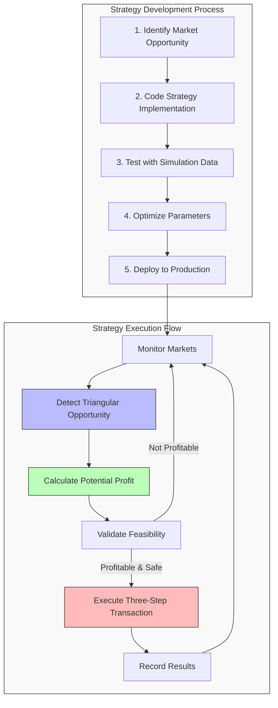
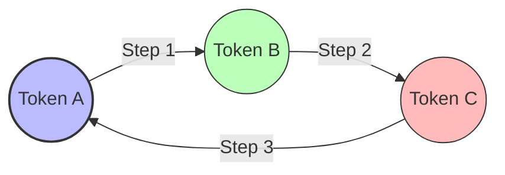

# Custom Strategy Example

This guide demonstrates how to create and implement a custom strategy for ON1Builder. We'll walk through creating a triangular arbitrage strategy as an example.

## Overview

In this example, we'll:

1. Create a custom triangular arbitrage strategy
2. Configure ON1Builder to use the custom strategy
3. Test and optimize the strategy
4. Deploy it on a live network



## What is Triangular Arbitrage?

Triangular arbitrage exploits price discrepancies between three related assets. For example:



1. Start with Token A
2. Trade Token A for Token B
3. Trade Token B for Token C
4. Trade Token C back to Token A
5. End with more of Token A than you started with

For our example, we'll implement a strategy that looks for triangular arbitrage opportunities between ETH, USDC, and a third token on Uniswap.

## Step 1: Create the Strategy Class

Create a new file at `src/on1builder/strategies/triangular_arbitrage.py`:

```python
"""
ON1Builder – Triangular Arbitrage Strategy
==========================================
This strategy looks for triangular arbitrage opportunities between three tokens
on a DEX like Uniswap.
"""

from decimal import Decimal
from typing import List, Dict, Any, Optional, Tuple

from web3 import Web3

from on1builder.strategies.base import Strategy
from on1builder.utils.math import calculate_price_impact, calculate_tokens_out
from on1builder.utils.logging import get_logger

logger = get_logger("TriangularArbitrage")

class TriangularArbitrageStrategy(Strategy):
    """
    Triangular arbitrage strategy that looks for profitable trading loops
    between three tokens on a DEX.
    """
    name = "triangular_arbitrage"
    description = "Executes triangular arbitrage between three tokens"
    
    def __init__(self, config, tx_core, market_monitor):
        super().__init__(config, tx_core, market_monitor)
        # Initialize strategy-specific components
        self.base_token_address = self.config.get("WETH_ADDRESS")
        self.stable_token_address = self.config.get("USDC_ADDRESS")
        self.dex_router_address = self.config.get("UNISWAP_ADDRESS")
        self.min_profitability = Decimal(self.config.get("MIN_PROFIT", "0.001"))
        
        # Load token list
        self.token_list = self._load_token_list()
        
        logger.info(f"Initialized Triangular Arbitrage strategy with "
                   f"{len(self.token_list)} tokens")
    
    def _load_token_list(self) -> List[Dict[str, Any]]:
        """Load the list of tokens to consider for the third vertex of the triangle."""
        # In a real implementation, load from a file or database
        # For this example, we'll return a hardcoded list
        return [
            {
                "address": "0x1f9840a85d5aF5bf1D1762F925BDADdC4201F984",  # UNI
                "symbol": "UNI",
                "decimals": 18
            },
            {
                "address": "0x514910771AF9Ca656af840dff83E8264EcF986CA",  # LINK
                "symbol": "LINK",
                "decimals": 18
            },
            {
                "address": "0x7Fc66500c84A76Ad7e9c93437bFc5Ac33E2DDaE9",  # AAVE
                "symbol": "AAVE", 
                "decimals": 18
            },
            # Add more tokens as needed
        ]
    
    async def find_opportunities(self) -> List[Dict[str, Any]]:
        """
        Find triangular arbitrage opportunities by checking prices
        for various token combinations.
        """
        opportunities = []
        base_amount = Web3.to_wei(0.1, 'ether')  # Start with 0.1 ETH
        
        for token in self.token_list:
            try:
                # Check the triangular path:
                # ETH -> USDC -> TOKEN -> ETH
                
                # 1. Simulate ETH -> USDC
                usdc_amount = await self._get_tokens_out(
                    self.base_token_address,
                    self.stable_token_address,
                    base_amount
                )
                
                if not usdc_amount:
                    continue
                
                # 2. Simulate USDC -> TOKEN
                token_amount = await self._get_tokens_out(
                    self.stable_token_address,
                    token["address"],
                    usdc_amount
                )
                
                if not token_amount:
                    continue
                
                # 3. Simulate TOKEN -> ETH
                final_eth_amount = await self._get_tokens_out(
                    token["address"],
                    self.base_token_address,
                    token_amount
                )
                
                if not final_eth_amount:
                    continue
                
                # Calculate profitability
                profit = final_eth_amount - base_amount
                profit_eth = Web3.from_wei(profit, 'ether')
                
                if profit > 0:
                    logger.debug(f"Found potential triangular arbitrage via {token['symbol']}: "
                               f"profit = {profit_eth} ETH")
                    
                    # Estimate gas cost
                    estimated_gas = 350000  # Typical gas for 3 swaps
                    gas_price = await self.tx_core.get_gas_price()
                    gas_cost = estimated_gas * gas_price
                    gas_cost_eth = Web3.from_wei(gas_cost, 'ether')
                    
                    # Calculate net profit after gas
                    net_profit = profit - gas_cost
                    net_profit_eth = Web3.from_wei(net_profit, 'ether')
                    
                    # Only consider if net profit meets minimum threshold
                    if net_profit > Web3.to_wei(self.min_profitability, 'ether'):
                        opportunity = {
                            "type": "triangular_arbitrage",
                            "base_token": {
                                "address": self.base_token_address,
                                "symbol": "ETH",
                                "amount": base_amount
                            },
                            "intermediate_token": {
                                "address": self.stable_token_address,
                                "symbol": "USDC",
                                "amount": usdc_amount
                            },
                            "third_token": {
                                "address": token["address"],
                                "symbol": token["symbol"],
                                "amount": token_amount
                            },
                            "final_amount": final_eth_amount,
                            "profit": profit,
                            "profit_eth": float(profit_eth),
                            "gas_cost": gas_cost,
                            "gas_cost_eth": float(gas_cost_eth),
                            "net_profit": net_profit,
                            "net_profit_eth": float(net_profit_eth),
                            "dex_router": self.dex_router_address
                        }
                        opportunities.append(opportunity)
                        logger.info(f"Found profitable triangular arbitrage via {token['symbol']}: "
                                   f"net profit = {net_profit_eth} ETH")
            
            except Exception as e:
                logger.error(f"Error checking triangular arbitrage for {token['symbol']}: {str(e)}")
        
        # Sort opportunities by profit (descending)
        return sorted(opportunities, key=lambda x: x['net_profit'], reverse=True)
    
    async def _get_tokens_out(self, token_in: str, token_out: str, amount_in: int) -> Optional[int]:
        """
        Simulate a token swap to get the expected output amount.
        
        Args:
            token_in: Address of input token
            token_out: Address of output token
            amount_in: Amount of input token
            
        Returns:
            Expected output amount or None if the call fails
        """
        try:
            # Get the router contract
            router = await self.tx_core.get_contract(
                self.dex_router_address, 
                "UNISWAP_ABI"
            )
            
            # Call getAmountsOut function to simulate the swap
            # This is Uniswap V2 style, adjust for other DEXes as needed
            result = await router.functions.getAmountsOut(
                amount_in,
                [token_in, token_out]
            ).call()
            
            return result[1]
        except Exception as e:
            logger.debug(f"Error getting tokens out for {token_in} -> {token_out}: {str(e)}")
            return None
    
    async def execute(self, opportunity: Dict[str, Any]) -> Dict[str, Any]:
        """
        Execute a triangular arbitrage opportunity.
        
        Args:
            opportunity: The opportunity data from find_opportunities
            
        Returns:
            Result of the execution
        """
        logger.info(f"Executing triangular arbitrage via {opportunity['third_token']['symbol']}")
        
        try:
            # Get the router contract
            router = await self.tx_core.get_contract(
                opportunity["dex_router"], 
                "UNISWAP_ABI"
            )
            
            # 1. Approve tokens if needed (for non-ETH tokens)
            
            # 2. Create the swap transaction
            # For simplicity, we'll do three separate swaps
            # In production, you might want to use a flashloan or create a custom contract
            
            # Swap 1: ETH -> USDC
            swap1_tx = await self._create_swap_tx(
                router,
                opportunity["base_token"]["address"],
                opportunity["intermediate_token"]["address"],
                opportunity["base_token"]["amount"],
                0  # Min amount out (we would calculate this with slippage in production)
            )
            
            # Execute the transaction
            receipt1 = await self.tx_core.send_transaction(swap1_tx)
            
            if not receipt1 or receipt1["status"] != 1:
                logger.error("First swap failed")
                return {"success": False, "error": "First swap failed"}
            
            # Swap 2: USDC -> TOKEN
            swap2_tx = await self._create_swap_tx(
                router,
                opportunity["intermediate_token"]["address"],
                opportunity["third_token"]["address"],
                opportunity["intermediate_token"]["amount"],
                0  # Min amount out
            )
            
            receipt2 = await self.tx_core.send_transaction(swap2_tx)
            
            if not receipt2 or receipt2["status"] != 1:
                logger.error("Second swap failed")
                return {"success": False, "error": "Second swap failed"}
            
            # Swap 3: TOKEN -> ETH
            swap3_tx = await self._create_swap_tx(
                router,
                opportunity["third_token"]["address"],
                opportunity["base_token"]["address"],
                opportunity["third_token"]["amount"],
                0  # Min amount out
            )
            
            receipt3 = await self.tx_core.send_transaction(swap3_tx)
            
            if not receipt3 or receipt3["status"] != 1:
                logger.error("Third swap failed")
                return {"success": False, "error": "Third swap failed"}
            
            # Calculate actual profit
            # In a real implementation, we would calculate this from the transaction receipts
            
            return {
                "success": True,
                "txs": [receipt1, receipt2, receipt3],
                "expected_profit": opportunity["net_profit_eth"]
            }
            
        except Exception as e:
            logger.error(f"Error executing triangular arbitrage: {str(e)}")
            return {"success": False, "error": str(e)}
    
    async def _create_swap_tx(self, router, token_in, token_out, amount_in, min_amount_out):
        """Create a transaction for swapping tokens."""
        # This is a simplified version - would need adjustments for actual implementation
        
        # Get the current block's deadline (10 minutes from now)
        block = await self.tx_core.web3.eth.get_block('latest')
        deadline = block.timestamp + 600
        
        # Create transaction
        tx = await router.functions.swapExactTokensForTokens(
            amount_in,
            min_amount_out,
            [token_in, token_out],
            self.tx_core.wallet_address,
            deadline
        ).build_transaction({
            'from': self.tx_core.wallet_address,
            'gas': 200000,  # Estimated gas limit
            'nonce': await self.tx_core.web3.eth.get_transaction_count(self.tx_core.wallet_address)
        })
        
        return tx
```

This implementation demonstrates the key components of a custom strategy:

- **Initialization**: Set up strategy-specific parameters
- **find_opportunities()**: Scan for potential trading opportunities
- **execute()**: Execute the identified opportunities
- **Helper methods**: Additional functionality needed by the strategy

## Step 2: Register the Strategy

Now, register the strategy with ON1Builder by creating a file at `src/on1builder/strategies/__init__.py` (or adding to it if it exists):

```python
from on1builder.strategies.base import Strategy
from on1builder.strategies.triangular_arbitrage import TriangularArbitrageStrategy

# Dictionary mapping strategy names to strategy classes
STRATEGY_REGISTRY = {
    "triangular_arbitrage": TriangularArbitrageStrategy,
    # Add other strategies here
}

def get_strategy_class(name):
    """Get a strategy class by name."""
    return STRATEGY_REGISTRY.get(name)

def register_strategy(strategy_class):
    """Register a new strategy class."""
    if not issubclass(strategy_class, Strategy):
        raise TypeError("Strategy must inherit from Strategy base class")
    STRATEGY_REGISTRY[strategy_class.name] = strategy_class
```

## Step 3: Configure ON1Builder to Use the Custom Strategy

Create a configuration file at `configs/chains/triangular_arbitrage_config.yaml`:

```yaml
# =============================================================================
# ON1Builder – Triangular Arbitrage Strategy Configuration
# =============================================================================

development:
  # -------------------------------------------------------------------------
  # Web3 connectivity
  # -------------------------------------------------------------------------
  CHAIN_ID: "1"
  CHAIN_NAME: "Ethereum Mainnet"
  HTTP_ENDPOINT: "https://mainnet.infura.io/v3/${INFURA_PROJECT_ID}"
  WEBSOCKET_ENDPOINT: "wss://mainnet.infura.io/ws/v3/${INFURA_PROJECT_ID}"
  INFURA_PROJECT_ID: "${INFURA_PROJECT_ID}"
  WEB3_MAX_RETRIES: 5
  WEB3_RETRY_DELAY: 2

  # -------------------------------------------------------------------------
  # Wallet / account
  # -------------------------------------------------------------------------
  WALLET_ADDRESS: "0xYourEthereumWalletAddress"  # Replace with your address
  WALLET_KEY: "${WALLET_KEY}"                   # From .env file
  MIN_BALANCE: 0.1                              # Minimum ETH balance

  # -------------------------------------------------------------------------
  # Contract addresses (Ethereum Mainnet)
  # -------------------------------------------------------------------------
  WETH_ADDRESS: "0xC02aaA39b223FE8D0A0e5C4F27eAD9083C756Cc2"
  USDC_ADDRESS: "0xA0b86991c6218b36c1d19D4a2e9Eb0cE3606eB48"
  UNISWAP_ADDRESS: "0x7a250d5630B4cF539739dF2C5dAcb4c659F2488D"

  # -------------------------------------------------------------------------
  # Strategy settings
  # -------------------------------------------------------------------------
  # Enable our custom strategy
  ENABLED_STRATEGIES: "triangular_arbitrage"
  
  # Strategy-specific settings
  MIN_PROFIT: 0.002                             # Minimum profit in ETH
  SCAN_INTERVAL: 30                             # Scan for opportunities every 30 seconds
  MAX_EXECUTION_TIME: 5.0                       # Maximum execution time in seconds
  
  # For initial testing, start with DRY_RUN: true
  DRY_RUN: true                                 # Simulate without executing
  GO_LIVE: false                                # Set to true for execution
  
  # -------------------------------------------------------------------------
  # Safety parameters
  # -------------------------------------------------------------------------
  MAX_GAS_PRICE_GWEI: 100                       # Maximum gas price in Gwei
  GAS_PRICE_STRATEGY: "fast"                    # Gas price strategy
  SLIPPAGE_DEFAULT: 0.05                        # Default slippage (5%)
  
  # -------------------------------------------------------------------------
  # Monitoring configuration
  # -------------------------------------------------------------------------
  LOG_LEVEL: "INFO"                             # Logging level
  LOG_TO_FILE: true                             # Enable file logging
  LOG_DIR: "data/logs"                          # Log directory
  
  ENABLE_PROMETHEUS: true                       # Enable Prometheus metrics
  PROMETHEUS_PORT: 9090                         # Prometheus port

production:
  # Override settings for production environment
  DRY_RUN: false
  GO_LIVE: true
  MIN_PROFIT: 0.003
  MAX_GAS_PRICE_GWEI: 80
```

## Step 4: Create and Register Strategy-Specific Metrics

To track strategy performance, let's create custom metrics. Add to `src/on1builder/monitoring/metrics.py`:

```python
# Add to existing metrics or create if needed

# Triangular arbitrage metrics
triangular_opportunities_total = Counter(
    'on1builder_triangular_opportunities_total',
    'Total number of triangular arbitrage opportunities found',
    ['token_symbol']
)

triangular_executions_total = Counter(
    'on1builder_triangular_executions_total',
    'Total number of triangular arbitrage executions',
    ['token_symbol', 'status']
)

triangular_profit_total = Counter(
    'on1builder_triangular_profit_total',
    'Total profit from triangular arbitrage in ETH',
    ['token_symbol']
)

triangular_scan_duration = Histogram(
    'on1builder_triangular_scan_duration_seconds',
    'Duration of triangular arbitrage opportunity scanning',
    buckets=[0.1, 0.5, 1.0, 2.0, 5.0, 10.0]
)
```

## Step 5: Test the Strategy in Dry Run Mode

Run ON1Builder with the new strategy in dry run mode:

```bash
python -m on1builder run --config configs/chains/triangular_arbitrage_config.yaml
```

In dry run mode, ON1Builder will:
1. Connect to Ethereum Mainnet
2. Load the triangular arbitrage strategy
3. Scan for triangular arbitrage opportunities
4. Simulate and log potential opportunities without executing them

Watch the logs to see if the strategy is identifying opportunities.

## Step 6: Optimize the Strategy

After testing in dry run mode, you might want to optimize the strategy:

1. **Token Selection**: Adjust the token list to focus on high-liquidity tokens
2. **Gas Optimization**: Optimize execution to reduce gas costs
3. **Slippage Handling**: Improve slippage calculation for more accurate profitability estimates
4. **Path Finding**: Implement more efficient path finding algorithms

For example, to optimize token selection, you could modify the `_load_token_list` method to prioritize tokens based on liquidity:

```python
def _load_token_list(self) -> List[Dict[str, Any]]:
    """Load the list of tokens to consider for the third vertex of the triangle."""
    # Load tokens from a file
    with open(self.config.get("TOKEN_LIST_PATH", "resources/tokens/chainid-1/address2symbol.json.json"), "r") as f:
        tokens = json.load(f)
    
    # Filter tokens by minimum liquidity
    min_liquidity = Decimal(self.config.get("MIN_TOKEN_LIQUIDITY", "1000000"))
    filtered_tokens = []
    
    for token in tokens:
        # Get token liquidity
        liquidity = await self._get_token_liquidity(token["address"])
        if liquidity >= min_liquidity:
            token["liquidity"] = liquidity
            filtered_tokens.append(token)
    
    # Sort by liquidity (descending)
    sorted_tokens = sorted(filtered_tokens, key=lambda x: x["liquidity"], reverse=True)
    
    # Take top N tokens
    max_tokens = int(self.config.get("MAX_TOKENS", "20"))
    return sorted_tokens[:max_tokens]
```

## Step 7: Implement Advanced Features

To make the strategy more robust, you could add advanced features:

### Flash Loan Integration

Instead of executing three separate swaps, use a flash loan to execute the entire arbitrage in a single transaction:

```python
async def execute_with_flash_loan(self, opportunity):
    """Execute triangular arbitrage using a flash loan."""
    # Use flash loan provider (e.g., Aave, DyDx)
    flash_loan_amount = opportunity["base_token"]["amount"]
    
    # Build flash loan transaction
    # This would call a custom smart contract that:
    # 1. Borrows ETH in a flash loan
    # 2. Executes the three swaps
    # 3. Repays the flash loan with a portion of the profit
    # 4. Returns remaining profit to the wallet
    
    # Sample pseudocode for flash loan execution:
    contract = await self.tx_core.get_contract(self.flash_loan_executor_address, "FLASH_LOAN_ABI")
    
    tx = await contract.functions.executeTriangularArbitrage(
        opportunity["base_token"]["address"],
        opportunity["intermediate_token"]["address"],
        opportunity["third_token"]["address"],
        opportunity["dex_router"],
        flash_loan_amount
    ).build_transaction({
        'from': self.tx_core.wallet_address,
        'gas': 500000,
        'nonce': await self.tx_core.web3.eth.get_transaction_count(self.tx_core.wallet_address)
    })
    
    return await self.tx_core.send_transaction(tx)
```

### Multi-DEX Support

Extend the strategy to check prices across multiple DEXes:

```python
async def find_opportunities(self):
    """Find triangular arbitrage opportunities across multiple DEXes."""
    opportunities = []
    
    # List of DEXes to check
    dexes = [
        {"name": "Uniswap", "router": self.config.get("UNISWAP_ADDRESS"), "abi": "UNISWAP_ABI"},
        {"name": "SushiSwap", "router": self.config.get("SUSHISWAP_ADDRESS"), "abi": "SUSHISWAP_ABI"},
        # Add more DEXes as needed
    ]
    
    # For each token, check triangular paths across all DEXes
    for token in self.token_list:
        for dex1 in dexes:
            for dex2 in dexes:
                for dex3 in dexes:
                    # Check arbitrage path across three DEXes
                    # ETH on DEX1 -> USDC on DEX2 -> TOKEN on DEX3 -> ETH
                    
                    # Calculate profitability
                    # Add to opportunities if profitable
    
    return opportunities
```

### Market Impact Analysis

Add market impact analysis to more accurately estimate profitability:

```python
async def calculate_market_impact(self, token_address, amount, is_buy):
    """Calculate the price impact of a trade."""
    # Get pool reserves
    pool = await self._get_pool(token_address, self.base_token_address)
    
    if is_buy:
        # Buying token with ETH
        return calculate_price_impact(
            amount, 
            pool["reserve_eth"], 
            pool["reserve_token"]
        )
    else:
        # Selling token for ETH
        return calculate_price_impact(
            amount, 
            pool["reserve_token"], 
            pool["reserve_eth"]
        )
```

## Step 8: Going Live

Once you're satisfied with the strategy in dry run mode, you can go live:

1. Edit the configuration file:
   ```yaml
   DRY_RUN: false
   GO_LIVE: true
   ```

2. Or run with the production environment:
   ```bash
   python -m on1builder run --config configs/chains/triangular_arbitrage_config.yaml --environment production
   ```

**Important**: Always start with small amounts and gradually increase as you gain confidence in the strategy.

## Step 9: Monitor and Analyze Performance

Use the monitoring tools to track strategy performance:

```bash
# Check logs
tail -f data/logs/on1builder.log

# Watch Prometheus metrics
curl http://localhost:9090/metrics | grep triangular

# Set up Grafana dashboard
# Create a custom dashboard focusing on the triangular arbitrage metrics
```

## Advanced Configuration Options

Here are some additional configuration options for fine-tuning the strategy:

```yaml
# Advanced strategy settings
TRIANGULAR_SCAN_INTERVAL: 15           # Scan every 15 seconds
TRIANGULAR_MAX_TOKENS: 50              # Maximum tokens to check
TRIANGULAR_MIN_LIQUIDITY: 1000000      # Minimum token liquidity in USD
TRIANGULAR_USE_FLASH_LOAN: true        # Use flash loans for execution
TRIANGULAR_MIN_PRICE_DIFF: 0.005       # Minimum price difference (0.5%)
TRIANGULAR_TOKEN_BLACKLIST: "SUSHI,YFI" # Tokens to exclude
```

## Troubleshooting Common Issues

1. **No Opportunities Found**:
   - Check token liquidity requirements
   - Verify that price feeds are working correctly
   - Ensure gas estimates are accurate

2. **Execution Failures**:
   - Check for sufficient token approvals
   - Verify that slippage parameters are appropriate
   - Monitor for front-running or sandwich attacks

3. **Timing Issues**:
   - Optimize execution speed
   - Use flash loans for atomic execution
   - Implement MEV protection mechanisms

## Conclusion

This example demonstrates how to create, configure, test, and optimize a custom triangular arbitrage strategy for ON1Builder. The modular architecture of ON1Builder makes it easy to extend with custom strategies, allowing you to implement your own trading logic while leveraging the framework's infrastructure for connectivity, transaction management, and monitoring.

For more ideas on custom strategies, explore:

- Flash loan arbitrage
- Liquidation strategies
- Sandwich trading
- NFT trading strategies
- Token launch strategies

Refer to the [Configuration Reference](../reference/configuration_reference.md) for all available configuration options, and the [Architecture Overview](../reference/architecture.md) for details on how to integrate custom components with the ON1Builder framework.
