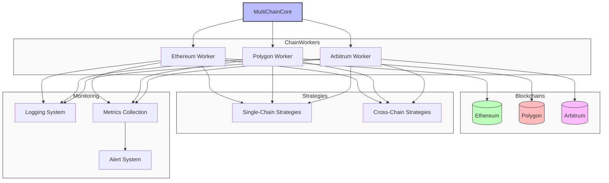

# Multi-Chain Example

This guide demonstrates how to configure and run ON1Builder across multiple blockchain networks simultaneously. We'll walk through a complete example from configuration to execution.

## Overview

In this example, we'll set up ON1Builder to:

1. Connect to three blockchain networks (Ethereum Mainnet, Polygon, and Arbitrum)
2. Monitor opportunities across all three chains
3. Execute cross-chain and single-chain strategies
4. Log and monitor the results across all networks



## Prerequisites

Before following this example, make sure you have:

- [Installed ON1Builder](../guides/installation.md)
- Wallet addresses on all target chains with sufficient funds
- Access to nodes for all chains (via Infura, Alchemy, or your own nodes)
- API keys as needed (Infura, Etherscan, Polygonscan, etc.)

## Step 1: Setting Up Environment Variables

Create a `.env` file in your project root:

```
# API Keys
INFURA_PROJECT_ID=your_infura_project_id
ALCHEMY_API_KEY=your_alchemy_api_key
ETHERSCAN_API_KEY=your_etherscan_api_key
POLYGONSCAN_API_KEY=your_polygonscan_api_key
ARBISCAN_API_KEY=your_arbiscan_api_key
COINGECKO_API_KEY=your_coingecko_api_key

# Wallet Information (use separate wallets for production)
ETH_WALLET_KEY=your_ethereum_private_key_without_0x_prefix
POLYGON_WALLET_KEY=your_polygon_private_key_without_0x_prefix
ARBITRUM_WALLET_KEY=your_arbitrum_private_key_without_0x_prefix

# Settings for testing
DEBUG=true
```

Replace all placeholders with your actual values.

## Step 2: Creating the Multi-Chain Configuration File

Create a file named `multi_chain_config.yaml` in the `configs/chains/` directory:

```yaml
# =============================================================================
# ON1Builder – Multi-Chain Configuration Example
# =============================================================================

common:
  # -------------------------------------------------------------------------
  # Multi-chain settings
  # -------------------------------------------------------------------------
  # Comma-separated list of chain IDs to enable
  CHAINS: "1,137,42161"
  
  # -------------------------------------------------------------------------
  # Chain-specific settings for Ethereum Mainnet (Chain ID: 1)
  # -------------------------------------------------------------------------
  CHAIN_1_CHAIN_NAME: "Ethereum Mainnet"
  CHAIN_1_HTTP_ENDPOINT: "https://mainnet.infura.io/v3/${INFURA_PROJECT_ID}"
  CHAIN_1_WEBSOCKET_ENDPOINT: "wss://mainnet.infura.io/ws/v3/${INFURA_PROJECT_ID}"
  CHAIN_1_WALLET_ADDRESS: "0xYourEthereumWalletAddress"
  CHAIN_1_WALLET_KEY: "${ETH_WALLET_KEY}"
  CHAIN_1_BLOCK_TIME: 12.0
  CHAIN_1_MAX_GAS_PRICE_GWEI: 150
  CHAIN_1_GAS_PRICE_STRATEGY: "fast"
  CHAIN_1_USE_EIP1559: true
  CHAIN_1_PRIORITY_FEE_GWEI: 1.5
  
  # Token addresses for Ethereum
  CHAIN_1_WETH_ADDRESS: "0xC02aaA39b223FE8D0A0e5C4F27eAD9083C756Cc2"
  CHAIN_1_USDC_ADDRESS: "0xA0b86991c6218b36c1d19D4a2e9Eb0cE3606eB48"
  CHAIN_1_USDT_ADDRESS: "0xdAC17F958D2ee523a2206206994597C13D831ec7"
  CHAIN_1_UNISWAP_ADDRESS: "0x7a250d5630B4cF539739dF2C5dAcb4c659F2488D"
  CHAIN_1_SUSHISWAP_ADDRESS: "0xd9e1cE17f2641f24aE83637ab66a2cca9C378B9F"
  
  # -------------------------------------------------------------------------
  # Chain-specific settings for Polygon (Chain ID: 137)
  # -------------------------------------------------------------------------
  CHAIN_137_CHAIN_NAME: "Polygon Mainnet"
  CHAIN_137_HTTP_ENDPOINT: "https://polygon-rpc.com"
  CHAIN_137_WEBSOCKET_ENDPOINT: "wss://polygon-rpc.com"
  CHAIN_137_WALLET_ADDRESS: "0xYourPolygonWalletAddress"
  CHAIN_137_WALLET_KEY: "${POLYGON_WALLET_KEY}"
  CHAIN_137_BLOCK_TIME: 2.0
  CHAIN_137_MAX_GAS_PRICE_GWEI: 300
  CHAIN_137_GAS_PRICE_STRATEGY: "fast"
  CHAIN_137_USE_EIP1559: true
  CHAIN_137_PRIORITY_FEE_GWEI: 30.0
  
  # Token addresses for Polygon
  CHAIN_137_WETH_ADDRESS: "0x0d500B1d8E8eF31E21C99d1Db9A6444d3ADf1270"  # WMATIC
  CHAIN_137_USDC_ADDRESS: "0x2791Bca1f2de4661ED88A30C99A7a9449Aa84174"
  CHAIN_137_USDT_ADDRESS: "0xc2132D05D31c914a87C6611C10748AEb04B58e8F"
  CHAIN_137_QUICKSWAP_ADDRESS: "0xa5E0829CaCEd8fFDD4De3c43696c57F7D7A678ff"
  CHAIN_137_SUSHISWAP_ADDRESS: "0x1b02dA8Cb0d097eB8D57A175b88c7D8b47997506"
  
  # -------------------------------------------------------------------------
  # Chain-specific settings for Arbitrum (Chain ID: 42161)
  # -------------------------------------------------------------------------
  CHAIN_42161_CHAIN_NAME: "Arbitrum One"
  CHAIN_42161_HTTP_ENDPOINT: "https://arb1.arbitrum.io/rpc"
  CHAIN_42161_WEBSOCKET_ENDPOINT: "wss://arb1.arbitrum.io/ws"
  CHAIN_42161_WALLET_ADDRESS: "0xYourArbitrumWalletAddress"
  CHAIN_42161_WALLET_KEY: "${ARBITRUM_WALLET_KEY}"
  CHAIN_42161_BLOCK_TIME: 0.25
  CHAIN_42161_MAX_GAS_PRICE_GWEI: 10
  CHAIN_42161_GAS_PRICE_STRATEGY: "medium"
  
  # Token addresses for Arbitrum
  CHAIN_42161_WETH_ADDRESS: "0x82aF49447D8a07e3bd95BD0d56f35241523fBab1"
  CHAIN_42161_USDC_ADDRESS: "0xFF970A61A04b1cA14834A43f5dE4533eBDDB5CC8"
  CHAIN_42161_USDT_ADDRESS: "0xFd086bC7CD5C481DCC9C85ebE478A1C0b69FCbb9"
  CHAIN_42161_UNISWAP_ADDRESS: "0xE592427A0AEce92De3Edee1F18E0157C05861564"
  CHAIN_42161_SUSHISWAP_ADDRESS: "0x1b02dA8Cb0d097eB8D57A175b88c7D8b47997506"
  
  # -------------------------------------------------------------------------
  # Global settings for all chains
  # -------------------------------------------------------------------------
  # Execution control
  DRY_RUN: true
  GO_LIVE: false
  
  # Parallel execution settings
  PARALLEL_CHAIN_EXECUTION: true
  MAX_PARALLEL_CHAINS: 3
  
  # Risk management
  MIN_PROFIT: 0.001
  SLIPPAGE_DEFAULT: 0.05
  
  # Monitoring
  LOG_LEVEL: "INFO"
  LOG_TO_FILE: true
  LOG_DIR: "data/logs"
  
  ENABLE_PROMETHEUS: true
  PROMETHEUS_PORT: 9090
  
  # ABI files (common for all chains)
  ERC20_ABI: "resources/abi/erc20_abi.json"
  UNISWAP_ABI: "resources/abi/uniswap_abi.json"
  SUSHISWAP_ABI: "resources/abi/sushiswap_abi.json"
  
  # Cross-chain strategies
  ENABLE_CROSS_CHAIN_STRATEGIES: true
  CROSS_CHAIN_PAIRS:
    - ["ETH-USDC", "1", "137"]  # ETH-USDC between Ethereum and Polygon
    - ["ETH-USDC", "1", "42161"]  # ETH-USDC between Ethereum and Arbitrum
    - ["ETH-USDT", "1", "42161"]  # ETH-USDT between Ethereum and Arbitrum

# Production environment overrides common settings
production:
  DRY_RUN: false
  GO_LIVE: true
  MIN_PROFIT: 0.002
  SLIPPAGE_DEFAULT: 0.03
  
  # Chain-specific overrides
  CHAIN_1_MAX_GAS_PRICE_GWEI: 100
  CHAIN_137_MAX_GAS_PRICE_GWEI: 200
  CHAIN_42161_MAX_GAS_PRICE_GWEI: 5
```

Replace `0xYourEthereumWalletAddress`, `0xYourPolygonWalletAddress`, and `0xYourArbitrumWalletAddress` with your actual wallet addresses for each chain.

## Step 3: Validate the Configuration

Before running, let's validate the multi-chain configuration file:

```bash
python -m on1builder validate-config --config configs/chains/multi_chain_config.yaml
```

Fix any validation errors before proceeding.

## Step 4: Running in Dry Run Mode

First, let's run ON1Builder in dry run mode to test the multi-chain configuration without executing actual transactions:

```bash
python -m on1builder run --config configs/chains/multi_chain_config.yaml
```

In this mode, ON1Builder will:
1. Connect to all three blockchain networks
2. Start separate workers for each chain
3. Monitor for opportunities on all chains
4. Simulate profitable transactions without executing them
5. Log the results for each chain

In the terminal, you should see log output indicating the system is running, including connection status for each chain, block updates, and any opportunities found.

## Step 5: Running on a Specific Chain

If you want to focus on a single chain within your multi-chain configuration, you can specify the chain ID:

```bash
python -m on1builder run --config configs/chains/multi_chain_config.yaml --chain-id 1
```

This will run only the Ethereum Mainnet component of your multi-chain configuration.

## Step 6: Monitoring the Multi-Chain System

While ON1Builder is running, you can monitor it using several methods:

### Chain-Specific Logs

ON1Builder creates separate log files for each chain:

```bash
tail -f data/logs/on1builder_chain_1.log    # Ethereum logs
tail -f data/logs/on1builder_chain_137.log  # Polygon logs
tail -f data/logs/on1builder_chain_42161.log # Arbitrum logs
```

### Prometheus Metrics

Prometheus metrics are available with chain-specific labels:

```
http://localhost:9090/metrics
```

Sample metrics include:
- `on1builder_chain_block_number{chain_id="1"}`
- `on1builder_chain_block_number{chain_id="137"}`
- `on1builder_chain_block_number{chain_id="42161"}`
- `on1builder_gas_price_gwei{chain_id="1"}`
- `on1builder_transactions_total{chain_id="1",status="success"}`

### Grafana Dashboard

If you have Grafana set up with the provided dashboards, you can access the multi-chain dashboard at:

```
http://localhost:3000
```

The multi-chain dashboard shows metrics for all chains on a single interface, with the ability to filter by chain.

## Step 7: Going Live

Once you're satisfied with the dry run, you can switch to live mode:

1. Edit the configuration file and set:
   ```yaml
   DRY_RUN: false
   GO_LIVE: true
   ```

2. Or run with the production environment:
   ```bash
   python -m on1builder run --config configs/chains/multi_chain_config.yaml --environment production
   ```

**Important**: Always start with small amounts and carefully monitor the system when going live.

## Step 8: Chain-Specific Fine-Tuning

After running for a while, you may want to adjust settings for specific chains based on their performance:

### Ethereum (high gas, high value)

```yaml
CHAIN_1_MIN_PROFIT: 0.005  # Higher minimum profit due to high gas costs
CHAIN_1_GAS_PRICE_STRATEGY: "medium"  # Balance between cost and speed
CHAIN_1_MAX_EXECUTION_TIME: 3.0  # Lower execution time for faster markets
```

### Polygon (low gas, high throughput)

```yaml
CHAIN_137_MIN_PROFIT: 0.0005  # Lower minimum profit due to lower gas costs
CHAIN_137_SLIPPAGE_DEFAULT: 0.08  # Higher slippage due to higher volatility
CHAIN_137_MAX_CONCURRENT_TRANSACTIONS: 10  # More concurrent transactions
```

### Arbitrum (very low gas, fast blocks)

```yaml
CHAIN_42161_MIN_PROFIT: 0.0002  # Very low minimum profit due to very low gas
CHAIN_42161_GAS_PRICE_STRATEGY: "fast"  # Faster inclusion is affordable
CHAIN_42161_BLOCK_POLLING_INTERVAL: 0.2  # Faster polling for faster blocks
```

## Example Scenarios

### Scenario 1: Single-Chain Arbitrage

ON1Builder monitors for arbitrage opportunities within each chain independently:

**Ethereum Example:**
- Uniswap: 1 ETH = 2,000 USDC
- SushiSwap: 1 ETH = 2,010 USDC
- Transaction sequence:
  1. Swap 1 ETH for 2,000 USDC on Uniswap
  2. Swap 2,000 USDC for ~0.995 ETH on SushiSwap
  3. Net profit: ~0.005 ETH (minus gas costs)

**Polygon Example:**
- QuickSwap: 1 MATIC = 0.80 USDC
- SushiSwap: 1 MATIC = 0.82 USDC
- Transaction sequence:
  1. Swap 100 MATIC for 80 USDC on QuickSwap
  2. Swap 80 USDC for ~97.6 MATIC on SushiSwap
  3. Net profit: ~2.4 MATIC (minus gas costs)

### Scenario 2: Cross-Chain Arbitrage

ON1Builder also monitors for arbitrage opportunities across chains:

**ETH-USDC Between Ethereum and Arbitrum:**
- Ethereum Uniswap: 1 ETH = 2,000 USDC
- Arbitrum Uniswap: 1 ETH = 2,030 USDC
- Strategy:
  1. Identify the price difference
  2. Calculate expected profit after gas and bridge fees
  3. If profitable, execute using cross-chain liquidity providers
  4. Monitor and complete the cross-chain transaction

## Error Handling and Troubleshooting

If you encounter issues with multi-chain operation:

1. **Per-Chain Connection Problems**:
   - Check each RPC endpoint individually
   - Verify wallet addresses and keys for each chain
   - Ensure each chain's node is synced

2. **Resource Constraints**:
   - Reduce `MAX_PARALLEL_CHAINS` if system resources are limited
   - Increase memory allocation for running multiple chains
   - Consider dedicated hardware for production deployment

3. **Chain-Specific Issues**:
   - Ethereum: High gas costs making opportunities unprofitable
   - Polygon: Network congestion during peak times
   - Arbitrum: Sequencer delays affecting transaction timing

See the [Troubleshooting Guide](../guides/troubleshooting.md) for more detailed solutions.

## Advanced Multi-Chain Configuration

### Load Balancing Between Chains

You can prioritize chains based on their profitability:

```yaml
CHAIN_1_PRIORITY: 1    # Higher priority
CHAIN_137_PRIORITY: 2  # Medium priority
CHAIN_42161_PRIORITY: 3 # Lower priority
```

### Chain-Specific Strategies

Enable different strategies for different chains:

```yaml
CHAIN_1_STRATEGIES: "arbitrage,flash_loan"
CHAIN_137_STRATEGIES: "arbitrage"
CHAIN_42161_STRATEGIES: "arbitrage,liquidation"
```

### Cross-Chain Monitoring

Customize cross-chain monitoring settings:

```yaml
CROSS_CHAIN_UPDATE_INTERVAL: 30  # Update cross-chain prices every 30 seconds
CROSS_CHAIN_MIN_PRICE_DIFF: 0.01  # Minimum 1% price difference for opportunities
CROSS_CHAIN_BRIDGE_FEE_BUFFER: 0.002  # 0.2% buffer for bridge fees
```

## Docker Deployment for Multi-Chain

For production deployment, we recommend using Docker:

```bash
# Start in detached mode
docker-compose -f docker/compose/docker-compose.multi-chain.yml up -d

# View logs
docker-compose -f docker/compose/docker-compose.multi-chain.yml logs -f

# Stop the application
docker-compose -f docker/compose/docker-compose.multi-chain.yml down
```

## Scaling Considerations

As you add more chains:

1. **Hardware Requirements**:
   - 2GB RAM per chain (minimum)
   - 1 CPU core per 2-3 chains
   - Sufficient disk space for logs and data

2. **Network Bandwidth**:
   - Each WebSocket connection requires stable bandwidth
   - Plan for 10-20 Mbps per chain for smooth operation

3. **Distributed Deployment**:
   - Consider splitting chains across multiple servers
   - Use shared database for coordination
   - Implement centralized monitoring

## Conclusion

This example demonstrates running ON1Builder across multiple chains. After following these steps, you should have a working ON1Builder instance monitoring for and potentially executing opportunities across Ethereum, Polygon, and Arbitrum simultaneously.

For more advanced configuration options, refer to the [Configuration Reference](../reference/configuration_reference.md).

For single-chain operation, see the [Single Chain Example](single_chain_example.md).
