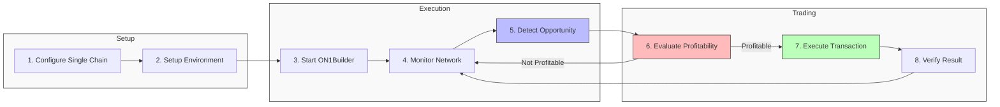

# Single Chain Example

This guide demonstrates how to configure and run ON1Builder on a single blockchain network. We'll walk through a complete example from configuration to execution.

## Overview

In this example, we'll set up ON1Builder to:

1. Connect to Ethereum Mainnet
2. Monitor for arbitrage opportunities between Uniswap and SushiSwap
3. Execute profitable trades when found
4. Log and monitor the results



## Prerequisites

Before following this example, make sure you have:

- [Installed ON1Builder](../guides/installation.md)
- An Ethereum wallet with some ETH for gas
- Access to an Ethereum node (via Infura, Alchemy, or your own node)
- API keys as needed (Infura, Etherscan, etc.)

## Step 1: Setting Up Environment Variables

Create a `.env` file in your project root:

```
# API Keys
INFURA_PROJECT_ID=your_infura_project_id
ETHERSCAN_API_KEY=your_etherscan_api_key
COINGECKO_API_KEY=your_coingecko_api_key

# Wallet Information
WALLET_KEY=your_private_key_without_0x_prefix

# Settings for testing
DEBUG=true
```

Replace `your_infura_project_id`, `your_etherscan_api_key`, `your_coingecko_api_key`, and `your_private_key_without_0x_prefix` with your actual values.

## Step 2: Creating the Configuration File

Create a file named `single_chain_config.yaml` in the `configs/chains/` directory with the following content:

```yaml
# =============================================================================
# ON1Builder – Single Chain Configuration Example
# =============================================================================

development:
  # -------------------------------------------------------------------------
  # Web3 connectivity
  # -------------------------------------------------------------------------
  CHAIN_ID: "1"
  CHAIN_NAME: "Ethereum Mainnet"
  HTTP_ENDPOINT: "https://mainnet.infura.io/v3/${INFURA_PROJECT_ID}"
  WEBSOCKET_ENDPOINT: "wss://mainnet.infura.io/ws/v3/${INFURA_PROJECT_ID}"
  INFURA_PROJECT_ID: "${INFURA_PROJECT_ID}"
  WEB3_MAX_RETRIES: 5
  WEB3_RETRY_DELAY: 2

  # -------------------------------------------------------------------------
  # Wallet / account
  # -------------------------------------------------------------------------
  WALLET_ADDRESS: "0xYourEthereumWalletAddress"  # Replace with your address
  WALLET_KEY: "${WALLET_KEY}"                   # From .env file
  MIN_BALANCE: 0.1                              # Minimum ETH balance

  # -------------------------------------------------------------------------
  # Contract addresses (Ethereum Mainnet)
  # -------------------------------------------------------------------------
  WETH_ADDRESS: "0xC02aaA39b223FE8D0A0e5C4F27eAD9083C756Cc2"
  USDC_ADDRESS: "0xA0b86991c6218b36c1d19D4a2e9Eb0cE3606eB48"
  USDT_ADDRESS: "0xdAC17F958D2ee523a2206206994597C13D831ec7"
  UNISWAP_ADDRESS: "0x7a250d5630B4cF539739dF2C5dAcb4c659F2488D"
  SUSHISWAP_ADDRESS: "0xd9e1cE17f2641f24aE83637ab66a2cca9C378B9F"

  # -------------------------------------------------------------------------
  # ABI + data files (relative to project root)
  # -------------------------------------------------------------------------
  ERC20_ABI: "resources/abi/erc20_abi.json"
  UNISWAP_ABI: "resources/abi/uniswap_abi.json"
  SUSHISWAP_ABI: "resources/abi/sushiswap_abi.json"
  TOKEN_ADDRESSES: "resources/tokens/chainid-1/symbol2address.json"
  TOKEN_SYMBOLS: "resources/tokens/chainid-1/address2symbol.json"

  # -------------------------------------------------------------------------
  # Safety parameters
  # -------------------------------------------------------------------------
  MAX_GAS_PRICE_GWEI: 100                       # Maximum gas price in Gwei
  GAS_PRICE_STRATEGY: "fast"                    # Gas price strategy
  PRIORITY_FEE_GWEI: 1.5                        # Priority fee for EIP-1559
  USE_EIP1559: true                             # Use EIP-1559 transactions
  
  MIN_PROFIT: 0.001                             # Minimum profit in ETH
  SLIPPAGE_DEFAULT: 0.05                        # Default slippage (5%)
  
  # For initial testing, start with DRY_RUN: true
  DRY_RUN: true                                 # Simulate without executing
  GO_LIVE: false                                # Set to true for execution
  
  # -------------------------------------------------------------------------
  # Monitoring configuration
  # -------------------------------------------------------------------------
  LOG_LEVEL: "INFO"                             # Logging level
  LOG_TO_FILE: true                             # Enable file logging
  LOG_DIR: "data/logs"                          # Log directory
  
  ENABLE_PROMETHEUS: true                       # Enable Prometheus metrics
  PROMETHEUS_PORT: 9090                         # Prometheus port
  
  # -------------------------------------------------------------------------
  # Alerting configuration (optional)
  # -------------------------------------------------------------------------
  # ENABLE_SLACK_ALERTS: true
  # SLACK_WEBHOOK_URL: "https://hooks.slack.com/services/..."
  # ENABLE_EMAIL_ALERTS: false

production:
  # Override settings for production environment
  DRY_RUN: false
  GO_LIVE: true
  LOG_LEVEL: "INFO"
  MIN_PROFIT: 0.002
  SLIPPAGE_DEFAULT: 0.03
  MAX_GAS_PRICE_GWEI: 150
```

Make sure to replace `0xYourEthereumWalletAddress` with your actual Ethereum wallet address.

## Step 3: Validate the Configuration

Before running, let's validate the configuration file:

```bash
python -m on1builder validate-config --config configs/chains/single_chain_config.yaml
```

If the validation is successful, you'll see a message confirming that the configuration is valid. If there are any issues, fix them before proceeding.

## Step 4: Running in Dry Run Mode

First, let's run ON1Builder in dry run mode to test that everything is working without executing actual transactions:

```bash
python -m on1builder run --config configs/chains/single_chain_config.yaml --environment development
```

In this mode, ON1Builder will:
1. Connect to Ethereum Mainnet
2. Monitor for opportunities
3. Simulate profitable transactions without executing them
4. Log the results

You should see log output indicating the system is running, including connection status, block updates, and any opportunities found.

## Step 5: Monitoring the System

While ON1Builder is running, you can monitor it using the following methods:

### Logs

Check the logs in the `data/logs` directory:

```bash
tail -f data/logs/on1builder.log
```

### Prometheus Metrics

If you have Prometheus set up, you can access the metrics at:

```
http://localhost:9090/metrics
```

### Grafana Dashboard

If you have Grafana set up with the provided dashboards, you can access it at:

```
http://localhost:3000
```

Login with the default credentials (username: `admin`, password: `admin`) and navigate to the ON1Builder dashboard.

## Step 6: Going Live

Once you're satisfied with the dry run, you can switch to live mode:

1. Edit the configuration file and set:
   ```yaml
   DRY_RUN: false
   GO_LIVE: true
   ```

2. Or run with the production environment:
   ```bash
   python -m on1builder run --config configs/chains/single_chain_config.yaml --environment production
   ```

**Important**: Always start with small amounts and carefully monitor the system when going live.

## Step 7: Fine-Tuning Parameters

After running for a while, you may want to fine-tune the parameters based on performance:

### Adjusting Profit Thresholds

If you're finding too few opportunities, you might lower the minimum profit threshold:

```yaml
MIN_PROFIT: 0.0005  # Lower the minimum profit requirement
```

### Optimizing Gas Settings

For faster transaction inclusion during high-congestion periods:

```yaml
GAS_PRICE_STRATEGY: "fast"
PRIORITY_FEE_GWEI: 2.0  # Increase priority fee
```

### Adjusting Slippage Tolerance

If transactions are failing due to price movements:

```yaml
SLIPPAGE_DEFAULT: 0.08  # Increase slippage tolerance
```

## Example Scenario: Arbitrage Between DEXes

This configuration is set up to detect and execute arbitrage opportunities between Uniswap and SushiSwap. Here's how it works:

1. ON1Builder monitors token prices on both Uniswap and SushiSwap
2. When a price discrepancy exceeds the gas costs plus minimum profit, an opportunity is found
3. The system simulates a transaction to buy on the lower-priced DEX and sell on the higher-priced DEX
4. If the simulation confirms profitability, the transaction is executed (when `GO_LIVE` is `true`)
5. The transaction is monitored until confirmation
6. Profits and transaction details are recorded

### Sample Transaction Sequence

For example, if WETH/USDC is priced at:
- Uniswap: 1 WETH = 2,000 USDC
- SushiSwap: 1 WETH = 2,010 USDC

ON1Builder might execute the following transaction sequence:
1. Swap 1 WETH for 2,000 USDC on Uniswap
2. Swap 2,000 USDC for ~0.995 WETH on SushiSwap
3. Net profit: ~0.005 WETH (minus gas costs)

## Error Handling and Troubleshooting

If you encounter issues, check:

1. **Connection Problems**:
   - Verify your Infura project ID is correct
   - Ensure you have internet connectivity
   - Check Ethereum network status

2. **Transaction Failures**:
   - Check your wallet has sufficient ETH for gas
   - Verify contract addresses are correct
   - Check for high network congestion

3. **Missing Opportunities**:
   - Your `MIN_PROFIT` might be set too high
   - Gas prices might be too high for profitable arbitrage
   - Market volatility might be low

See the [Troubleshooting Guide](../guides/troubleshooting.md) for more detailed solutions.

## Advanced Customization

For advanced users, you can customize the strategy behavior:

1. **Token Pairs**: Add specific token pairs to monitor in `resources/tokens/chainid-1/symbol2address.json`

2. **Custom Gas Strategies**: Create your own gas price strategy:

   ```yaml
   GAS_PRICE_STRATEGY: "custom"
   CUSTOM_GAS_PRICE_GWEI: 25
   ```

3. **Advanced Logging**: Enable detailed performance logging:

   ```yaml
   LOG_LEVEL: "DEBUG"
   PERFORMANCE_LOGGING: true
   ```

## Conclusion

This example demonstrates running ON1Builder on a single chain. After following these steps, you should have a working ON1Builder instance monitoring for and potentially executing arbitrage opportunities on Ethereum Mainnet.

For multi-chain configurations, see the [Multi-Chain Example](multi_chain_example.md).

For more advanced configuration options, refer to the [Configuration Reference](../reference/configuration_reference.md).
