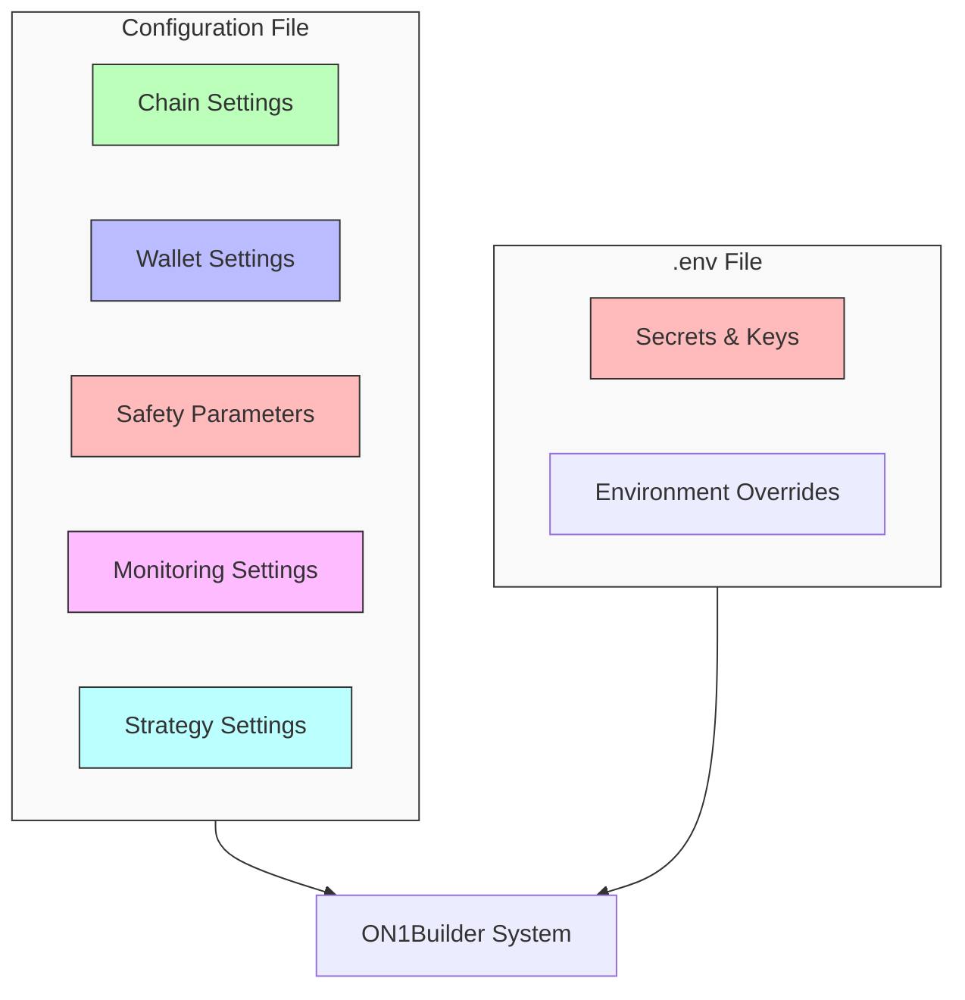

# ON1Builder Configuration Guide

This guide covers the configuration options for ON1Builder, explaining how to structure your configuration files and what each setting does.

## Configuration Files

ON1Builder uses YAML files for configuration. The main configuration files are:

- `configs/chains/config.yaml` - Single-chain configuration
- `configs/chains/config_multi_chain.yaml` - Multi-chain configuration
- `configs/chains/example_config.yaml` - Example with commented settings

Configuration is supplemented by environment variables, typically stored in a `.env` file in the project root.

## Configuration Structure

The configuration is organized into several sections:



1. **Chain Settings** - Blockchain-specific settings
2. **Wallet Settings** - Wallet and private key configuration
3. **Safety Parameters** - Risk management and safety settings
4. **Monitoring Settings** - Prometheus and alerting configuration
5. **Strategy Settings** - Strategy-specific parameters

## Basic Configuration Example

Here's a minimal configuration example for a single chain:

```yaml
# Chain information
CHAIN_ID: "1"
CHAIN_NAME: "Ethereum Mainnet"
HTTP_ENDPOINT: "https://mainnet.infura.io/v3/YOUR_INFURA_KEY"
WEBSOCKET_ENDPOINT: "wss://mainnet.infura.io/ws/v3/YOUR_INFURA_KEY"

# Wallet information
WALLET_ADDRESS: "0xYourEthereumWalletAddress"
WALLET_KEY: "${WALLET_KEY}"  # Referenced from .env file

# Safety parameters
MAX_GAS_PRICE_GWEI: 100
MIN_PROFIT: 0.001
SLIPPAGE_DEFAULT: 0.05

# Monitoring
ENABLE_PROMETHEUS: true
PROMETHEUS_PORT: 9090
ALERT_EMAIL: "alerts@example.com"
```

## Parameter Relationships

The following diagram shows how different configuration parameters relate to and affect each other:

```mermaid
flowchart LR
    subgraph ChainConfig["Chain Configuration"]
        CHAIN_ID --> HTTP_ENDPOINT
        CHAIN_ID --> WEBSOCKET_ENDPOINT
        CHAIN_NAME
    end
    
    subgraph TransactionConfig["Transaction Configuration"]
        MAX_GAS_PRICE_GWEI
        GAS_LIMIT_MULTIPLIER
        NONCE_MANAGEMENT_STRATEGY
    end
    
    subgraph SafetyConfig["Safety Configuration"]
        MIN_PROFIT
        SLIPPAGE_DEFAULT
        MAX_TRANSACTION_ATTEMPTS
        SIMULATION_REQUIRED
    end
    
    subgraph WalletConfig["Wallet Configuration"]
        WALLET_ADDRESS
        WALLET_KEY
    end
    
    subgraph MonitoringConfig["Monitoring Configuration"]
        ENABLE_PROMETHEUS
        PROMETHEUS_PORT
        LOG_LEVEL
        ALERT_EMAIL
    end
    
    ChainConfig --> TransactionConfig
    WalletConfig --> TransactionConfig
    TransactionConfig --> SafetyConfig
    SafetyConfig --> MonitoringConfig
    
    style ChainConfig fill:#bbf,stroke:#333,stroke-width:1px
    style TransactionConfig fill:#bfb,stroke:#333,stroke-width:1px
    style SafetyConfig fill:#fbb,stroke:#333,stroke-width:1px
    style WalletConfig fill:#fbf,stroke:#333,stroke-width:1px
    style MonitoringConfig fill:#bff,stroke:#333,stroke-width:1px
```



## Environment Variables

Sensitive information like private keys should be stored in the `.env` file:

```
# API Keys
INFURA_PROJECT_ID=your_infura_project_id
ETHERSCAN_API_KEY=your_etherscan_api_key
COINGECKO_API_KEY=your_coingecko_api_key

# Wallet Information
WALLET_KEY=your_private_key_without_0x_prefix

# Other Settings
DEBUG=false
```

## Chain-Specific Configuration

### Chain Information

These settings identify the blockchain and provide connection details:

| Setting | Description | Example |
|---------|-------------|---------|
| `CHAIN_ID` | Chain ID as a string | "1" for Ethereum Mainnet |
| `CHAIN_NAME` | Human-readable chain name | "Ethereum Mainnet" |
| `HTTP_ENDPOINT` | HTTP RPC endpoint URL | "https://mainnet.infura.io/v3/YOUR_KEY" |
| `WEBSOCKET_ENDPOINT` | WebSocket endpoint for real-time data | "wss://mainnet.infura.io/ws/v3/YOUR_KEY" |
| `IPC_ENDPOINT` | Optional IPC endpoint path | "/path/to/geth.ipc" |

### Wallet Settings

Wallet configuration for transaction signing:

| Setting | Description | Example |
|---------|-------------|---------|
| `WALLET_ADDRESS` | Public wallet address | "0x1234..." |
| `WALLET_KEY` | Private key (preferably from .env) | "${WALLET_KEY}" |
| `MIN_BALANCE` | Minimum balance to maintain (ETH) | 0.1 |

### Token Addresses

Configure the addresses of important tokens:

| Setting | Description | Example |
|---------|-------------|---------|
| `WETH_ADDRESS` | Wrapped ETH address | "0xC02aaA39b223FE8D0A0e5C4F27eAD9083C756Cc2" |
| `USDC_ADDRESS` | USDC token address | "0xA0b86991c6218b36c1d19d4a2e9eb0ce3606eb48" |
| `USDT_ADDRESS` | USDT token address | "0xdAC17F958D2ee523a2206206994597C13D831ec7" |

## Safety Parameters

These settings help manage risk and ensure profitability:

| Setting | Description | Example |
|---------|-------------|---------|
| `MAX_GAS_PRICE_GWEI` | Maximum gas price to use | 100 |
| `MIN_PROFIT` | Minimum profit threshold in ETH | 0.001 |
| `SLIPPAGE_DEFAULT` | Default slippage tolerance (0.1 = 10%) | 0.05 |
| `AGGRESSIVE_FRONT_RUN_MIN_VALUE_ETH` | Minimum value for aggressive strategies | 0.02 |

## Monitoring Configuration

Settings for system monitoring and alerting:

| Setting | Description | Example |
|---------|-------------|---------|
| `ENABLE_PROMETHEUS` | Enable Prometheus metrics | true |
| `PROMETHEUS_PORT` | Port for Prometheus metrics | 9090 |
| `ENABLE_SLACK_ALERTS` | Enable Slack alerting | true |
| `SLACK_WEBHOOK_URL` | Slack webhook URL | "https://hooks.slack.com/services/..." |
| `ENABLE_EMAIL_ALERTS` | Enable email alerting | true |
| `ALERT_EMAIL` | Email address for alerts | "alerts@example.com" |

## Advanced Configuration

### Multi-Chain Configuration

For running on multiple chains simultaneously, use a structure like:

```yaml
# Global settings that apply to all chains
global:
  ENABLE_PROMETHEUS: true
  PROMETHEUS_PORT: 9090
  MIN_PROFIT: 0.001
  # Other global settings...

# Chain-specific settings
chains:
  - CHAIN_ID: "1"
    CHAIN_NAME: "Ethereum Mainnet"
    HTTP_ENDPOINT: "https://mainnet.infura.io/v3/YOUR_KEY"
    WEBSOCKET_ENDPOINT: "wss://mainnet.infura.io/ws/v3/YOUR_KEY"
    WALLET_ADDRESS: "0xYourMainnetAddress"
    # Other Ethereum-specific settings...

  - CHAIN_ID: "137"
    CHAIN_NAME: "Polygon Mainnet"
    HTTP_ENDPOINT: "https://polygon-rpc.com"
    WEBSOCKET_ENDPOINT: "wss://polygon-rpc.com/ws"
    WALLET_ADDRESS: "0xYourPolygonAddress"
    # Other Polygon-specific settings...
```

### Custom Strategy Configuration

For configuring specific strategies:

```yaml
# Strategy settings
STRATEGIES:
  arbitrage:
    ENABLED: true
    MIN_PROFIT_THRESHOLD: 0.002
    MAX_SLIPPAGE: 0.02
    TOKENS:
      - "0xToken1Address"
      - "0xToken2Address"
  
  liquidation:
    ENABLED: false
    # Liquidation-specific settings...
```

## Configuration Validation

ON1Builder validates your configuration at startup. If there are any issues, detailed error messages will help you identify and fix problems.

To validate a configuration file without running the system:

```bash
python -m on1builder validate-config --config configs/chains/my_config.yaml
```

## Next Steps

Now that you understand how to configure ON1Builder, you can:

1. Customize your configuration for your specific needs
2. Proceed to the [Running Guide](running.md) to start using ON1Builder
3. Review the [Configuration Reference](../reference/configuration_reference.md) for a complete list of all configuration options
