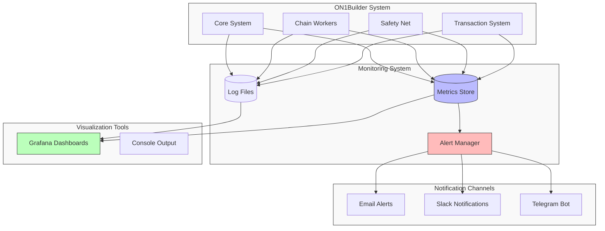
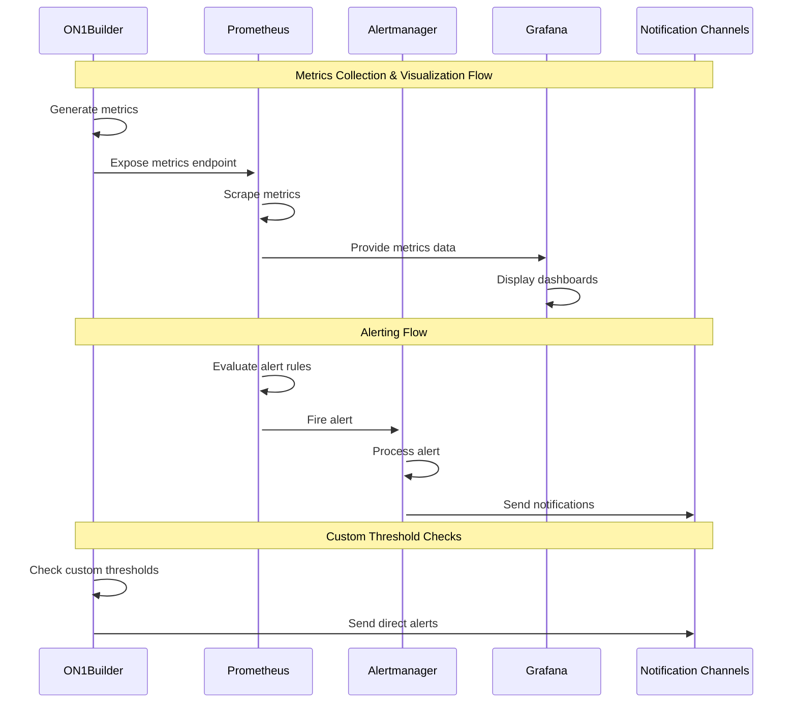
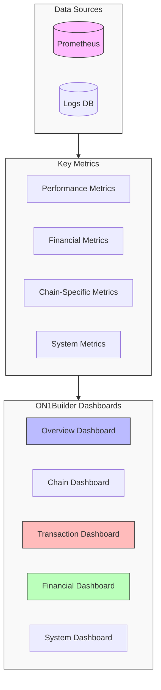
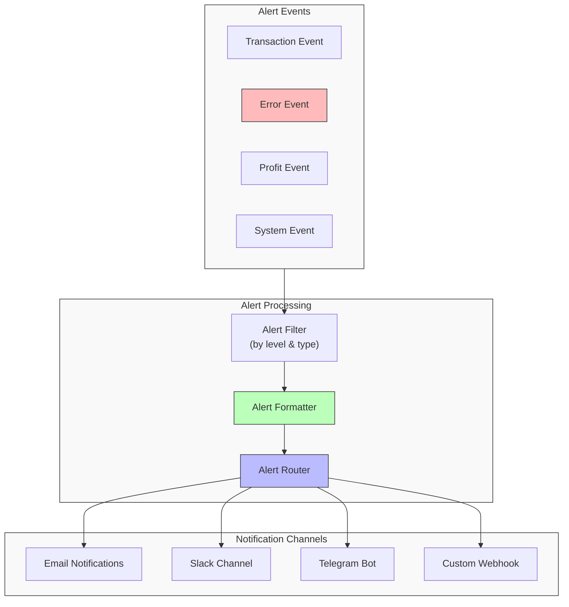

# ON1Builder Monitoring Guide

This guide covers the monitoring capabilities of ON1Builder, including metrics, logs, alerting, and dashboards for keeping track of your system's performance and status.

## Monitoring Architecture



## Monitoring Overview

ON1Builder provides comprehensive monitoring tools to help you:

1. **Track Performance**: Monitor transaction throughput, response times, and system resource usage
2. **Ensure Reliability**: Detect and respond to outages or errors
3. **Measure Profitability**: Track profits, gas costs, and other financial metrics
4. **Receive Alerts**: Get notified of important events or issues
5. **Visualize Data**: Use dashboards to understand system behavior

## Logging

### Log Configuration

ON1Builder writes detailed logs that can be configured in your configuration file:

```yaml
# Logging configuration
LOG_LEVEL: "INFO"  # Options: DEBUG, INFO, WARNING, ERROR
LOG_FORMAT: "detailed"  # Options: simple, detailed, json
LOG_TO_FILE: true
LOG_DIR: "data/logs"
```

### Log File Locations

Logs are written to the following locations:

- **Main log**: `data/logs/on1builder.log`
- **Transaction log**: `data/logs/transactions.log`
- **Error log**: `data/logs/error.log`

### Log Rotation

Logs are automatically rotated to prevent disk space issues:

- Logs rotate when they reach 100MB
- Up to 10 rotated log files are kept
- Older logs are compressed

### Reading the Logs

Logs contain structured information including:

- Timestamp
- Log level (DEBUG, INFO, WARNING, ERROR)
- Component (ChainWorker, SafetyNet, etc.)
- Message
- Additional context (transaction hash, values, etc.)

Example log entry:
```
2025-05-21 08:13:21 [INFO] ChainWorker: Initialized chain worker for Ethereum Mainnet (ID: 1)
```

## Prometheus Metrics

ON1Builder exposes metrics via Prometheus for real-time monitoring.



### Enabling Prometheus

In your configuration:

```yaml
# Prometheus configuration
ENABLE_PROMETHEUS: true
PROMETHEUS_PORT: 9090
PROMETHEUS_PATH: "/metrics"
```

### Available Metrics

The following metrics are available:

#### System Metrics
- `on1builder_system_memory_usage`: Memory usage in bytes
- `on1builder_system_cpu_usage`: CPU usage percentage
- `on1builder_uptime_seconds`: System uptime in seconds

#### Transaction Metrics
- `on1builder_transactions_total`: Total number of transactions
- `on1builder_transactions_success`: Number of successful transactions
- `on1builder_transactions_failed`: Number of failed transactions
- `on1builder_gas_price_gwei`: Current gas price in Gwei

#### Financial Metrics
- `on1builder_profit_total`: Total profit in ETH
- `on1builder_gas_spent_total`: Total gas spent in ETH
- `on1builder_wallet_balance`: Current wallet balance in ETH

#### Chain-Specific Metrics
- `on1builder_chain_block_number`: Latest block number per chain
- `on1builder_chain_transactions`: Transactions per chain
- `on1builder_chain_profit`: Profit per chain

### Accessing Prometheus Metrics

When enabled, metrics are available at:
```
http://your-server:9090/metrics
```

## Grafana Dashboards

ON1Builder includes pre-configured Grafana dashboards for visualizing metrics.



### Setting Up Grafana

1. Ensure Prometheus is enabled
2. Start Grafana (included in Docker setup)
3. Import the provided dashboards

Using Docker:
```bash
docker-compose -f docker/compose/docker-compose.prod.yml up -d
```

### Available Dashboards

ON1Builder includes several dashboards:

1. **Overview Dashboard**: System-wide metrics and status
2. **Chain Dashboard**: Per-chain metrics and performance
3. **Transaction Dashboard**: Detailed transaction metrics
4. **Financial Dashboard**: Profit, costs, and financial metrics
5. **System Dashboard**: Hardware and system performance

### Accessing Grafana

Grafana is available at:
```
http://your-server:3000
```

Default credentials (if using provided Docker setup):
- Username: `admin`
- Password: `admin`

## Alerting

ON1Builder can send alerts via multiple channels.



### Alert Channels

#### Email Alerts

Configure email alerts:
```yaml
ENABLE_EMAIL_ALERTS: true
ALERT_EMAIL: "alerts@example.com"
SMTP_SERVER: "smtp.example.com"
SMTP_PORT: 587
SMTP_USERNAME: "user@example.com"
SMTP_PASSWORD: "${SMTP_PASSWORD}"  # From .env
```

#### Slack Alerts

Configure Slack alerts:
```yaml
ENABLE_SLACK_ALERTS: true
SLACK_WEBHOOK_URL: "${SLACK_WEBHOOK_URL}"  # From .env
SLACK_CHANNEL: "#alerts"
```

#### Telegram Alerts

Configure Telegram alerts:
```yaml
ENABLE_TELEGRAM_ALERTS: true
TELEGRAM_BOT_TOKEN: "${TELEGRAM_BOT_TOKEN}"  # From .env
TELEGRAM_CHAT_ID: "${TELEGRAM_CHAT_ID}"  # From .env
```

### Alert Levels

Alerts are categorized by severity:

1. **INFO**: Informational alerts (successful transactions, etc.)
2. **WARNING**: Issues that require attention but aren't critical
3. **ERROR**: Problems that need immediate attention
4. **CRITICAL**: Severe issues that could impact system stability

Configure which levels trigger alerts:
```yaml
ALERT_LEVELS: ["ERROR", "CRITICAL"]  # Only send ERROR and CRITICAL alerts
```

### Alert Types

Configure which events trigger alerts:

```yaml
ALERT_ON_TRANSACTION: true  # Alert on transactions
ALERT_ON_ERROR: true  # Alert on errors
ALERT_ON_PROFIT: true  # Alert on profit events
ALERT_ON_SYSTEM: true  # Alert on system events
```

## Health Checks

ON1Builder provides health check endpoints for monitoring system health.

### Enabling Health Checks

In your configuration:
```yaml
ENABLE_HEALTH_CHECK: true
HEALTH_CHECK_PORT: 8080
HEALTH_CHECK_PATH: "/health"
```

### Health Check Endpoints

- `/health`: Overall system health
- `/health/chain/{chain_id}`: Health for a specific chain
- `/health/metrics`: Basic metrics in JSON format
- `/health/status`: Detailed status information

### Integrating with Monitoring Systems

The health check endpoints are compatible with:

- Kubernetes health probes
- AWS health checks
- Datadog
- Pingdom
- UptimeRobot

## Database Monitoring

If using a database for persistence:

### Transaction Tracking

All transactions are recorded with:
- Transaction hash
- Chain ID
- From/to addresses
- Value
- Gas price and usage
- Status
- Timestamp

### Profit Tracking

Profit records include:
- Transaction hash
- Profit amount
- Token address
- Strategy used
- Timestamp

### Database Maintenance

For production systems, regular database maintenance is recommended:

1. **Backups**: Configure regular backups
2. **Pruning**: Remove old data periodically
3. **Optimization**: Run optimization routines for large datasets

## Custom Monitoring

### Creating Custom Metrics

You can add custom metrics in your code:

```python
from on1builder.monitoring.metrics import metrics

# Creating and updating metrics
metrics.counter("custom_events_total").inc()
metrics.gauge("custom_value").set(42.0)
```

### Example: Monitor a Custom Strategy

```python
def execute_custom_strategy():
    # Track strategy execution time
    with metrics.timer("custom_strategy_execution_time"):
        # Strategy implementation
        result = perform_strategy()
        
    # Track success/failure
    if result.success:
        metrics.counter("custom_strategy_success").inc()
    else:
        metrics.counter("custom_strategy_failure").inc()
        
    # Track profit
    metrics.gauge("custom_strategy_profit").set(result.profit)
```

## Best Practices

### Monitoring Recommendations

1. **Set up alerts for critical issues**: Configure alerts for errors, low balance, or other critical conditions
2. **Monitor system resources**: Keep track of CPU, memory, and disk usage
3. **Track performance trends**: Watch for degradation in performance over time
4. **Review logs regularly**: Check logs for warnings or unexpected behavior
5. **Back up monitoring data**: Ensure your metrics and logs are backed up

### Recommended Monitoring Stack

For production deployments, we recommend:

1. **Prometheus** for metrics collection
2. **Grafana** for visualization
3. **Loki** for log aggregation
4. **Alertmanager** for alert management
5. **Grafana Cloud** or self-hosted Grafana Enterprise for team collaboration

## Troubleshooting Monitoring Issues

### Common Issues

1. **Metrics not appearing**: Check Prometheus configuration and ensure the server is reachable
2. **Dashboard shows no data**: Verify Prometheus data source in Grafana
3. **Alerts not triggering**: Check alert configurations and connection to alert channels
4. **High resource usage by monitoring**: Adjust scrape intervals or reduce metrics cardinality

### Debugging Steps

1. Check if Prometheus can reach the metrics endpoint:
   ```bash
   curl http://localhost:9090/metrics
   ```

2. Verify Grafana can access Prometheus:
   - Go to Grafana Configuration > Data Sources
   - Test the Prometheus connection

3. Test alert channels:
   ```bash
   python -m on1builder test-alert --config your_config.yaml
   ```

## Next Steps

Now that you understand how to monitor ON1Builder, you might want to:

1. Learn how to [troubleshoot common issues](troubleshooting.md)
2. Customize your [configuration](configuration.md) for better monitoring
3. Set up [custom dashboards](../reference/monitoring_reference.md) for your specific needs
