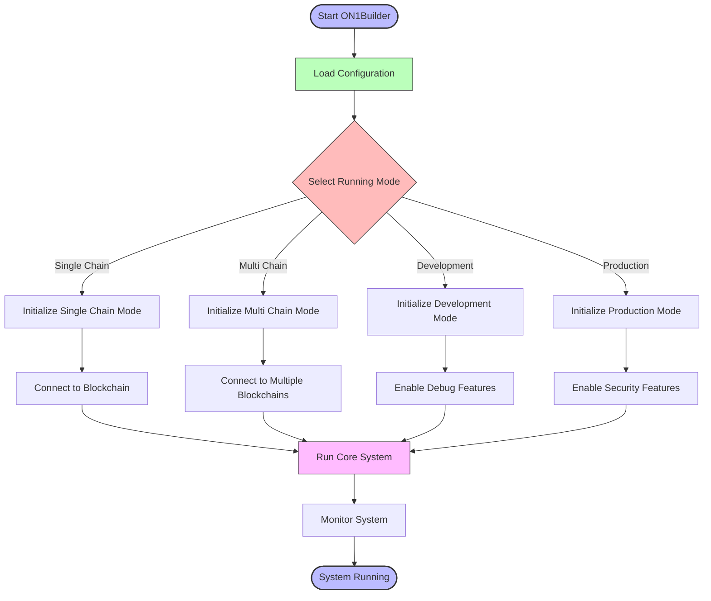
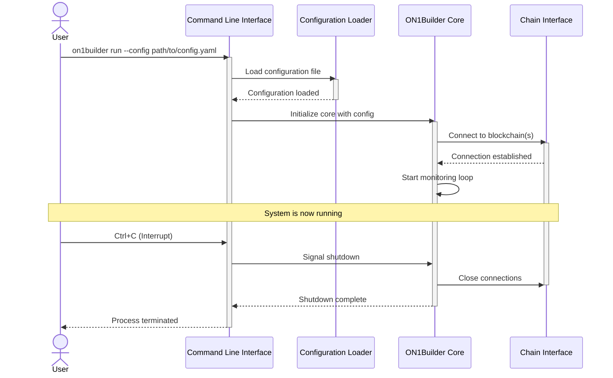

# Running ON1Builder

This guide covers the various ways to run ON1Builder, including command-line options, running modes, and production deployment.

## Running Modes

ON1Builder can be run in several modes:



1. **Single-Chain Mode**: Running on a single blockchain
2. **Multi-Chain Mode**: Running on multiple blockchains simultaneously
3. **Development Mode**: For testing and development
4. **Production Mode**: For secure, reliable production operation

## Prerequisites

Before running ON1Builder, ensure you have:

1. Completed the [installation process](installation.md)
2. Created a [configuration file](configuration.md)
3. Set up your wallet and obtained the necessary API keys

## Basic Command Line Usage

The basic command to run ON1Builder is:

```bash
python -m on1builder run --config CONFIG_PATH [OPTIONS]
```

Where:
- `CONFIG_PATH` is the path to your configuration YAML file
- `[OPTIONS]` are additional command-line parameters



### Common Command Line Options

| Option | Description |
|--------|-------------|
| `--config` | Path to configuration file |
| `--debug` | Enable debug logging |
| `--dry-run` | Simulate transactions without execution |
| `--chain-id` | Only run on specified chain ID (for multi-chain configs) |
| `--log-level` | Set logging level (DEBUG, INFO, WARNING, ERROR) |
| `--help` | Show help message and exit |

## Running in Single-Chain Mode

To run ON1Builder on a single blockchain:

```bash
python -m on1builder run --config configs/chains/config.yaml
```

This will:
1. Load the specified configuration
2. Connect to the blockchain
3. Start monitoring for opportunities
4. Execute transactions according to your configuration

## Running in Multi-Chain Mode

To run ON1Builder across multiple blockchains:

```bash
python -m on1builder run --config configs/chains/config_multi_chain.yaml
```

This will start separate workers for each chain defined in your multi-chain configuration.

## Development and Testing

### Dry Run Mode

To run in dry-run mode (simulating but not executing transactions):

```bash
python -m on1builder run --config configs/chains/config.yaml --dry-run
```

### Debug Mode

To enable more verbose logging:

```bash
python -m on1builder run --config configs/chains/config.yaml --debug
```

### Testing a Connection

To test that your blockchain connection is working without starting the full system:

```bash
python -m on1builder test-connection --config configs/chains/config.yaml
```

### Running in Testnet Mode

To run on a testnet, use a configuration file with testnet settings:

```bash
python -m on1builder run --config configs/chains/testnet_config.yaml
```

## Production Deployment

For production environments, we recommend using Docker for reliable operation.

### Using Docker

Start the application using Docker Compose:

```bash
# Start in detached mode
docker-compose -f docker/compose/docker-compose.prod.yml up -d

# View logs
docker-compose -f docker/compose/docker-compose.prod.yml logs -f

# Stop the application
docker-compose -f docker/compose/docker-compose.prod.yml down
```

### Using the Deployment Helper

The project includes a deployment helper script:

```bash
# Interactive deployment helper
./infra/bash/deploy_helper.sh
```

This script will guide you through deployment options including:
- Single-chain or multi-chain deployment
- Configuration validation
- Starting and stopping the application
- Viewing logs and monitoring data

## Monitoring Running Instances

While ON1Builder is running, you can:

1. Check logs in `data/logs/`
2. View Prometheus metrics at `http://localhost:9090` (if enabled)
3. Access Grafana dashboards at `http://localhost:3000` (if configured)

For more information on monitoring, see the [Monitoring Guide](monitoring.md).

## Command Line Interface Reference

ON1Builder includes a comprehensive CLI with the following commands:

### Main Commands

| Command | Description |
|---------|-------------|
| `run` | Run the main application |
| `test-connection` | Test blockchain connection |
| `validate-config` | Validate a configuration file |
| `version` | Show version information |

### Run Command Options

| Option | Description | Default |
|--------|-------------|---------|
| `--config` | Path to configuration file | Required |
| `--debug` | Enable debug logging | False |
| `--dry-run` | Simulate without execution | False |
| `--chain-id` | Only run on specified chain ID | All chains |
| `--log-level` | Set logging level | INFO |
| `--log-file` | Path to log file | `data/logs/on1builder.log` |

### Examples

Test a configuration file:
```bash
python -m on1builder validate-config --config configs/chains/my_config.yaml
```

Run with custom log file:
```bash
python -m on1builder run --config configs/chains/config.yaml --log-file custom_log.log
```

Run only on Ethereum Mainnet in a multi-chain configuration:
```bash
python -m on1builder run --config configs/chains/config_multi_chain.yaml --chain-id 1
```

## Stopping and Restarting

To gracefully stop a running instance:

1. If running in the foreground: Press `Ctrl+C`
2. If running in Docker: `docker-compose -f docker/compose/docker-compose.prod.yml down`
3. For emergency shutdown: `./infra/bash/emergency_shutdown.sh`

To restart:
1. Simply run the application again with the same command
2. For Docker: `docker-compose -f docker/compose/docker-compose.prod.yml up -d`

## Next Steps

Now that you know how to run ON1Builder, you might want to:

1. Learn how to [monitor your running instance](monitoring.md)
2. Troubleshoot [common issues](troubleshooting.md)
3. Explore [advanced configurations](../reference/configuration_reference.md)
