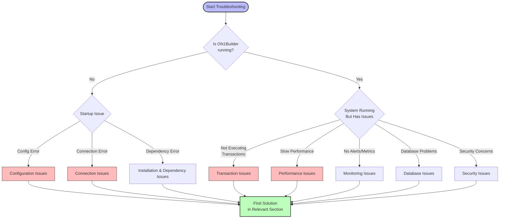

# ON1Builder Troubleshooting Guide

This guide will help you diagnose and resolve common issues you might encounter while running ON1Builder.

## Troubleshooting Decision Flow

Use this flowchart to quickly diagnose and navigate to the appropriate section for your issue:



## Common Issues

Below are the most common issues and their solutions, organized by category:

1. [Connection Issues](#connection-issues)
2. [Configuration Issues](#configuration-issues)
3. [Transaction Issues](#transaction-issues)
4. [Performance Issues](#performance-issues)
5. [Monitoring Issues](#monitoring-issues)
6. [Database Issues](#database-issues)
7. [Security Issues](#security-issues)

## Connection Issues

### Unable to Connect to Blockchain

**Symptoms:**
- Error messages like "Failed to connect to the endpoint"
- System not receiving blockchain updates

**Possible Causes:**
- Incorrect RPC endpoints
- API rate limiting
- Network connectivity issues
- Node provider downtime

**Solutions:**

1. **Verify your endpoints:**
   ```bash
   # Test HTTP endpoint
   curl -X POST -H "Content-Type: application/json" --data '{"jsonrpc":"2.0","method":"eth_blockNumber","params":[],"id":1}' YOUR_HTTP_ENDPOINT
   ```

2. **Check API rate limits:**
   - Review your node provider's documentation for rate limits
   - Consider upgrading your plan or using multiple providers

3. **Use backup endpoints:**
   ```yaml
   # Configure backup endpoints in your config file
   HTTP_ENDPOINT: "https://mainnet.infura.io/v3/YOUR_KEY"
   BACKUP_HTTP_ENDPOINTS:
     - "https://eth-mainnet.alchemyapi.io/v2/YOUR_KEY"
     - "https://rpc.ankr.com/eth"
   ```

4. **Enable connection resilience:**
   ```yaml
   # Add retry configuration
   CONNECTION_RETRIES: 5
   RETRY_DELAY_SECONDS: 2
   AUTO_RECONNECT: true
   ```

### WebSocket Disconnections

**Symptoms:**
- Frequent "WebSocket disconnected" errors in logs
- Missing real-time events

**Solutions:**

1. **Configure WebSocket heartbeats:**
   ```yaml
   WS_HEARTBEAT_INTERVAL: 30  # Send heartbeat every 30 seconds
   ```

2. **Enable auto-reconnection:**
   ```yaml
   WS_AUTO_RECONNECT: true
   WS_MAX_RECONNECT_ATTEMPTS: 10
   ```

## Configuration Issues

### Configuration Validation Errors

**Symptoms:**
- Error messages during startup about invalid configuration
- System refusing to start

**Solutions:**

1. **Validate your configuration:**
   ```bash
   python -m on1builder validate-config --config your_config.yaml
   ```

2. **Check for common mistakes:**
   - Missing required fields
   - Incorrect data types
   - Invalid addresses or endpoints
   - Environment variables not properly set in .env file

3. **Reference working examples:**
   - Compare with example configs in `configs/chains/example_config.yaml`

### Missing Environment Variables

**Symptoms:**
- Error messages like "Missing required environment variable"
- Values showing as "${ENV_VAR}" in logs

**Solutions:**

1. **Verify your .env file:**
   - Ensure the file exists and has correct permissions
   - Check for typos in variable names

2. **Manually export variables:**
   ```bash
   export WALLET_KEY=your_private_key
   ```

3. **Debug environment loading:**
   ```bash
   python -m on1builder debug-env --config your_config.yaml
   ```

## Transaction Issues

### Transactions Failing

**Symptoms:**
- High rate of failed transactions in logs
- Error messages related to transactions

**Possible Causes:**
- Insufficient funds
- Gas price too low
- Contract reverts
- Slippage issues

**Solutions:**

1. **Check your wallet balance:**
   ```bash
   python -m on1builder wallet-balance --address YOUR_WALLET_ADDRESS
   ```

2. **Review gas settings:**
   ```yaml
   # Adjust gas settings in config
   MAX_GAS_PRICE_GWEI: 150  # Increase maximum gas price
   GAS_PRICE_MULTIPLIER: 1.2  # Use 120% of recommended gas price
   ```

3. **Increase slippage tolerance for volatile markets:**
   ```yaml
   SLIPPAGE_DEFAULT: 0.05  # 5% slippage tolerance
   ```

4. **Enable simulation before execution:**
   ```yaml
   SIMULATE_TRANSACTIONS: true
   ```

### Nonce Errors

**Symptoms:**
- "Nonce too low" or "Nonce too high" errors
- Transactions stuck pending

**Solutions:**

1. **Reset your nonce tracking:**
   ```bash
   python -m on1builder reset-nonce --address YOUR_WALLET_ADDRESS
   ```

2. **Enable automatic nonce management:**
   ```yaml
   AUTO_NONCE_MANAGEMENT: true
   ```

3. **Clear pending transactions:**
   ```bash
   python -m on1builder clear-pending-tx --address YOUR_WALLET_ADDRESS
   ```

## Performance Issues

### High CPU or Memory Usage

**Symptoms:**
- System becoming slow or unresponsive
- Out of memory errors

**Solutions:**

1. **Optimize subscription settings:**
   ```yaml
   # Subscribe only to necessary events
   SUBSCRIBE_NEW_BLOCKS: true
   SUBSCRIBE_PENDING_TX: false  # Disable if not needed
   ```

2. **Adjust polling intervals:**
   ```yaml
   BLOCK_POLLING_INTERVAL_MS: 5000  # Increase polling interval
   ```

3. **Monitor resource usage:**
   ```bash
   # Run with resource monitoring
   python -m on1builder run --config your_config.yaml --monitor-resources
   ```

4. **Limit concurrent operations:**
   ```yaml
   MAX_CONCURRENT_REQUESTS: 10
   ```

### Slow Transaction Processing

**Symptoms:**
- Long delays between opportunity detection and execution
- Missed opportunities

**Solutions:**

1. **Optimize gas settings for faster inclusion:**
   ```yaml
   GAS_PRICE_STRATEGY: "fast"
   PRIORITY_FEE_GWEI: 2
   ```

2. **Use a more responsive node provider**

3. **Enable performance logging for analysis:**
   ```yaml
   PERFORMANCE_LOGGING: true
   ```

## Monitoring Issues

### Prometheus Metrics Not Available

**Symptoms:**
- Cannot access metrics endpoint
- Grafana dashboards show no data

**Solutions:**

1. **Check Prometheus configuration:**
   ```bash
   # Verify metrics endpoint is accessible
   curl http://localhost:9090/metrics
   ```

2. **Ensure Prometheus is correctly configured:**
   - Check prometheus.yml file
   - Verify scrape configurations

3. **Enable verbose metrics logging:**
   ```yaml
   METRICS_DEBUG: true
   ```

### Missing or Incomplete Logs

**Symptoms:**
- Cannot find expected log entries
- Logs lack details needed for debugging

**Solutions:**

1. **Increase log verbosity:**
   ```yaml
   LOG_LEVEL: "DEBUG"
   ```

2. **Check log file permissions:**
   ```bash
   chmod 755 data/logs/
   ```

3. **Use structured logging for better filtering:**
   ```yaml
   LOG_FORMAT: "json"
   ```

## Database Issues

### Database Connection Errors

**Symptoms:**
- Errors about failed database connections
- Features requiring persistence not working

**Solutions:**

1. **Check database configuration:**
   ```yaml
   DB_TYPE: "sqlite"  # or "postgresql"
   DB_PATH: "data/db/on1builder.db"  # for SQLite
   # For PostgreSQL
   # DB_HOST: "localhost"
   # DB_PORT: 5432
   # DB_NAME: "on1builder"
   # DB_USER: "on1builder"
   # DB_PASSWORD: "${DB_PASSWORD}"
   ```

2. **Verify database existence and permissions:**
   ```bash
   # For SQLite
   ls -la data/db/
   # For PostgreSQL
   psql -h localhost -U on1builder -d on1builder -c "SELECT 1"
   ```

3. **Initialize database manually:**
   ```bash
   python -m on1builder init-db --config your_config.yaml
   ```

## Security Issues

### Private Key Exposed

**Symptoms:**
- Warnings about insecure private key storage
- Unexpected transactions from your account

**Solutions:**

1. **Use environment variables for private keys:**
   ```yaml
   WALLET_KEY: "${WALLET_KEY}"  # Store actual key in .env file
   ```

2. **Set proper permissions on .env file:**
   ```bash
   chmod 600 .env
   ```

3. **Consider using a hardware wallet for production:**
   ```yaml
   USE_HARDWARE_WALLET: true
   HARDWARE_WALLET_TYPE: "ledger"
   ```

### Unauthorized Access Attempts

**Symptoms:**
- Unusual access patterns in logs
- Unexpected API calls

**Solutions:**

1. **Enable security logging:**
   ```yaml
   SECURITY_LOGGING: true
   ```

2. **Restrict API access:**
   ```yaml
   API_ENABLE_AUTH: true
   API_ALLOWED_IPS: ["127.0.0.1", "10.0.0.0/24"]
   ```

3. **Use proper network security:**
   - Run behind a firewall
   - Use VPN for remote access

## Diagnostic Tools

ON1Builder includes several diagnostic tools to help troubleshoot issues:

### Connection Tester

Test your blockchain connection:

```bash
python -m on1builder test-connection --endpoint YOUR_HTTP_ENDPOINT
```

### Configuration Validator

Validate your configuration file:

```bash
python -m on1builder validate-config --config your_config.yaml
```

### System Diagnostics

Run a complete system diagnostic:

```bash
python -m on1builder diagnostics --config your_config.yaml
```

### Log Analyzer

Analyze logs for patterns and issues:

```bash
python -m on1builder analyze-logs --log-file data/logs/on1builder.log
```

## Getting Additional Help

If you're unable to resolve an issue using this guide:

1. **Check the GitHub Issues:**
   - Search for similar issues on the [GitHub repository](https://github.com/John0n1/ON1Builder/issues)

2. **Collect Diagnostic Information:**
   ```bash
   python -m on1builder collect-diagnostics --output diagnostic_report.zip
   ```

3. **Contact Support:**
   - Open a new issue on GitHub with your diagnostic report
   - Include detailed steps to reproduce the issue
   - Share your configuration file (with sensitive information removed)

## Next Steps

After resolving your issues, consider:

1. Review the [Configuration Guide](configuration.md) to optimize your settings
2. Set up proper [Monitoring](monitoring.md) to detect issues early
3. Implement [best practices](../reference/best_practices.md) for stable operation
