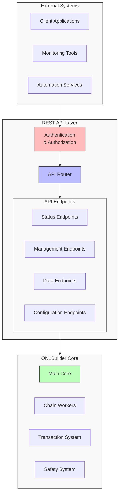
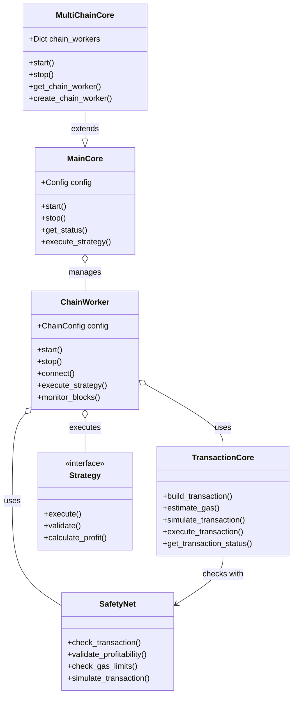

# API Reference

This document provides a comprehensive reference for the ON1Builder API, including both the programmatic API for extending the framework and the REST API for external integrations.

## API Architecture Overview



## REST API

ON1Builder exposes a REST API that can be used to monitor and control the application.

### Base URL

The API is available at:

```
http://your-server:8080/api/v1
```

By default, the API runs on port 8080, but this can be configured in your configuration file:

```yaml
API_PORT: 8080
API_ENABLE: true
```

### Authentication

To secure the API, authentication can be enabled:

```yaml
API_ENABLE_AUTH: true
API_AUTH_TOKEN: "your-secure-token"
```

When authentication is enabled, include the token in the `Authorization` header:

```
Authorization: Bearer your-secure-token
```

### Endpoints

```mermaid
classDiagram
    class SystemEndpoints {
        GET /status
        GET /metrics
        GET /health
        POST /control/shutdown
        POST /control/restart
    }
    
    class ChainEndpoints {
        GET /chains
        GET /chains/{chain_id}/status
        POST /chains/{chain_id}/enable
        POST /chains/{chain_id}/disable
    }
    
    class TransactionEndpoints {
        GET /transactions
        GET /transactions/{tx_hash}
        POST /transactions/simulate
        POST /transactions/execute
    }
    
    class ConfigurationEndpoints {
        GET /config
        GET /config/{section}
        PUT /config/{section}
        POST /config/reload
    }
    
    SystemEndpoints --|> APIBase : extends
    ChainEndpoints --|> APIBase : extends
    TransactionEndpoints --|> APIBase : extends
    ConfigurationEndpoints --|> APIBase : extends
```

#### System Status

```
GET /status
```

Returns the overall system status:

```json
{
  "status": "running",
  "uptime": 3600,
  "version": "1.0.0",
  "chains": [
    {
      "chain_id": 1,
      "name": "Ethereum Mainnet",
      "status": "connected",
      "block_height": 16123456
    },
    {
      "chain_id": 137,
      "name": "Polygon Mainnet",
      "status": "connected",
      "block_height": 45678901
    }
  ]
}
```

#### Chain Status

```
GET /chains/{chain_id}/status
```

Returns status information for a specific chain:

```json
{
  "chain_id": 1,
  "name": "Ethereum Mainnet",
  "status": "connected",
  "block_height": 16123456,
  "gas_price": "25.5",
  "gas_price_unit": "gwei",
  "wallet_balance": "1.234",
  "wallet_balance_unit": "ETH",
  "transactions_today": 15,
  "successful_transactions": 14,
  "failed_transactions": 1
}
```

#### Transactions

```
GET /transactions
```

Returns a list of recent transactions:

```json
{
  "transactions": [
    {
      "tx_hash": "0x1234...",
      "chain_id": 1,
      "status": "confirmed",
      "block_number": 16123456,
      "timestamp": "2023-06-15T12:34:56Z",
      "from": "0xabcd...",
      "to": "0xefgh...",
      "value": "0.1",
      "value_unit": "ETH",
      "gas_used": 150000,
      "gas_price": "25.5",
      "gas_price_unit": "gwei",
      "strategy": "flash_loan"
    },
    // ...more transactions...
  ],
  "pagination": {
    "page": 1,
    "total_pages": 5,
    "total_items": 100,
    "items_per_page": 20
  }
}
```

Query parameters:
- `page`: Page number (default: 1)
- `per_page`: Items per page (default: 20, max: 100)
- `chain_id`: Filter by chain ID
- `status`: Filter by status (pending, confirmed, failed)
- `from`: Filter by start timestamp (ISO 8601)
- `to`: Filter by end timestamp (ISO 8601)

#### Transaction Details

```
GET /transactions/{tx_hash}
```

Returns detailed information about a specific transaction:

```json
{
  "tx_hash": "0x1234...",
  "chain_id": 1,
  "status": "confirmed",
  "block_number": 16123456,
  "timestamp": "2023-06-15T12:34:56Z",
  "from": "0xabcd...",
  "to": "0xefgh...",
  "value": "0.1",
  "value_unit": "ETH",
  "gas_used": 150000,
  "gas_price": "25.5",
  "gas_price_unit": "gwei",
  "strategy": "flash_loan",
  "profit": "0.05",
  "profit_unit": "ETH",
  "input_data": "0x...",
  "logs": [
    // Transaction logs
  ],
  "receipt": {
    // Full transaction receipt
  }
}
```

#### Metrics

```
GET /metrics
```

Returns system metrics in a format compatible with Prometheus:

```
# HELP on1builder_transactions_total Total number of transactions
# TYPE on1builder_transactions_total counter
on1builder_transactions_total{chain_id="1"} 150
on1builder_transactions_total{chain_id="137"} 75

# HELP on1builder_gas_price_gwei Current gas price in Gwei
# TYPE on1builder_gas_price_gwei gauge
on1builder_gas_price_gwei{chain_id="1"} 25.5
on1builder_gas_price_gwei{chain_id="137"} 10.2

# ...more metrics...
```

#### Control Endpoints

```
POST /control/start
```

Start the system:

```json
{
  "success": true,
  "message": "System started",
  "timestamp": "2023-06-15T12:34:56Z"
}
```

```
POST /control/stop
```

Stop the system:

```json
{
  "success": true,
  "message": "System stopped",
  "timestamp": "2023-06-15T12:34:56Z"
}
```

```
POST /control/restart
```

Restart the system:

```json
{
  "success": true,
  "message": "System restarted",
  "timestamp": "2023-06-15T12:34:56Z"
}
```

#### Configuration

```
GET /config
```

Get the current configuration (sensitive data redacted):

```json
{
  "chain_id": 1,
  "chain_name": "Ethereum Mainnet",
  "http_endpoint": "https://mainnet.infura.io/v3/***",
  "websocket_endpoint": "wss://mainnet.infura.io/ws/v3/***",
  "wallet_address": "0xabcd...",
  "max_gas_price_gwei": 100,
  "slippage_default": 0.05,
  // ...more configuration...
}
```

```
PUT /config
```

Update configuration (requires authentication):

```json
{
  "success": true,
  "message": "Configuration updated",
  "timestamp": "2023-06-15T12:34:56Z",
  "requires_restart": true
}
```

## Programmatic API

ON1Builder provides a programmatic API that can be used to extend the framework, create custom strategies, or integrate with other systems.



### Core Classes

#### MainCore

The main application core that coordinates all components.

```python
from on1builder.core import MainCore

# Initialize core
core = MainCore(config_path="config.yaml")

# Start and stop
await core.start()
await core.stop()

# Get status
status = await core.get_status()

# Execute strategy
result = await core.execute_strategy(strategy_name, strategy_params)
```

#### MultiChainCore

Extended core for multi-chain operations.

```python
from on1builder.core import MultiChainCore

# Initialize multi-chain core
core = MultiChainCore(config_path="config_multi_chain.yaml")

# Get chain-specific worker
eth_worker = core.get_chain_worker(chain_id=1)

# Execute on specific chain
result = await eth_worker.execute_strategy(strategy_name, strategy_params)
```

#### TransactionCore

Handles transaction building, signing, and execution.

```python
from on1builder.core import TransactionCore

# Create transaction
tx = await tx_core.build_transaction(
    to_address="0x...",
    value=0.1,  # ETH
    data="0x...",
    gas_price_strategy="fast"
)

# Simulate transaction
simulation = await tx_core.simulate_transaction(tx)

# Send transaction
receipt = await tx_core.send_transaction(tx)

# Get transaction status
status = await tx_core.get_transaction_status(tx_hash)
```

### Strategy Development

Custom strategies can be created by inheriting from the `Strategy` base class:

```python
from on1builder.strategies import Strategy

class MyCustomStrategy(Strategy):
    name = "my_custom_strategy"
    description = "My custom trading strategy"
    
    def __init__(self, config, tx_core, market_monitor):
        super().__init__(config, tx_core, market_monitor)
        # Initialize strategy-specific components
        
    async def find_opportunities(self):
        # Logic to find opportunities
        opportunities = []
        # ... analyze market conditions ...
        return opportunities
        
    async def execute(self, opportunity):
        # Execute the strategy
        # ... build and send transactions ...
        return result
```

Register your custom strategy:

```python
from on1builder.strategies import register_strategy
from my_strategies import MyCustomStrategy

register_strategy(MyCustomStrategy)
```

### Event Handling

Subscribe to system events:

```python
from on1builder.events import EventBus

# Subscribe to block events
async def on_new_block(block):
    print(f"New block: {block['number']}")
    
EventBus.subscribe("new_block", on_new_block)

# Subscribe to transaction events
async def on_transaction(tx):
    print(f"Transaction: {tx['hash']}")
    
EventBus.subscribe("transaction", on_transaction)

# Publish custom events
await EventBus.publish("custom_event", {"data": "value"})
```

### Market Monitor

Access market data:

```python
from on1builder.monitoring import MarketMonitor

# Get token price
price = await market_monitor.get_token_price("ETH", "USD")

# Get token pair price
pair_price = await market_monitor.get_pair_price("ETH", "USDT")

# Get historical prices
historical = await market_monitor.get_historical_prices("ETH", "USD", days=7)

# Subscribe to price updates
async def on_price_update(price_data):
    print(f"New ETH price: ${price_data['price']}")
    
await market_monitor.subscribe_price_updates("ETH", "USD", on_price_update)
```

### Utilities

Various utility functions:

```python
from on1builder.utils import (
    convert_to_wei,
    convert_from_wei,
    calculate_gas_cost,
    estimate_profit,
    validate_address
)

# Convert ETH to Wei
wei_amount = convert_to_wei(1.5)  # 1.5 ETH to Wei

# Calculate gas cost
gas_cost = calculate_gas_cost(
    gas_used=150000,
    gas_price_gwei=25.5
)  # in ETH

# Estimate profit
profit = estimate_profit(
    revenue=0.2,  # ETH
    gas_cost=0.05,  # ETH
    slippage=0.01  # 1%
)

# Validate Ethereum address
is_valid = validate_address("0x...")
```

## WebSocket API

For real-time updates, ON1Builder also provides a WebSocket API:

```
ws://your-server:8080/ws
```

### Authentication

When authentication is enabled, connect with a token:

```
ws://your-server:8080/ws?token=your-secure-token
```

### Available Events

Subscribe to specific events:

```json
{
  "action": "subscribe",
  "channels": ["blocks", "transactions", "metrics"]
}
```

Example block event:

```json
{
  "event": "block",
  "data": {
    "chain_id": 1,
    "block_number": 16123456,
    "timestamp": "2023-06-15T12:34:56Z",
    "transactions": 150,
    "gas_used": 12500000,
    "gas_limit": 30000000
  }
}
```

Example transaction event:

```json
{
  "event": "transaction",
  "data": {
    "tx_hash": "0x1234...",
    "chain_id": 1,
    "status": "confirmed",
    "block_number": 16123456,
    "timestamp": "2023-06-15T12:34:56Z",
    "from": "0xabcd...",
    "to": "0xefgh...",
    "value": "0.1",
    "value_unit": "ETH",
    "gas_used": 150000,
    "gas_price": "25.5",
    "gas_price_unit": "gwei"
  }
}
```

Example metrics event:

```json
{
  "event": "metrics",
  "data": {
    "timestamp": "2023-06-15T12:34:56Z",
    "system": {
      "cpu_usage": 25.5,
      "memory_usage": 1024000000,
      "disk_usage": 35.0
    },
    "chains": [
      {
        "chain_id": 1,
        "block_height": 16123456,
        "gas_price": "25.5",
        "wallet_balance": "1.234"
      }
    ],
    "transactions": {
      "total": 150,
      "today": 15,
      "successful": 140,
      "failed": 10
    },
    "profit": {
      "total": "5.678",
      "today": "0.123",
      "unit": "ETH"
    }
  }
}
```

## Error Handling

All API endpoints return standard HTTP status codes:

- `200 OK`: Request was successful
- `400 Bad Request`: Invalid request parameters
- `401 Unauthorized`: Authentication required
- `403 Forbidden`: Insufficient permissions
- `404 Not Found`: Resource not found
- `500 Internal Server Error`: Server error

Error responses include additional details:

```json
{
  "error": true,
  "code": "INVALID_PARAMETER",
  "message": "Invalid chain ID",
  "details": {
    "parameter": "chain_id",
    "value": "invalid",
    "expected": "integer"
  },
  "timestamp": "2023-06-15T12:34:56Z"
}
```

## Rate Limiting

To prevent abuse, rate limiting is applied to API endpoints:

```
X-RateLimit-Limit: 100
X-RateLimit-Remaining: 95
X-RateLimit-Reset: 1623760496
```

When rate limits are exceeded, a `429 Too Many Requests` status code is returned.

## Versioning

The API is versioned to ensure backward compatibility:

```
/api/v1/... - Current stable API
/api/v2/... - Next generation API (when available)
```

## Conclusion

The ON1Builder API provides comprehensive access to the system's functionality, allowing for monitoring, control, and integration with external systems. The programmatic API enables customization and extension of the framework's capabilities.

---

**Next Steps:**

- Explore the [Architecture Overview](architecture.md) for a high-level understanding
- Learn about all available [Configuration Options](configuration_reference.md)
- Understand the [Components](components.md) in detail
- Try the [Single Chain Example](../examples/single_chain_example.md) to get started
- Return to the [Main Documentation](../index.md)
