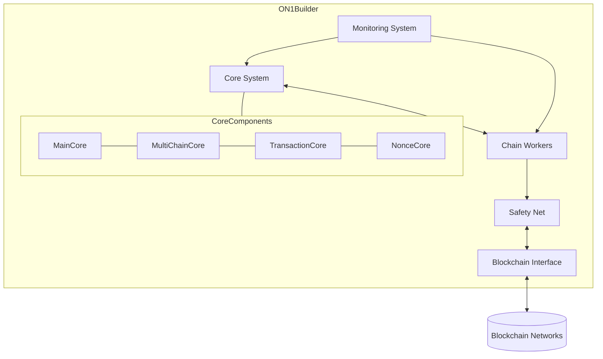
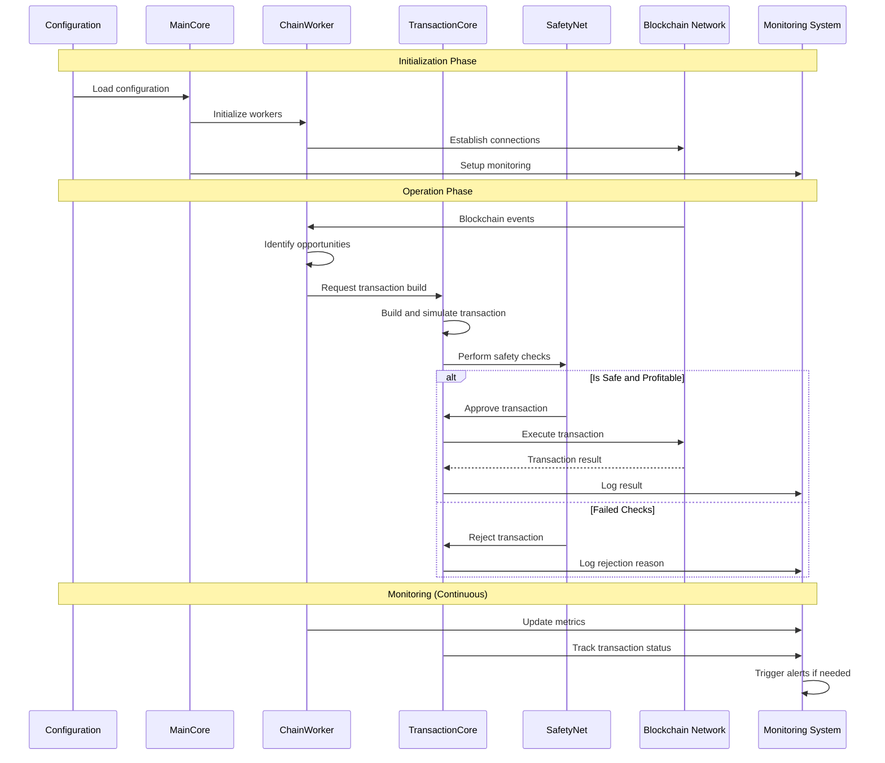
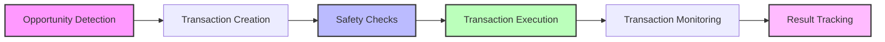
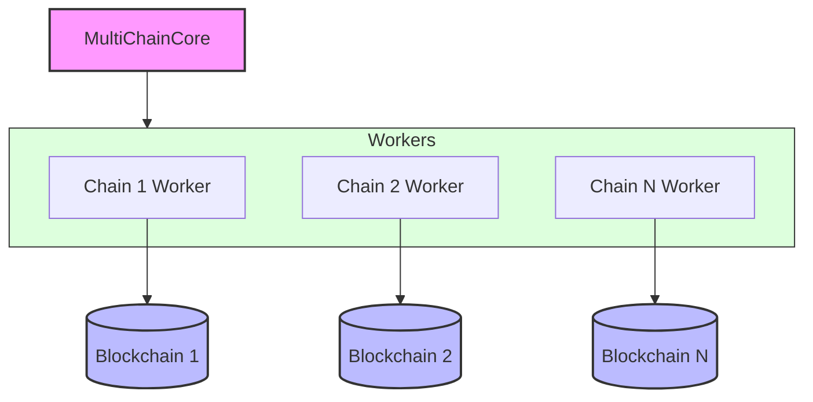
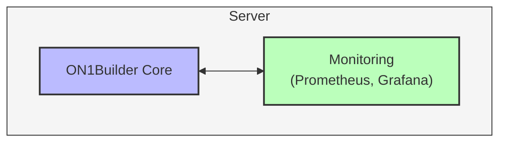
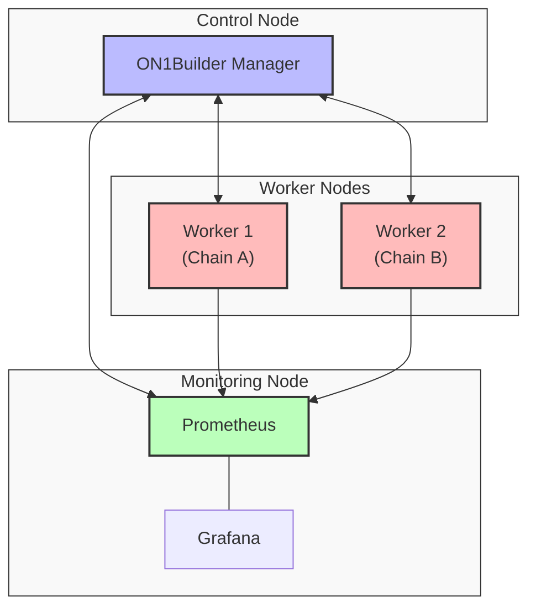
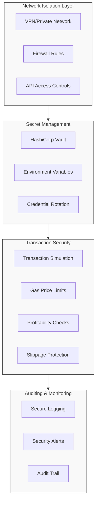
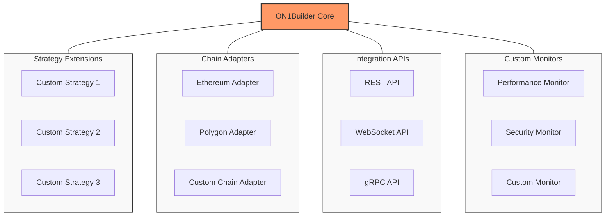

<!-- [MermaidChart: 32f1a0c0-2ee4-4776-aeeb-e7899bb145ac] -->

# Architecture Overview

This document provides a comprehensive overview of the ON1Builder architecture, including how components interact and the system's workflow.

## High-Level Architecture

ON1Builder follows a modular architecture designed for high performance, reliability, and extensibility across multiple blockchains.

## Core Components

### MainCore

The `MainCore` is the central component that bootstraps and coordinates all other components. It:

- Manages the AsyncIO event loop
- Initializes all components
- Handles startup and shutdown sequences
- Maintains the application lifecycle

### MultiChainCore

For multi-chain deployments, the `MultiChainCore` extends `MainCore` to manage parallel operations across multiple blockchains. It:

- Creates and manages blockchain-specific workers
- Coordinates cross-chain operations
- Provides unified interfaces for interacting with multiple chains

### ChainWorker

Each `ChainWorker` handles blockchain-specific operations for a single chain. It:

- Connects to blockchain nodes
- Monitors blocks and transactions
- Executes blockchain-specific strategies
- Reports metrics and status

### TransactionCore

Handles all transaction-related operations:

- Building transaction objects
- Signing transactions with wallet keys
- Estimating gas and costs
- Simulating transactions before execution
- Submitting transactions to the network
- Tracking transaction status

### NonceCore

Manages transaction nonces to ensure proper transaction ordering:

- Tracks current nonce values
- Prevents nonce conflicts
- Handles nonce recovery in error cases

### Safety Net

Implements safeguards to protect against risks:

- Transaction validation before execution
- Profitability checks
- Gas price limits and controls
- Error handling and recovery procedures

### Monitoring

Provides comprehensive monitoring capabilities:

- Logging all system activities
- Prometheus metrics
- Health check endpoints
- Alerting through multiple channels

## Data Flow

1. **Initialization**:
   - Configuration loaded
   - Connections established to blockchains
   - Components initialized

2. **Operation**:
   - Blockchain events monitored
   - Opportunities identified by strategy components
   - Transactions built and simulated by TransactionCore
   - Safety checks performed by SafetyNet
   - Profitable transactions executed
   - Results tracked and recorded

3. **Monitoring**:
   - All activities logged
   - Metrics updated in real-time
   - Alerts triggered based on conditions
   - Health status maintained

## System Workflows

### Transaction Workflow

### Multi-Chain Workflow

## Deployment Architecture

ON1Builder supports multiple deployment configurations:

### Single-Node Deployment

All components run on a single server or container.

### Distributed Deployment

Components distributed across multiple servers:

## Security Architecture

Security is implemented at multiple levels:

1. **Network Isolation**:
   - VPN or private network for inter-component communication
   - Restricted access to API endpoints

2. **Secret Management**:
   - Integration with HashiCorp Vault for secure secrets
   - Environment variable isolation
   - No hardcoded credentials

3. **Access Controls**:
   - Role-based access to system components
   - API authentication and authorization
   - Audit logging of all operations

4. **Transaction Protection**:
   - Simulation before execution
   - Gas price limitations
   - Profit requirements
   - Slippage protection

## Disaster Recovery

```mermaid
flowchart LR
    subgraph Normal["Normal Operation"]
        Monitoring["Continuous Monitoring"]
        Backup["Automated Backups"]
    end
    
    subgraph Incident["Incident Occurs"]
        Detection["Issue Detection"]
        Assessment["Impact Assessment"]
        Classification["Severity Classification"]
    end
    
    subgraph Recovery["Recovery Process"]
        Containment["Containment"]
        Restoration["Service Restoration"]
        RootCause["Root Cause Analysis"]
    end
    
    subgraph PostRecovery["Post-Recovery"]
        Improvement["Process Improvement"]
        Documentation["Incident Documentation"]
        Prevention["Preventative Measures"]
    end
    
    Normal -- "Incident Detected" --> Incident
    Incident -- "Recovery Plan Activated" --> Recovery
    Recovery -- "Services Restored" --> PostRecovery
    PostRecovery -- "Cycle Continues" --> Normal
    
    style Normal fill:#bfb,stroke:#333,stroke-width:1px
    style Incident fill:#fbb,stroke:#333,stroke-width:1px
    style Recovery fill:#bbf,stroke:#333,stroke-width:1px
    style PostRecovery fill:#fbf,stroke:#333,stroke-width:1px
```

The system includes disaster recovery capabilities:

1. **Automatic backup** of configuration and state
2. **Graceful degradation** during partial failures
3. **Self-healing** capabilities for common issues
4. **Rollback procedures** for failed deployments

## Extensibility

ON1Builder is designed to be extensible:

1. **Plugin Architecture** for adding new strategies
2. **Chain Adapters** for supporting additional blockchains
3. **API Interfaces** for integration with external systems
4. **Custom Monitors** for specific monitoring needs

## Conclusion

The ON1Builder architecture provides a robust, scalable, and secure framework for executing blockchain transactions across multiple chains. Its modular design allows for easy maintenance, extension, and customization while maintaining high performance and reliability.

---

**Next Steps:**

- Explore the [API Reference](api.md) for integrating with ON1Builder
- Learn about all available [Configuration Options](configuration_reference.md)
- Understand the [Components](components.md) in detail
- Try the [Single Chain Example](../examples/single_chain_example.md) to get started
- Return to the [Main Documentation](../index.md)
