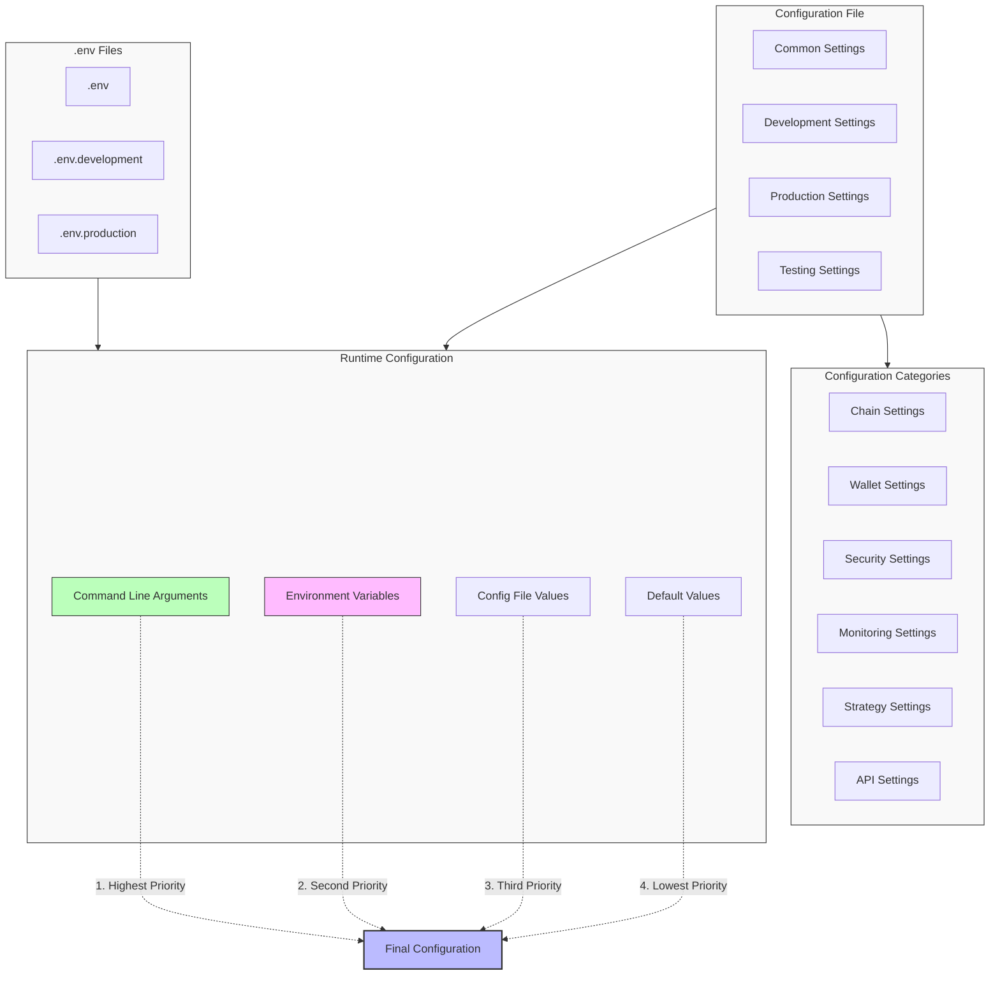

# Configuration Reference

This document provides a complete reference of all configuration options available in ON1Builder. It serves as a comprehensive guide to all settings, their default values, and their effects on the system.

## Configuration Structure Overview



## Configuration File Structure

ON1Builder uses YAML configuration files with environment-specific sections. The basic structure is:

```yaml
# Common settings used across all environments
common:
  SETTING1: value1
  SETTING2: value2

# Development environment settings
development:
  SETTING3: dev_value3
  SETTING4: dev_value4

# Production environment settings
production:
  SETTING3: prod_value3
  SETTING4: prod_value4
```

When running ON1Builder, you can specify which environment to use:

```bash
python -m on1builder run --config configs/chains/config.yaml --environment production
```

If no environment is specified, the system defaults to using the `common` section and the `development` environment.

## Configuration Precedence

ON1Builder uses the following order of precedence for configuration values:

1. Command-line arguments
2. Environment variables
3. YAML configuration file (matching the specified environment)
4. Default values

## Core Configuration Options

### Chain Information

| Setting | Type | Default | Description |
|---------|------|---------|-------------|
| `CHAIN_ID` | string | "1" | Blockchain network ID |
| `CHAIN_NAME` | string | "Ethereum Mainnet" | Human-readable chain name |
| `HTTP_ENDPOINT` | string | - | HTTP RPC endpoint URL |
| `WEBSOCKET_ENDPOINT` | string | - | WebSocket endpoint URL |
| `IPC_ENDPOINT` | string | - | Optional IPC endpoint path |
| `BLOCK_TIME` | float | 12.0 | Average block time in seconds |
| `CHAIN_CURRENCY` | string | "ETH" | Native currency symbol |

### Connection Settings

| Setting | Type | Default | Description |
|---------|------|---------|-------------|
| `WEB3_MAX_RETRIES` | int | 3 | Maximum connection retry attempts |
| `WEB3_RETRY_DELAY` | float | 2.0 | Delay between retries in seconds |
| `WS_HEARTBEAT_INTERVAL` | int | 30 | WebSocket heartbeat interval in seconds |
| `WS_AUTO_RECONNECT` | bool | true | Enable automatic WebSocket reconnection |
| `WS_MAX_RECONNECT_ATTEMPTS` | int | 10 | Maximum WebSocket reconnection attempts |
| `CONNECTION_TIMEOUT` | float | 10.0 | Connection timeout in seconds |
| `REQUEST_TIMEOUT` | float | 30.0 | Request timeout in seconds |

### Wallet Settings

| Setting | Type | Default | Description |
|---------|------|---------|-------------|
| `WALLET_ADDRESS` | string | - | Ethereum wallet address |
| `WALLET_KEY` | string | - | Private key (store in .env file) |
| `MIN_BALANCE` | float | 0.1 | Minimum ETH balance to maintain |
| `AUTO_NONCE_MANAGEMENT` | bool | true | Enable automatic nonce management |
| `NONCE_LOCK_TIMEOUT` | float | 120.0 | Nonce lock timeout in seconds |
| `HD_WALLET_PATH` | string | "m/44'/60'/0'/0/0" | HD wallet derivation path (if used) |
| `HD_WALLET_MNEMONIC` | string | - | HD wallet mnemonic (store in .env file) |

### Gas and Fee Settings

| Setting | Type | Default | Description |
|---------|------|---------|-------------|
| `MAX_GAS_PRICE_GWEI` | float | 500.0 | Maximum gas price in Gwei |
| `MIN_GAS_PRICE_GWEI` | float | 1.0 | Minimum gas price in Gwei |
| `GAS_PRICE_STRATEGY` | string | "medium" | Gas price strategy (slow, medium, fast, fastest) |
| `GAS_PRICE_MULTIPLIER` | float | 1.1 | Multiplier applied to recommended gas price |
| `GAS_LIMIT_BUFFER` | float | 1.2 | Multiplier for gas limit estimates |
| `PRIORITY_FEE_GWEI` | float | 1.0 | Priority fee for EIP-1559 transactions |
| `USE_EIP1559` | bool | true | Use EIP-1559 transaction type |
| `BASE_FEE_MAX_CHANGE` | float | 1.25 | Maximum allowed base fee change factor |
| `MAX_FEE_PER_GAS_GWEI` | float | 500.0 | Maximum fee per gas in Gwei |

### Transaction Settings

| Setting | Type | Default | Description |
|---------|------|---------|-------------|
| `TX_CONFIRMATION_BLOCKS` | int | 2 | Blocks to wait for confirmation |
| `TX_CONFIRMATION_TIMEOUT` | float | 300.0 | Transaction confirmation timeout in seconds |
| `SIMULATE_TRANSACTIONS` | bool | true | Simulate transactions before execution |
| `MAX_PENDING_TRANSACTIONS` | int | 5 | Maximum allowed pending transactions |
| `RESUBMIT_TX_AFTER_BLOCKS` | int | 10 | Resubmit stuck transactions after blocks |
| `TX_REPLACEMENT_MULTIPLIER` | float | 1.25 | Gas price multiplier for replacing transactions |
| `TX_VALUE_BUFFER` | float | 0.01 | Additional ETH buffer for transactions |
| `TX_LOG_LEVEL` | string | "INFO" | Transaction logging level |

### Safety Parameters

| Setting | Type | Default | Description |
|---------|------|---------|-------------|
| `MIN_PROFIT` | float | 0.001 | Minimum profit in ETH to execute a transaction |
| `SLIPPAGE_DEFAULT` | float | 0.05 | Default slippage tolerance (0.05 = 5%) |
| `SLIPPAGE_LOW_CONGESTION` | float | 0.10 | Slippage for low congestion periods |
| `SLIPPAGE_HIGH_CONGESTION` | float | 0.03 | Slippage for high congestion periods |
| `MIN_SLIPPAGE` | float | 0.01 | Minimum allowed slippage |
| `MAX_SLIPPAGE` | float | 0.50 | Maximum allowed slippage |
| `DRY_RUN` | bool | false | Run in simulation mode without executing transactions |
| `GO_LIVE` | bool | false | Enable actual transaction execution |
| `FUND_RECOVERY_THRESHOLD` | float | 0.9 | Threshold to trigger fund recovery (ratio of wallet value) |
| `MAX_EXECUTION_TIME` | float | 5.0 | Maximum execution time in seconds |

### Contract Addresses

| Setting | Type | Default | Description |
|---------|------|---------|-------------|
| `WETH_ADDRESS` | string | (chain-specific) | Wrapped ETH address |
| `USDC_ADDRESS` | string | (chain-specific) | USDC token address |
| `USDT_ADDRESS` | string | (chain-specific) | USDT token address |
| `UNISWAP_ADDRESS` | string | (chain-specific) | Uniswap router address |
| `SUSHISWAP_ADDRESS` | string | (chain-specific) | SushiSwap router address |
| `AAVE_POOL_ADDRESS` | string | (chain-specific) | AAVE lending pool address |
| `AAVE_FLASHLOAN_ADDRESS` | string | (chain-specific) | AAVE flash loan provider address |
| `GAS_PRICE_ORACLE_ADDRESS` | string | (chain-specific) | Gas price oracle address |

### Data File Paths

| Setting | Type | Default | Description |
|---------|------|---------|-------------|
| `ERC20_ABI` | string | "abi/erc20_abi.json" | ERC20 token ABI file path |
| `AAVE_FLASHLOAN_ABI` | string | "abi/aave_flashloan_abi.json" | AAVE flash loan ABI file path |
| `AAVE_POOL_ABI` | string | "abi/aave_pool_abi.json" | AAVE pool ABI file path |
| `UNISWAP_ABI` | string | "abi/uniswap_abi.json" | Uniswap router ABI file path |
| `SUSHISWAP_ABI` | string | "abi/sushiswap_abi.json" | SushiSwap router ABI file path |
| `ERC20_SIGNATURES` | string | "abi/erc20_signatures.json" | ERC20 function signatures file path |
| `TOKEN_ADDRESSES` | string | "resources/tokens/chainid-1/symbol2address.json" | Token addresses file path |
| `TOKEN_SYMBOLS` | string | "resources/tokens/chainid-1/address2symbol.json" | Token symbols file path |

## Monitoring Configuration

### Logging

| Setting | Type | Default | Description |
|---------|------|---------|-------------|
| `LOG_LEVEL` | string | "INFO" | Logging level (DEBUG, INFO, WARNING, ERROR) |
| `LOG_FORMAT` | string | "detailed" | Log format (simple, detailed, json) |
| `LOG_TO_FILE` | bool | true | Enable logging to file |
| `LOG_DIR` | string | "data/logs" | Directory for log files |
| `LOG_MAX_SIZE_MB` | int | 100 | Maximum log file size in MB |
| `LOG_BACKUP_COUNT` | int | 10 | Number of backup log files to keep |
| `LOG_ROTATION` | bool | true | Enable log rotation |
| `PERFORMANCE_LOGGING` | bool | false | Enable detailed performance logging |
| `SECURITY_LOGGING` | bool | true | Enable security event logging |

### Prometheus Metrics

| Setting | Type | Default | Description |
|---------|------|---------|-------------|
| `ENABLE_PROMETHEUS` | bool | true | Enable Prometheus metrics |
| `PROMETHEUS_PORT` | int | 9090 | Port for Prometheus metrics |
| `PROMETHEUS_PATH` | string | "/metrics" | Path for Prometheus metrics endpoint |
| `METRICS_DEBUG` | bool | false | Enable debug output for metrics |
| `METRICS_COLLECTION_INTERVAL` | float | 10.0 | Metrics collection interval in seconds |
| `INCLUDE_SYSTEM_METRICS` | bool | true | Include system metrics (CPU, memory) |
| `INCLUDE_PROCESS_METRICS` | bool | true | Include process metrics |

### Alerting

| Setting | Type | Default | Description |
|---------|------|---------|-------------|
| `ENABLE_SLACK_ALERTS` | bool | false | Enable Slack alerting |
| `SLACK_WEBHOOK_URL` | string | - | Slack webhook URL |
| `SLACK_CHANNEL` | string | "#alerts" | Slack channel for alerts |
| `ENABLE_EMAIL_ALERTS` | bool | false | Enable email alerting |
| `SMTP_SERVER` | string | "smtp.gmail.com" | SMTP server address |
| `SMTP_PORT` | int | 587 | SMTP server port |
| `SMTP_USERNAME` | string | - | SMTP server username |
| `SMTP_PASSWORD` | string | - | SMTP server password |
| `ALERT_EMAIL` | string | - | Email address for alerts |
| `EMAIL_SUBJECT_PREFIX` | string | "[ON1Builder]" | Prefix for email alert subjects |
| `ALERT_SEVERITY_THRESHOLD` | string | "WARNING" | Minimum severity for alerts |

### Health Checks

| Setting | Type | Default | Description |
|---------|------|---------|-------------|
| `ENABLE_HEALTH_CHECK` | bool | true | Enable health check endpoint |
| `HEALTH_CHECK_PORT` | int | 8080 | Port for health check endpoint |
| `HEALTH_CHECK_PATH` | string | "/health" | Path for health check endpoint |
| `HEALTH_CHECK_INTERVAL` | float | 300.0 | Health check interval in seconds |
| `CRITICAL_ERRORS_THRESHOLD` | int | 5 | Threshold for critical errors before unhealthy |
| `WARNING_ERRORS_THRESHOLD` | int | 10 | Threshold for warning errors |

## Database Configuration

| Setting | Type | Default | Description |
|---------|------|---------|-------------|
| `DB_TYPE` | string | "sqlite" | Database type (sqlite, postgresql) |
| `DB_PATH` | string | "data/db/on1builder.db" | SQLite database file path |
| `DB_HOST` | string | "localhost" | Database server host |
| `DB_PORT` | int | 5432 | Database server port |
| `DB_NAME` | string | "on1builder" | Database name |
| `DB_USER` | string | "on1builder" | Database username |
| `DB_PASSWORD` | string | - | Database password |
| `POOL_SIZE` | int | 5 | Database connection pool size |
| `MAX_OVERFLOW` | int | 10 | Maximum database connection overflow |
| `POOL_TIMEOUT` | float | 30.0 | Database pool timeout in seconds |
| `POOL_RECYCLE` | int | 1800 | Connection recycle time in seconds |
| `ENABLE_DB_ECHO` | bool | false | Enable SQL query logging |

## API Configuration

| Setting | Type | Default | Description |
|---------|------|---------|-------------|
| `API_ENABLE` | bool | true | Enable REST API |
| `API_PORT` | int | 8080 | Port for REST API |
| `API_ENABLE_AUTH` | bool | false | Enable API authentication |
| `API_AUTH_TOKEN` | string | - | API authentication token |
| `API_CORS_ORIGINS` | list | ["*"] | Allowed CORS origins |
| `API_RATE_LIMIT` | int | 100 | Maximum API requests per minute |
| `API_TIMEOUT` | float | 30.0 | API request timeout in seconds |
| `ENABLE_WS_API` | bool | true | Enable WebSocket API |
| `WS_PORT` | int | 8080 | Port for WebSocket API |

## External Services

### Node Providers

| Setting | Type | Default | Description |
|---------|------|---------|-------------|
| `INFURA_PROJECT_ID` | string | - | Infura project ID |
| `ALCHEMY_API_KEY` | string | - | Alchemy API key |
| `ETHERSCAN_API_KEY` | string | - | Etherscan API key |
| `POLYGONSCAN_API_KEY` | string | - | PolygonScan API key |
| `BACKUP_HTTP_ENDPOINTS` | list | [] | Backup HTTP RPC endpoints |
| `BACKUP_WS_ENDPOINTS` | list | [] | Backup WebSocket endpoints |

### Price APIs

| Setting | Type | Default | Description |
|---------|------|---------|-------------|
| `COINGECKO_API_KEY` | string | - | CoinGecko API key |
| `COINMARKETCAP_API_KEY` | string | - | CoinMarketCap API key |
| `PRICE_UPDATE_INTERVAL` | float | 60.0 | Price update interval in seconds |
| `PRICE_API_FALLBACKS` | list | ["coingecko", "coinmarketcap", "onchain"] | Fallback order for price APIs |
| `PRICE_CACHE_TTL` | int | 300 | Price cache time-to-live in seconds |

## Multi-Chain Configuration

| Setting | Type | Default | Description |
|---------|------|---------|-------------|
| `CHAINS` | string | "1" | Comma-separated list of chain IDs |
| `CHAIN_{ID}_CHAIN_NAME` | string | - | Chain name for chain ID |
| `CHAIN_{ID}_HTTP_ENDPOINT` | string | - | HTTP endpoint for chain ID |
| `CHAIN_{ID}_WEBSOCKET_ENDPOINT` | string | - | WebSocket endpoint for chain ID |
| `CHAIN_{ID}_WALLET_ADDRESS` | string | - | Wallet address for chain ID |
| `CHAIN_{ID}_MAX_GAS_PRICE_GWEI` | float | - | Maximum gas price for chain ID |
| `PARALLEL_CHAIN_EXECUTION` | bool | true | Execute chain operations in parallel |
| `MAX_PARALLEL_CHAINS` | int | 3 | Maximum parallel chain operations |

## Security Configuration

| Setting | Type | Default | Description |
|---------|------|---------|-------------|
| `VAULT_ENABLE` | bool | false | Enable HashiCorp Vault integration |
| `VAULT_ADDR` | string | "http://localhost:8200" | Vault server address |
| `VAULT_TOKEN` | string | - | Vault authentication token |
| `VAULT_PATH` | string | "secret/on1builder" | Vault secrets path |
| `AUTO_LOCK_UNUSED_FUNDS` | bool | false | Automatically lock unused funds |
| `LOCK_THRESHOLD` | float | 0.5 | Threshold for locking funds (ratio of wallet value) |
| `REQUIRE_APPROVAL_ABOVE` | float | 0.5 | Require manual approval for transactions above this ETH value |
| `API_ALLOWED_IPS` | list | ["127.0.0.1"] | IP addresses allowed to access the API |
| `MAX_API_TOKEN_AGE` | int | 86400 | Maximum API token age in seconds |

## Advanced Configuration

| Setting | Type | Default | Description |
|---------|------|---------|-------------|
| `MEMPOOL_MONITORING` | bool | true | Enable mempool monitoring |
| `MEMPOOL_POLLING_INTERVAL` | float | 1.0 | Mempool polling interval in seconds |
| `BLOCK_MONITORING` | bool | true | Enable block monitoring |
| `BLOCK_POLLING_INTERVAL` | float | 12.0 | Block polling interval in seconds |
| `SUBSCRIBE_NEW_BLOCKS` | bool | true | Subscribe to new blocks |
| `SUBSCRIBE_PENDING_TX` | bool | true | Subscribe to pending transactions |
| `MAX_CONCURRENT_REQUESTS` | int | 20 | Maximum concurrent web3 requests |
| `CACHE_ABI` | bool | true | Cache contract ABIs |
| `ABI_CACHE_TTL` | int | 86400 | ABI cache time-to-live in seconds |
| `USE_FLASHBOTS` | bool | false | Use Flashbots for transaction submission |
| `FLASHBOTS_RELAY_URL` | string | "https://relay.flashbots.net" | Flashbots relay URL |
| `MAX_TX_LOOKBACK` | int | 50 | Maximum number of blocks to look back for transactions |
| `BUNDLE_GAS_LIMIT` | int | 5000000 | Gas limit for bundled transactions |

## Environment-Specific Settings

Different environments can have different settings:

### Development Environment

```yaml
development:
  DRY_RUN: true
  GO_LIVE: false
  LOG_LEVEL: "DEBUG"
  MIN_BALANCE: 0.005
  MAX_GAS_PRICE_GWEI: 50
  MIN_PROFIT: 0.0001
  ENABLE_DB_ECHO: true
  PERFORMANCE_LOGGING: true
```

### Production Environment

```yaml
production:
  DRY_RUN: false
  GO_LIVE: true
  LOG_LEVEL: "INFO"
  MIN_BALANCE: 0.1
  MAX_GAS_PRICE_GWEI: 500
  MIN_PROFIT: 0.001
  VAULT_ENABLE: true
  API_ENABLE_AUTH: true
  SLACK_WEBHOOK_URL: "https://hooks.slack.com/services/..."
  AUTO_LOCK_UNUSED_FUNDS: true
```

### Test Environment

```yaml
test:
  DRY_RUN: true
  GO_LIVE: false
  LOG_LEVEL: "DEBUG"
  HTTP_ENDPOINT: "http://localhost:8545"
  WEBSOCKET_ENDPOINT: "ws://localhost:8546"
  DB_TYPE: "sqlite"
  DB_PATH: ":memory:"
  ENABLE_PROMETHEUS: false
  ENABLE_HEALTH_CHECK: false
```

## Configuration Examples

### Minimal Configuration

```yaml
common:
  CHAIN_ID: "1"
  CHAIN_NAME: "Ethereum Mainnet"
  HTTP_ENDPOINT: "https://mainnet.infura.io/v3/${INFURA_PROJECT_ID}"
  WEBSOCKET_ENDPOINT: "wss://mainnet.infura.io/ws/v3/${INFURA_PROJECT_ID}"
  WALLET_ADDRESS: "0xYourWalletAddress"
  WALLET_KEY: "${WALLET_KEY}"
  MAX_GAS_PRICE_GWEI: 100
  DRY_RUN: true
```

### Production-Ready Configuration

```yaml
common:
  # Chain settings
  CHAIN_ID: "1"
  CHAIN_NAME: "Ethereum Mainnet"
  HTTP_ENDPOINT: "https://mainnet.infura.io/v3/${INFURA_PROJECT_ID}"
  WEBSOCKET_ENDPOINT: "wss://mainnet.infura.io/ws/v3/${INFURA_PROJECT_ID}"
  BACKUP_HTTP_ENDPOINTS:
    - "https://eth-mainnet.alchemyapi.io/v2/${ALCHEMY_API_KEY}"
    - "https://rpc.ankr.com/eth"
  
  # Wallet settings
  WALLET_ADDRESS: "0xYourWalletAddress"
  WALLET_KEY: "${WALLET_KEY}"
  MIN_BALANCE: 0.1
  
  # Transaction settings
  MAX_GAS_PRICE_GWEI: 500
  GAS_PRICE_STRATEGY: "fast"
  USE_EIP1559: true
  PRIORITY_FEE_GWEI: 1.5
  SIMULATE_TRANSACTIONS: true
  
  # Safety settings
  MIN_PROFIT: 0.002
  SLIPPAGE_DEFAULT: 0.03
  DRY_RUN: false
  GO_LIVE: true
  
  # Monitoring settings
  LOG_LEVEL: "INFO"
  ENABLE_PROMETHEUS: true
  PROMETHEUS_PORT: 9090
  ENABLE_SLACK_ALERTS: true
  SLACK_WEBHOOK_URL: "${SLACK_WEBHOOK}"
  
  # Security settings
  VAULT_ENABLE: true
  VAULT_ADDR: "http://vault:8200"
  VAULT_TOKEN: "${VAULT_TOKEN}"
  API_ENABLE_AUTH: true
  API_AUTH_TOKEN: "${API_TOKEN}"
```

## Environment Variables

Sensitive information should be stored in environment variables or a `.env` file:

```dotenv
# API Keys
INFURA_PROJECT_ID=your_infura_project_id
ALCHEMY_API_KEY=your_alchemy_api_key
ETHERSCAN_API_KEY=your_etherscan_api_key
COINGECKO_API_KEY=your_coingecko_api_key

# Wallet Information
WALLET_KEY=your_private_key_without_0x_prefix

# Security
VAULT_TOKEN=your_vault_token
API_TOKEN=your_api_token
SLACK_WEBHOOK=your_slack_webhook_url

# Database
DB_PASSWORD=your_database_password

# Email
SMTP_USERNAME=your_email@example.com
SMTP_PASSWORD=your_email_password
```

## Dynamic Configuration

ON1Builder supports dynamic configuration updates at runtime:

```python
from on1builder.config import update_config

# Update a single setting
update_config("MAX_GAS_PRICE_GWEI", 200)

# Update multiple settings
update_config({
    "MIN_PROFIT": 0.003,
    "SLIPPAGE_DEFAULT": 0.04
})
```

## Configuration Validation

ON1Builder validates your configuration at startup. You can also manually validate a configuration file:

```bash
python -m on1builder validate-config --config configs/chains/config.yaml
```

This command will check for:
- Required fields
- Type validation
- Value range validation
- Dependency validation
- Security best practices

## Next Steps

After configuring ON1Builder according to your needs, you may want to:

1. Learn how to [run ON1Builder](../guides/running.md) with your configuration
2. Set up [monitoring](../guides/monitoring.md) using the monitoring configuration options
3. Review the [security guidelines](../SECURITY.md) for securing your configuration

---

**Related Documentation:**

- Explore the [Architecture Overview](architecture.md) for a high-level understanding
- Learn about the [API Reference](api.md) for integrating with ON1Builder
- Understand the [Components](components.md) in detail
- Try the [Single Chain Example](../examples/single_chain_example.md) to get started
- Return to the [Main Documentation](../index.md)
