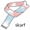

[](https://github.com/childmindresearch/skarf/actions/workflows/ci.yaml?query=branch%3Amain)
[](https://childmindresearch.github.io/skarf)
[](https://codecov.io/gh/childmindresearch/skarf)
[](https://github.com/astral-sh/ruff)

[](LICENSE)

<p align="left">
  
</p>

skarf (**s**ci**k**it **a**uto**r**egressive models for **f**unctional connectivity) is a Python package for regularized vector autoregressive (VAR) time series modeling built on top of [scikit-learn](https://scikit-learn.org). It is built for functional connectivity analyses of fMRI data.

## Installation

You can install the latest release from PyPI with

```bash
pip install skarf
```

The latest development version can be installed with

```bash
pip install git+https://github.com/childmindresearch/skarf.git
```

## Documentation

Package documentation is available [here](https://childmindresearch.github.io/skarf).
