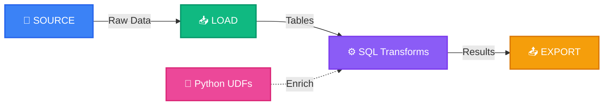

# SQLFlow: The Complete SQL Data Pipeline Platform

<div align="center">

**Get working data analytics in under 2 minutes with pure SQL**

[](https://opensource.org/licenses/Apache-2.0)
[](https://www.python.org/downloads/)
[](https://pypi.org/project/sqlflow-core/)
[](https://duckdb.org/)
[](https://codecov.io/github/giaosudau/sqlflow)

</div>



## 🚀 Get Started in 90 Seconds

```bash
# Install SQLFlow (includes everything for analytics)
pip install sqlflow-core

# Create project with realistic sample data + working pipelines
sqlflow init my_analytics

# See immediate results with 1,000 customers and 5,000 orders
cd my_analytics
sqlflow pipeline run customer_analytics

# View working customer analytics
cat output/customer_summary.csv
cat output/top_customers.csv
```

**That's it!** You now have working customer analytics with 1,000 customers, 5,000 orders, and 500 products.

## ⚡ Fastest Time to Value in the Industry

**SQLFlow: Under 2 minutes to working analytics**  
Competitors: 15-60 minutes of setup

| Framework | Time to Results | Setup Complexity | Sample Data |
|-----------|-----------------|------------------|-------------|
| **SQLFlow** | **1-2 minutes** | ✅ One command | ✅ Auto-generated |
| dbt | 15-20 minutes | ❌ Manual setup | ❌ Find your own |
| SQLMesh | 20-30 minutes | ❌ New concepts | ❌ Find your own |
| Airflow | 30-60 minutes | ❌ Complex DAGs | ❌ Find your own |

## Why Teams Switch to SQLFlow

**Before SQLFlow (Traditional Approach):**
- 15+ minutes to first results
- Multiple tools with different languages
- Manual data setup and configuration
- Context switching between ingestion, transformation, and export tools

**After SQLFlow:**
- Under 2 minutes to working analytics
- One tool with SQL you already know
- Instant realistic sample data (1,000 customers, 5,000 orders)
- Complete pipeline in a single file

## 📦 Installation Options

<details>
<summary><strong>Need database connectivity or cloud storage?</strong></summary>

```bash
# Basic installation (90% of users)
pip install sqlflow-core

# Add PostgreSQL support
pip install "sqlflow-core[postgres]"

# Add cloud storage (AWS S3 + Google Cloud)
pip install "sqlflow-core[cloud]"

# Everything included
pip install "sqlflow-core[all]"
```

**Having installation issues?** See our comprehensive [Installation Guide](INSTALLATION.md) for platform-specific instructions and troubleshooting.

</details>

## What Makes SQLFlow Different

Stop stitching together complex tools. SQLFlow unifies your entire data workflow in pure SQL with intelligent extensions.

### 🔄 Complete Data Workflow

* **Auto-Generated Sample Data:** 1,000 customers, 5,000 orders, 500 products ready to analyze
* **Ready-to-Run Pipelines:** Customer analytics, data quality monitoring, and basic examples
* **Source Connectors:** Ingest from CSV, PostgreSQL, and more
* **SQL Transformations:** Standard SQL with automatic dependency tracking
* **Python Integration:** Extend with Python UDFs when SQL isn't enough
* **Export Destinations:** Output to files, S3, and other targets

### 💪 Powerful Yet Simple

* **SQL-First:** Leverage the language data teams already know
* **Zero Configuration:** Profiles pre-configured for immediate use
* **Intuitive DSL:** Extended SQL with clear, purpose-built directives
* **Automatic DAG:** Dependencies automatically tracked and visualized
* **Clean Syntax:** No complex configuration or boilerplate

### 🛠️ Developer Experience

* **Instant Results:** Working analytics in under 2 minutes
* **Easy Environment Switching:** Dev to production in seconds with profiles
* **Fast Iteration:** Lightning-quick in-memory mode for development
* **Robust Production:** Persistent storage mode for deployment
* **Built-in Visualization:** Auto-generated pipeline diagrams

## Real-World Example

Here's what SQLFlow generates for you automatically:

**Customer Analytics Pipeline** (auto-created in every project):

```sql
-- Customer Analytics Pipeline (runs immediately!)
-- Load auto-generated realistic data
CREATE TABLE customers AS
SELECT * FROM read_csv_auto('data/customers.csv');

CREATE TABLE orders AS
SELECT * FROM read_csv_auto('data/orders.csv');

-- Analyze customer behavior by country and tier
CREATE TABLE customer_summary AS
SELECT 
    c.country,
    c.tier,
    COUNT(*) as customer_count,
    AVG(c.age) as avg_age,
    COUNT(o.order_id) as total_orders,
    COALESCE(SUM(o.price * o.quantity), 0) as total_revenue
FROM customers c
LEFT JOIN orders o ON c.customer_id = o.customer_id
GROUP BY c.country, c.tier
ORDER BY total_revenue DESC;

-- Export results (auto-saved to output/)
EXPORT SELECT * FROM customer_summary 
TO 'output/customer_summary.csv' 
TYPE CSV OPTIONS { "header": true };
```

**Python UDF Integration:**

```python
# python_udfs/metrics.py (when you need more than SQL)
from sqlflow.udfs.decorators import python_scalar_udf, python_table_udf
import pandas as pd

@python_scalar_udf
def calculate_score(value: float, weight: float = 1.0) -> float:
    """Calculate weighted score."""
    return value * weight

@python_table_udf
def add_metrics(df: pd.DataFrame) -> pd.DataFrame:
    """Add calculated metrics to the dataframe."""
    result = df.copy()
    result["total"] = result["quantity"] * result["price"]
    result["discount"] = result["total"] * 0.1
    return result
```

Use in your SQL:

```sql
-- Scalar UDF
SELECT
  product_id,
  price,
  PYTHON_FUNC("python_udfs.metrics.calculate_score", price, 1.5) AS weighted_price
FROM products;

-- Table UDF
CREATE TABLE enriched_orders AS
SELECT * FROM PYTHON_FUNC("python_udfs.metrics.add_metrics", orders);
```

## 🔍 Built-in Validation & Error Prevention

SQLFlow includes intelligent validation that catches errors before execution, saving you time and preventing pipeline failures.

### Catch Errors Early

```bash
# Validate any pipeline without running it
sqlflow pipeline validate customer_analytics

# Validate all pipelines in your project  
sqlflow pipeline validate
```

### Helpful Error Messages & Suggestions

When validation finds issues, you get clear, actionable feedback:

```bash
❌ Validation failed for my_pipeline.sf

📋 Pipeline: my_pipeline
❌ SOURCE missing_path: Missing required parameter 'path'
💡 Suggestion: Add "path": "your_file.csv" to the PARAMS

❌ SOURCE invalid_type: Unknown connector type 'unknown_connector'  
💡 Suggestion: Use one of: csv, postgresql, s3, bigquery

📊 Summary: 2 errors found
```

### Automatic Safety Checks

Validation runs automatically when you compile or run pipelines:

```bash
# These commands validate first, preventing bad deployments
sqlflow pipeline run my_pipeline    # ✅ Validates, then runs
sqlflow pipeline compile my_pipeline # ✅ Validates, then compiles
```

### What Gets Validated

- ✅ **Connector Types**: Ensures you're using valid connector types
- ✅ **Required Parameters**: Checks all required parameters are provided  
- ✅ **File Extensions**: Validates file extensions match connector types
- ✅ **Reference Integrity**: Ensures SOURCE references exist in LOAD statements
- ✅ **Schema Compliance**: Validates against connector schemas
- ✅ **Syntax Checking**: Catches SQL and SQLFlow syntax errors

**Result**: Catch configuration errors in seconds, not after long execution times.

## 📊 Feature Comparison

| Feature | SQLFlow | dbt | SQLMesh | Airflow |
|---------|---------|-----|---------|---------|
| **Time to first results** | **1-2 min** | 15-20 min | 20-30 min | 30-60 min |
| **Sample data included** | ✅ Auto-generated | ❌ Manual | ❌ Manual | ❌ Manual |
| **SQL-based pipelines** | ✅ Complete | ✅ Transform only | ✅ Models | ❌ Python DAGs |
| **Source connectors** | ✅ Built-in | ❌ No | ❌ Limited | ❌ No |
| **Export destinations** | ✅ Built-in | ❌ No | ❌ Limited | ❌ No |
| **Pipeline validation** | ✅ Built-in with suggestions | ❌ Basic syntax | ❌ Limited | ❌ Runtime only |
| **Python integration** | ✅ UDFs | ✅ Limited | ✅ Limited | ✅ Python-first |
| **Environment mgmt** | ✅ Profiles | ✅ Limited | ✅ Environments | ✅ Complex |
| **Learning curve** | ⭐ Low (SQL+) | ⭐⭐ Medium | ⭐⭐ Medium | ⭐⭐⭐ High |
| **Setup complexity** | ⭐ Minimal | ⭐⭐ Medium | ⭐⭐ Medium | ⭐⭐⭐ High |

## 🔍 Why Teams Choose SQLFlow

### For Data Analysts
* **Immediate Results:** Working analytics in 90 seconds
* **No New Tools:** Use SQL you already know for your entire workflow
* **Real Sample Data:** 1,000 customers and 5,000 orders ready to analyze
* **Focus on Insights:** No pipeline plumbing or configuration

### For Data Engineers
* **Faster Prototyping:** From idea to working pipeline in minutes
* **Unified Stack:** Simplify your data architecture
* **SQL Standardization:** One language across your organization
* **Python When Needed:** Extend without leaving your workflow

### For Startups & SMEs
* **Speed to Market:** Get data insights faster than competitors
* **Cost Effective:** Enterprise capabilities without enterprise complexity
* **Team Efficiency:** Leverage existing SQL skills instead of training on new tools

## 🧰 Core Concepts

### 1. Enhanced Project Initialization

SQLFlow creates everything you need to start analyzing data immediately:

```bash
# Default: Full analytics environment
sqlflow init my_project
# Creates: 1,000 customers, 5,000 orders, 500 products + 3 working pipelines

# Minimal: Basic structure only
sqlflow init my_project --minimal

# Demo: Full setup + immediate results
sqlflow init my_project --demo
```

### 2. Profiles for Environment Management

Switch between development and production with a single flag:

```bash
# Development (in-memory, fast)
sqlflow pipeline run customer_analytics

# Production (persistent storage)
sqlflow pipeline run customer_analytics --profile prod
```

### 3. DuckDB-Powered Execution

SQLFlow uses DuckDB as its core engine, offering:

* **In-memory mode** for lightning-fast development
* **Persistent mode** for production reliability  
* **High performance** SQL execution
* **Larger-than-memory** datasets supported

## 📖 Documentation

**New User?** Start here: [Getting Started Guide](docs/user/getting_started.md) - Get working results in under 2 minutes.

### For Users
* [Getting Started Guide](docs/user/getting_started.md) - 2-minute quickstart
* [Speed Comparison](docs/user/reference/speed_comparison.md) - Why SQLFlow is fastest
* [CLI Reference](docs/user/reference/cli.md) - Complete command reference
* [Python UDFs Guide](docs/user/reference/python_udfs.md) - Extend with Python

### For Developers
* [Contributing Guide](docs/developer/contributing.md)
* [Architecture Overview](docs/developer/architecture.md)

### Examples & Comparisons
* [Example Pipelines](examples/) - Real-world use cases
* [SQLFlow vs dbt](docs/comparison/vs_dbt.md) - Detailed comparison
* [SQLFlow vs Airflow](docs/comparison/vs_airflow.md)

## 🤝 Join the Community

SQLFlow is an open-source project built for data practitioners by data practitioners.

* ⭐ **Star us on GitHub!** Show your support and stay updated
* 🐞 [Report issues](https://github.com/sqlflow/sqlflow/issues) or suggest features
* 🧑‍💻 [Contribute code](docs/developer/contributing.md) - Look for 'good first issue' tags
* 💬 [Join discussions](https://github.com/sqlflow/sqlflow/discussions) - Share your use cases

## 📜 License

SQLFlow is released under the [Apache License 2.0](LICENSE).

## ❓ FAQ

**Q: How is SQLFlow different from dbt?**  
A: dbt focuses on transformation within your warehouse. SQLFlow provides end-to-end pipelines (ingestion → transformation → export) with auto-generated sample data for immediate results. [Full comparison](docs/comparison/vs_dbt.md)

**Q: Do I need a data warehouse to use SQLFlow?**  
A: No! SQLFlow uses DuckDB as its engine, working entirely local-first. You can connect to warehouses when needed, but it's not required.

**Q: How does SQLFlow prevent pipeline errors?**  
A: SQLFlow includes built-in validation that checks your pipelines before execution. It validates connector types, required parameters, file extensions, and more - catching errors in seconds instead of after long runs. Use `sqlflow pipeline validate` to check any pipeline.

**Q: Can SQLFlow handle large datasets?**  
A: Yes. DuckDB uses out-of-core algorithms for datasets larger than RAM, spilling to disk as needed. Performance scales well with proper indexing and partitioning.

**Q: How do I switch between development and production?**  
A: Use profiles: `sqlflow pipeline run my_pipeline --profile prod`. Each profile defines different settings, connections, and variables.

**Q: Are intermediate tables saved in persistent mode?**  
A: Yes. All tables are persisted to disk, making debugging and data examination easier.

**Q: Can I use SQLFlow in CI/CD?**  
A: Absolutely. SQLFlow is a CLI tool designed for automation. Use `sqlflow pipeline validate` and `sqlflow pipeline run` in your CI/CD scripts for automated testing and deployment.

---

<div align="center">
  <strong>
    Built with ❤️ for data teams who value speed and simplicity
  </strong>
</div>
