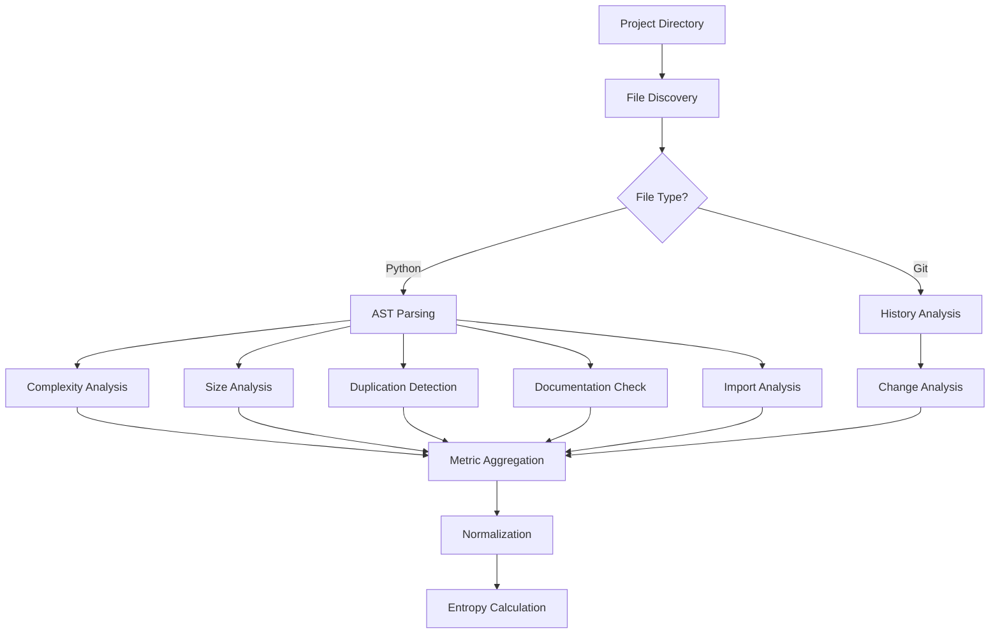

# Metrics Overview

swent analyzes six key dimensions of software quality, each contributing to the overall entropy score.

## Metric Categories

### 1. Complexity Metrics (25% weight)
Measures how difficult code is to understand and reason about.

- **Cyclomatic Complexity**: Number of independent paths through code
- **Halstead Metrics**: Computational complexity based on operators and operands
- **Maintainability Index**: Composite score of maintainability (0-100)

[Learn more →](complexity/cyclomatic.md)

### 2. Size Metrics (15% weight)
Analyzes file sizes and project structure.

- **Lines of Code**: Total, code, comment, and blank lines
- **File Size Distribution**: Identifies oversized files
- **Directory Structure**: Nesting depth and file organization

[Learn more →](size/file-size.md)

### 3. Duplication Metrics (20% weight)
Detects copy-pasted and similar code patterns.

- **AST Fingerprinting**: Structural similarity detection
- **Duplication Ratio**: Percentage of duplicated code
- **Clone Locations**: Where duplicates exist

[Learn more →](duplication/ast-fingerprinting.md)

### 4. Coverage Metrics (15% weight)
Evaluates documentation and code quality indicators.

- **Documentation Coverage**: Percentage of documented functions/classes
- **Maintainability Indicators**: Code quality proxies
- **Missing Documentation**: Specific items lacking docs

[Learn more →](documentation/coverage.md)

### 5. Dependency Metrics (15% weight)
Examines module coupling and dependencies.

- **Import Analysis**: Internal and external dependencies
- **Coupling Metrics**: Afferent and efferent coupling
- **Circular Dependencies**: Cyclic import detection

[Learn more →](dependencies/imports.md)

### 6. Change Metrics (10% weight)
Analyzes git history for volatility patterns.

- **Code Churn**: Lines added/deleted over time
- **Hot Spots**: Frequently modified files
- **Stability Ratio**: Files that haven't changed recently

[Learn more →](change/git-history.md)

## Metric Collection Process



## Key Assumptions

1. **Python-Focused**: Currently analyzes only Python files
2. **Static Analysis**: No runtime information required
3. **Git Optional**: Change metrics skipped if not a git repo
4. **Relative Paths**: All paths relative to project root
5. **UTF-8 Encoding**: Files assumed to be UTF-8

## Metric Properties

### Normalized Scale
All metrics are normalized to 0-1 where:
- **0.0** = Ideal/perfect
- **1.0** = Worst case

### Logarithmic Scaling
Most metrics use logarithmic scaling for smoother progression:
```python
normalized = log(1 + (value - ideal) / (max - ideal)) / log(2)
```

### Weighted Combination
Final entropy uses weighted sum:
```python
entropy = Σ(weight[i] * metric[i])
```

## Customization

Metrics can be customized through:
- Exclude patterns (ignore certain files/dirs)
- Weight adjustments (in config file)
- Threshold tuning (for CI/CD)

See [Configuration](../getting-started/configuration.md) for details.